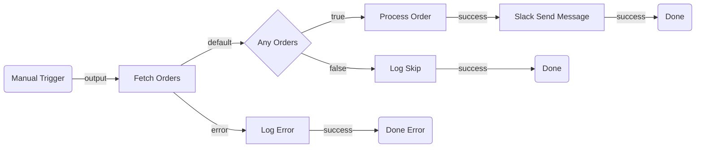

# Plan Document Guide

Machinery for producing the Phase 1 plan artifact: the "Is Maestro the Right Home?" gate, the `.uipath.flow.arch.plan.md` output format, and the mermaid syntax/validation rules. Topology design itself (plugin index, ports, wiring rules, patterns) lives in [planning-arch.md](planning-arch.md).

---

## Before You Build: Is Maestro the Right Home?

Run this gate **before** designing the topology. Maestro is the right tool for a *long-running case* — but not every automation is one, and reaching for a flow by default leads to orchestration overhead that a simpler design would avoid. If the answer below is "queue + Action Center," stop here and hand the work to [/uipath:uipath-rpa](/uipath:uipath-rpa) + [/uipath:uipath-platform](/uipath:uipath-platform) instead of authoring a flow.

### The one question

> **Where does the case live right now — and where should it live between steps?**

A business case (an invoice being approved, a claim being recovered, an onboarding in progress) needs a home for its state while it waits. There are two legitimate homes:

- **One durable instance — Maestro.** A single orchestrated process holds the whole case, survives every wait, and shows you exactly where each case is at any moment.
- **Scattered across infrastructure — a queue + Action Center state machine.** The case's state lives spread across queue items, asset values, and Action Center tasks; whichever robot picks the work up next reassembles it. RPA does the steps, a queue carries the work between them, Action Center holds the human-wait, and the "state" is implicit in which queue/task the item currently sits in.

### Decision table

| Factor | Lean **Maestro flow** | Lean **queue + Action Center state machine** |
|---|---|---|
| Number of distinct waits in the lifecycle | Several waits / branches / parallel paths | The lifecycle's **only** content is a single human-wait or external-wait |
| Per-case visibility | You need to see "where is case #1234 right now" | Per-item queue status is enough |
| Branching & parallelism | Real branching, fan-out/merge, SLAs | Mostly linear: do work → wait → finish |
| Who maintains it | Team comfortable with orchestration as a first-class artifact | RPA-only team, existing queue infrastructure |
| Cross-product composition | Coordinates RPA + Agents + connectors + humans | Pure RPA + Action Center, no agent reasoning |
| Cost of the orchestration layer | Justified by the above | Overhead you won't repay for a one-shot process |

**Rule of thumb:** a lifecycle whose **only content is a single human wait** — do work → wait for one approval → finish, with no branching, no mixed-resource composition, and no per-case visibility need — is a legitimate and *simpler* job for a queue + Action Center state machine. **Multi-wait, branched, visibility-critical, or mixed-resource** lifecycles are where Maestro earns its keep — and an approval gate *inside* such a flow is normal Maestro design, not a reason to leave (see [planning-arch.md — Orchestration (Mixed Resources)](planning-arch.md#orchestration-mixed-resources)). Both are valid — choose deliberately, not by habit.

> **Converting an existing RPA project to Maestro?** You don't rewrite the project into a flow — you keep the executors and lift only the orchestration. See [brownfield.md — Converting an existing project to Maestro](brownfield.md#converting-an-existing-project-to-maestro).

---

## Output Format

Generate a `<SolutionName>.uipath.flow.arch.plan.md` file in the **solution directory** (the folder containing the `.uipx` file, not the project subfolder). The plan covers the entire solution — which may contain multiple projects in the future.

### 1. Summary

2-3 sentences describing what the flow does end-to-end.

### 2. Flow Diagram (Mermaid)

A mermaid flowchart showing all nodes, edges, and branching logic.

**Requirements:**

- Use `graph LR` (left-right) for all flows — Flow uses a horizontal canvas. Do NOT use `graph TD` (top-down) — it produces vertical diagrams that conflict with the horizontal node layout. Do NOT use `flowchart` — it is not supported by all mermaid renderers.
- Use `subgraph` blocks to group related sections — required for flows with 10+ nodes
- Label every edge with the port name (e.g., `-->|success|`, `-->|true|`, `-->|false|`)
- **Labels must be plain text only** — no special characters inside shape delimiters. The following break mermaid parsing:
  - `>` and `<` (interpreted as shape operators or HTML) — replace with words like "over" or "under"
  - `(`, `)`, `[`, `]`, `{`, `}` (conflict with shape delimiters)
  - `:`, `;`, `?`, `&`, `"` (unreliable across renderers)
  - Use plain alphanumeric text and spaces only
- Do NOT put node types in diagram labels — node types belong in the Node Table only
- Do NOT use quotes inside shape delimiters — use `[Text]` not `["Text"]`
- Use only these universally supported node shapes:
  - Triggers: rounded rectangle `(Trigger Name)`
  - Actions: rectangle `[Action Name]`
  - Control flow: diamond `{Decision Name}` for Decision/Switch
  - End/Terminate: rounded rectangle `(Done)`
  - Connectors: rectangle `[Connector Service Operation]`
  - Placeholders: rectangle `[Mock Description]`

**Example:**

````markdown

````

### 3. Node Table

| # | Node ID | Name | Category | Node Type | Inputs | Outputs | Notes |
| --- | --- | --- | --- | --- | --- | --- | --- |
| 1 | trigger | Manual Trigger | trigger | `core.trigger.manual` | — | Trigger event | — |
| 2 | fetchOrders | Fetch Orders | action | `core.action.http.v2` | `method: GET`, `url: <ORDERS_API_URL>` | `output.body` (order list), `error` (on HTTP failure) | Phase 2: confirm URL and auth |
| 3 | checkHasOrders | Any Orders | control | `core.logic.decision` | `expression: $vars.fetchOrders.output.body.length > 0` | Routes to `true` or `false` | — |
| 4 | logError | Log Error | action | `core.action.script` | `script: return { message: $vars.fetchOrders.error.message };` | `output.message` | Handles failed HTTP call |

**Column definitions:**

- **Node ID**: Short camelCase identifier used in the mermaid diagram and edge table
- **Inputs**: Best-guess input values based on user requirements. Use `<PLACEHOLDER>` for values Phase 2 must resolve (URLs, IDs, connection details)
- **Outputs**: What downstream nodes are expected to consume via `$vars.{nodeId}.*`
- **Notes**: Implementation concerns for Phase 2 (e.g., "Phase 2: resolve Jira project ID", "Phase 2: bind Slack connection")

### 4. Edge Table

| # | Source Node | Source Port | Target Node | Target Port | Condition/Label |
| --- | --- | --- | --- | --- | --- |
| 1 | trigger | output | fetchOrders | input | — |
| 2 | fetchOrders | default | checkHasOrders | input | Call succeeded |
| 3 | fetchOrders | error | logError | input | HTTP failure fallback |
| 4 | checkHasOrders | true | processOrder | input | Has orders |
| 5 | checkHasOrders | false | logSkip | input | No orders |

> **Always include an `error`-port edge in the edge table whenever the requirements describe a failure fallback** (e.g., "return X if the API fails", "route to Y if the article doesn't exist", "handle timeouts gracefully"). Without the edge, the flow faults on failure instead of routing to the handler. See [planning-arch.md — Error Handling (implicit `error` port)](planning-arch.md#error-handling-implicit-error-port).

**Rules:**

- Source/target ports must match the [Standard Port Reference](planning-arch.md#standard-port-reference)
- Every node (except the trigger) must appear as a target at least once
- Every node (except End/Terminate) must appear as a source at least once

### 5. Inputs & Outputs

| Direction | Name | Type | Description |
| --- | --- | --- | --- |
| `in` | ordersApiUrl | `string` | Base URL for the orders API |
| `out` | processedCount | `number` | Number of orders successfully processed |
| `inout` | errorLog | `array` | Accumulates error messages across the flow |

### 6. Connector Summary (omit if no connectors)

| Node ID | Service | Intended Operation | Phase 2 Action |
| --- | --- | --- | --- |
| notifySlack | Slack | Send message to channel | Resolve connector key, bind connection, resolve channel ID |
| createTicket | Jira | Create issue | Resolve connector key, bind connection, resolve project/issue type IDs |

### 7. Open Questions (omit if none)

Prefix each with `**[REQUIRED]**` or `**[OPTIONAL]**`:

- **[REQUIRED]** Which Slack channel should notifications go to?
- **[OPTIONAL]** Should the error handler retry before terminating?

---

## Mermaid Validation Rules

LLM-generated mermaid frequently contains syntax errors. After generating the diagram, **check every rule below** before presenting it to the user. Fix violations before outputting.

### Syntax Rules

1. **First line must be `graph LR`** (horizontal — matches the Flow canvas) — use `graph` not `flowchart` (the `flowchart` keyword is not supported by all renderers).
2. **Node IDs must be alphanumeric + underscores only** — no hyphens, dots, or spaces in IDs. Use `fetchData` not `fetch-data` or `fetch.data`
3. **Node IDs must not start with or equal a reserved word** — mermaid reserves these as keywords: `end`, `subgraph`, `graph`, `flowchart`, `direction`, `click`, `style`, `classDef`, `class`, `linkStyle`, `callback`, `default`. IDs that start with these (e.g., `endWarm`, `defaultPath`, `styleNode`) break the parser. Use alternatives like `warmEnd`, `pathDefault`, `nodeStyle` — or use a prefix like `done_warm`, `finish_warm`.
4. **Node labels must be plain text** — no quotes inside shape delimiters. Use `A[Fetch Data]` not `A["Fetch Data"]`.
5. **No special characters in labels** — these break mermaid parsing even when quoted:
   - `>` and `<` (interpreted as shape operators or HTML) — replace with words like "over" or "under"
   - `(`, `)`, `[`, `]`, `{`, `}` (conflict with shape delimiters)
   - `:`, `;`, `?`, `&`, `"` (unreliable across renderers)
   - Use plain alphanumeric text and spaces only
6. **Use only universally supported shapes** — `(text)` for rounded rectangle, `[text]` for rectangle, `{text}` for diamond. Do NOT use `([text])` (stadium), `{{text}}` (hexagon), or other extended shapes — they are not supported by all renderers.
7. **Edge labels use `|label|` between arrow and target** — `A -->|success| B` not `A -->success B` or `A --success--> B`
8. **No empty labels** — `A --> B` is fine, but `A -->|| B` is invalid
9. **Subgraph IDs must be unique** and not collide with node IDs
10. **Subgraph blocks must be closed** — every `subgraph` needs a matching `end`
11. **No semicolons** — mermaid uses newlines, not semicolons, to separate statements
12. **No blank lines inside the mermaid block** — blank lines between node definitions and edges can prevent rendering in some mermaid implementations. Keep all lines contiguous.

### Structural Rules

1. **Every node defined must be connected** — no orphan nodes floating in the diagram
2. **Edge directions must match the flow** — trigger at the top, End at the bottom (for TB layouts)
3. **Decision nodes must show both branches** — `true` and `false` edges, each labeled
4. **Switch nodes must show all case edges** — one per case plus optional default
5. **Loop structures**: show the loop body and the loopBack edge returning to the loop node
6. **Parallel branches** must visually fork from one node and converge at a Merge node

### Validation Procedure

After generating the mermaid block:

1. First line is `graph LR` — not `flowchart`
2. Check each node ID contains only `[a-zA-Z0-9_]`
3. Check no node ID starts with or equals a reserved word (`end`, `subgraph`, `graph`, `flowchart`, `direction`, `click`, `style`, `classDef`, `class`, `linkStyle`, `callback`, `default`)
4. Check no labels contain `>`, `<`, `:`, `;`, `?`, `&`, `(`, `)`, or quotes — replace with plain words
5. Only `(text)`, `[text]`, and `{text}` shapes are used — no `([text])`, `{{text}}`, or other extended shapes
6. Check each edge has valid `-->`, `-->|label|` syntax
7. Check all subgraphs are closed
8. Verify every node in the node table appears in the diagram
9. Verify every edge in the edge table appears in the diagram
10. Check for blank lines inside the mermaid block — remove any empty lines between statements
11. If any rule is violated, fix it before outputting
