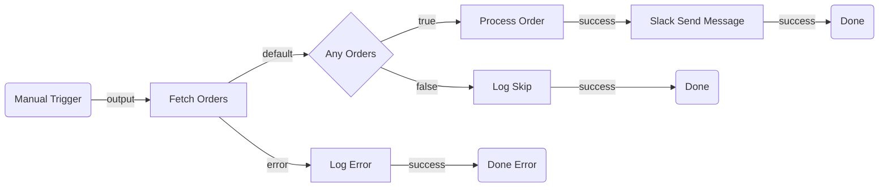

# Planning Phase 1: Discovery & Architectural Design

Discover available capabilities, then design the flow topology — select node types, define edges, and identify expected inputs and outputs. This phase produces a **mermaid diagram** and structured tables that can be reviewed before any implementation work begins.

> **Registry rules for this phase:**
> - **`registry search` and `registry list` are ALLOWED** — use them to discover what connectors, resources, and operations exist before committing to a topology.
> - **`registry get` IS REQUIRED for any OOTB action node** the flow will use — `core.action.http`, `core.action.http.v2`, `core.action.script`, `core.action.transform`, queue actions, etc. These nodes have no connection-id; their full input/output schema, port names, and required fields are only visible via `registry get <node-type> --output json`. Run `get` once per OOTB action node type during discovery so the topology and ports are grounded in real metadata.
> - **`registry get` is DEFERRED for connector and resource nodes** — those require a `--connection-id` (connector) or `--local` resolution that belongs to [Planning Phase 2: Implementation](planning-impl.md).

---

## Process

1. Analyze the user's requirements
2. **Discover capabilities** — if the flow uses connector or resource nodes, run `registry search` / `registry list` to confirm they exist and identify available operations (see [Capability Discovery](#capability-discovery))
3. Select node types from the [Plugin Index](#plugin-index) below — read each relevant plugin's `planning.md` for selection heuristics, ports, and key inputs
4. Define edges (how nodes connect) — see [Wiring Rules](#wiring-rules) and each plugin's port documentation
5. Identify suspected inputs and outputs for each node
6. Generate a mermaid diagram
7. Validate the mermaid syntax (see [Mermaid Validation Rules](#mermaid-validation-rules))
8. Present the plan for user review
9. Iterate until approved, then hand off to [Planning Phase 2: Implementation](planning-impl.md)

---

## Capability Discovery

**When to run:** The flow uses connector nodes (external services) or resource nodes (RPA processes, agents, other flows). **Skip** if the flow only uses OOTB nodes (scripts, HTTP, branching, loops).

Discovery answers "what can I work with?" before you commit to a topology. This prevents designing around a connector that doesn't exist, an operation the connector doesn't support, or an RPA process / agent that hasn't been published yet.

```bash
# Registry should already be refreshed (greenfield.md Step 3 runs `registry pull`)
uip maestro flow registry search <keyword> --output json    # search by service, resource name, or category
uip maestro flow registry search outlook --output json       # example: does an Outlook connector exist?
uip maestro flow registry search "invoice process" --output json  # example: is an RPA process published?
uip maestro flow registry search agent --output json         # example: what agents are available?
uip maestro flow registry list --output json                 # list all available node types

# OOTB action nodes — fetch full schema during discovery (no --connection-id needed):
uip maestro flow registry get core.action.script --output json  # script node inputs/outputs and language options
# Repeat for every OOTB action node the flow will use (transform, queue actions, etc.)
# Note: `core.action.http.v2` is a managed-HTTP connector node, not OOTB — discover it
#       via the connector flow ([http/planning.md](plugins/http/planning.md)).
```

> **Auth note:** Without `uip login`, the registry shows OOTB nodes only. After login, tenant-specific connector and resource nodes are also available. If the flow requires connectors or resources, verify login status first: `uip login status --output json`.

**In-solution discovery (no login required):**
```bash
uip maestro flow registry list --local --output json     # discover sibling projects in the same .uipx solution
```
Run from inside the flow project directory. If the resource (RPA, agent, flow, API workflow) exists as a sibling project in the same solution, it appears here without needing to be published. Prefer in-solution resources over mock placeholders.

### Check Connector Connections

For each connector found in registry search, verify a healthy connection exists. See [plugins/connector/planning.md](plugins/connector/planning.md) for the full connection check workflow.

**Never type a connector key from memory.** Use the key from the `registry search` node type only. The registry key is frequently prefixed or qualified differently than the service's brand name, so a guessed key silently misses the real connector and makes `connections list` return a false "No connections found."

```bash
uip is connections list "<connector-key>" --all-folders --output json
```

> `--all-folders` is mandatory. Without it the CLI returns the active folder only and hides connections in other folders the user can see. Plain `uip is connections list "<connector-key>"` is forbidden for discovery.

- If a default enabled connection exists (`IsDefault: Yes`, `State: Enabled`), record the connection ID for Phase 2.
- **If the result is empty, do not conclude "no connection exists."** An empty `connections list` is suspicious, not authoritative. Three things must hold before you treat it as real: (a) the key came from `registry search`, not memory; (b) the call used `--all-folders`; (c) a `--refresh` retry was still empty. Only then surface it in **Open Questions** so the user can create one while reviewing (creating a connection may involve OAuth flows or admin approval — front-loading this avoids blocking Phase 2). Never ask the user a connection-creation question on an unverified empty result. See [connector/impl.md](plugins/connector/impl.md) for the platform-skill empty-result recovery path shared with implementation.

> This is a lightweight existence check, not full connection binding. Phase 2 will ping the connection, fetch enriched metadata, and resolve reference fields.

**What to record from discovery:**
- **Connectors:** Whether a connector exists for each external service, available operations (from node type names), and whether a healthy connection exists. Field details require `registry get --connection-id` in Phase 2.
- **Resources:** Whether a published or in-solution node exists for each RPA process, agent, or flow referenced in the requirements. Check in-solution first (`registry list --local`), then the tenant registry. Input/output schemas require `registry get` (with `--local` for in-solution) in Phase 2.
- **Gaps:** Services with no connector -> fall back to `core.action.http.v2` (manual mode). Resources in the same solution but unpublished -> use `--local` discovery (no mock needed). Resources not in the solution and not yet published -> use `core.logic.mock` placeholder. Connectors with no connection -> flag in Open Questions for the user to create.

Use these findings to select the right node types from the [Plugin Index](#plugin-index). If a connector doesn't exist, fall back to `core.action.http.v2` (manual mode) or note it as a gap in Open Questions.

> **Run `registry get` for OOTB action nodes during discovery; defer for connector and resource nodes.** OOTB nodes (HTTP, Script, Transform, queue actions, etc.) have no `--connection-id` dependency — fetch their full schemas now so the planned topology references real ports and fields. Connector field metadata (required fields, enums, reference resolution) requires `registry get --connection-id` and belongs to Phase 2; resource schemas (RPA, agent, flow, API workflow) require `--local` or published resolution and also belong to Phase 2. `is connections list --all-folders` is enough to confirm connector connection availability in this phase.

---

## Plugin Index

Each plugin has a `planning.md` with full selection heuristics, ports, key inputs, and wiring rules. **Read the relevant plugin's planning.md** when selecting that node type for your flow.

### Triggers

| Node Type | Plugin | When to Select |
| --- | --- | --- |
| `core.trigger.manual` | _(inline — no plugin)_ | Flow is started on demand by a user or API call |
| `core.trigger.scheduled` | [scheduled-trigger](plugins/scheduled-trigger/planning.md) | Flow runs on a recurring schedule |
| IS connector trigger | [connector-trigger](plugins/connector-trigger/planning.md) | Flow starts when an external event fires (e.g., email received, issue created). Node type: `uipath.connector.trigger.<key>.<trigger>` |

**Rules:**
- Every flow must have exactly one trigger node
- The trigger is always the first node in the topology
- IS connector triggers replace the manual trigger as the start node — they cannot coexist with `core.trigger.manual` or `core.trigger.scheduled`
- `core.trigger.manual` has no inputs and outputs on port `output` — it is simple enough to use without a plugin reference

### Actions

| Node Type | Plugin | When to Select |
| --- | --- | --- |
| `core.action.script` | [script](plugins/script/planning.md) | Custom logic, data transformation, computation, formatting |
| `core.action.http.v2` | [http](plugins/http/planning.md) | Call a REST API — connector mode (IS auth) or manual mode (raw URL). Replaces deprecated `core.action.http` |
| `core.action.transform` | [transform](plugins/transform/planning.md) | Declarative map, filter, or group-by on a collection |
| Wait for events (mid-flow) | [connector-trigger](plugins/connector-trigger/planning.md) | Flow pauses mid-run and waits for an external event before continuing (e.g., wait for an approval reply, a downstream issue update). Node type: `uipath.connector.event.<key>.<event>`. Same connector event metadata as a trigger, but has an `input` port |
| `uipath.pattern.batch-transform` | [batch-transform](plugins/batch-transform/planning.md) | Append LLM-generated columns (category, summary, extracted entities) to every row of an attached CSV. Gated by tenant flag `canvas.nodes.batch-transform` |
| `uipath.pattern.deep-rag` (Summarize) | [summarize](plugins/summarize/planning.md) | Comprehensive synthesis / Q&A over one attached document, with optional per-claim citations. Gated by tenant flag `canvas.nodes.summarize` |
| `core.logic.delay` | [delay](plugins/delay/planning.md) | Pause execution for a duration or until a specific date |
| `core.action.queue.create` | [queue](plugins/queue/planning.md) | Distribute work to robots — fire-and-forget |
| `core.action.queue.create-and-wait` | [queue](plugins/queue/planning.md) | Distribute work to robots — wait for result |
| `uipath.human-in-the-loop` | [hitl](plugins/hitl/planning.md) | Pause flow for a human to review, approve, or fill in data — inline schema, no app required |

### Control Flow

| Node Type | Plugin | When to Select |
| --- | --- | --- |
| `core.logic.decision` | [decision](plugins/decision/planning.md) | Binary branching (if/else) based on a boolean condition |
| `core.logic.switch` | [switch](plugins/switch/planning.md) | Multi-way branching (3+ paths) based on ordered case expressions |
| `core.logic.loop` | [loop](plugins/loop/planning.md) | Iterate over a collection of items |
| `core.logic.merge` | [merge](plugins/merge/planning.md) | Synchronize parallel branches before continuing |
| `core.control.end` | [end](plugins/end/planning.md) | Graceful flow completion (one per terminal path) |
| `core.logic.terminate` | [terminate](plugins/terminate/planning.md) | Abort entire flow immediately on fatal error |
| `core.subflow` | [subflow](plugins/subflow/planning.md) | Group related steps into a reusable container with isolated scope |

### Connector Nodes

Connector nodes call external services via Integration Service. They are **not** built-in — they come from the registry after `uip login` + `uip maestro flow registry pull`.

| When to Select | Plugin |
| --- | --- |
| A pre-built connector exists for the target service (Jira, Slack, Salesforce, etc.) | [connector](plugins/connector/planning.md) |
| The flow needs to read/write UiPath Data Fabric entities (Query / Create / Update / Delete / Get by ID) | [connector/data-fabric](plugins/connector/data-fabric/planning.md) |

**In this phase:** Use [Capability Discovery](#capability-discovery) to confirm the connector exists and note it as `connector: <service-name>` with the intended operation. Phase 2 resolves the exact type, connection, and fields via [connector/impl.md](plugins/connector/impl.md).

### Agent Nodes

Agent nodes invoke AI agents for reasoning, judgment, or natural language tasks. Two kinds exist — pick based on reuse and lifecycle:

| Node Type Pattern | Plugin | When to Select |
| --- | --- | --- |
| `uipath.agent.autonomous` | [inline-agent](plugins/inline-agent/planning.md) | Low-code agent is defined **inside** this flow project (scaffolded via `uip agent init --inline-in-flow`), tightly coupled to this flow, no separate versioning or cross-flow reuse |
| `uipath.core.agent.{key}` | [agent](plugins/agent/planning.md) | Agent lives as a separate project — either in this solution (sibling of the flow) or as a **published tenant resource** (appears in the registry after `uip login` + `uip maestro flow registry pull`); reusable across flows, independently versioned |

See [inline-agent/planning.md — Inline vs Published Agent Decision Table](plugins/inline-agent/planning.md#inline-vs-published-agent-decision-table) for the full decision matrix.

### Resource Nodes (External Automations)

Resource nodes invoke published UiPath automations. They are tenant-specific and appear in the registry after `uip login` + `uip maestro flow registry pull`.

| Category | Node Type Pattern | Plugin |
| --- | --- | --- |
| RPA Process | `uipath.core.rpa-workflow.{key}` | [rpa](plugins/rpa/planning.md) |
| Agent | `uipath.core.agent.{key}` | [agent](plugins/agent/planning.md) |
| Agentic Process | `uipath.core.agentic-process.{key}` | [agentic-process](plugins/agentic-process/planning.md) |
| Flow | `uipath.core.flow.{key}` | [flow](plugins/flow/planning.md) |
| API Workflow | `uipath.core.api-workflow.{key}` | [api-workflow](plugins/api-workflow/planning.md) |
| Human Task (app-based) | `uipath.core.human-task.{key}` | [hitl](plugins/hitl/planning.md) |
| Document Extraction | `uipath.ixp.{modelName}.{fullyQualifiedName}` | [ixp](plugins/ixp/planning.md) |

> The IxP entry uses a **two-segment tail** (`{modelName}.{fullyQualifiedName}`), unlike the other resource nodes which use a single-segment `{key}` tail. Both segments are sanitized at registry-emit time. See [plugins/ixp/planning.md](plugins/ixp/planning.md) for the sanitization rule.

### Placeholders

| Node Type | When to Select |
| --- | --- |
| `core.logic.mock` | Step is TBD, resource doesn't exist yet, or prototyping. Placeholder with `input` -> `output` |

---

## Selecting External Service Nodes

When the flow needs to call an external service, use this decision order — prefer higher tiers:

1. **Pre-built Integration Service connector** — Use when a connector exists and covers the use case. See [connector](plugins/connector/planning.md).
2. **Managed HTTP Request** (`core.action.http.v2`) — connector mode: use when a connector exists but lacks the specific curated activity. Manual mode: use for one-off API calls to services without connectors. See [http](plugins/http/planning.md).
3. **RPA workflow node** — Use only when the target system has no API (legacy desktop apps, terminals). See [rpa](plugins/rpa/planning.md).

---

## Standard Port Reference

Use this when defining edges. Every edge requires a `sourcePort` and `targetPort`.

| Node Type | Input Port(s) | Output Port(s) |
| --- | --- | --- |
| `core.trigger.manual` | — | `output` |
| `core.trigger.scheduled` | — | `output` |
| `uipath.connector.trigger.*` | — | `output` |
| `uipath.connector.event.*` (Wait for events) | `input` | `output`, `error` |
| `core.action.script` | `input` | `success`, `error` |
| `core.action.http.v2` | `input` | `default`, `error`, `branch-{id}` (dynamic per `inputs.branches` entry) |
| `core.action.transform` | `input` | `output`, `error` |
| `uipath.pattern.batch-transform` | `input` | `output`, `error` |
| `uipath.pattern.deep-rag` | `input` | `output`, `error` |
| `core.logic.delay` | `input` | `output` |
| `core.logic.decision` | `input` | `true`, `false` |
| `core.logic.switch` | `input` | `case-{id}` (dynamic per case), `default` |
| `core.logic.loop` | `input`, `loopBack` | `success`, `output`, `error` |
| `core.logic.merge` | `input` (multiple) | `output` |
| `core.control.end` | `input` | — |
| `core.logic.terminate` | `input` | — |
| `core.subflow` | `input` | `output`, `error` |
| `core.logic.mock` | `input` | `output` |
| `uipath.agent.autonomous` | `input` | `success`, `error`, `tool`, `context`, `escalation` |
| `uipath.core.agent.*` | `input` | `output`, `error` |
| `uipath.core.rpa-workflow.*` | `input` | `output`, `error` |
| `uipath.core.human-task.*` | `input` | `output`, `error` |
| `uipath.core.flow.*` | `input` | `output`, `error` |
| `uipath.core.agentic-process.*` | `input` | `output`, `error` |
| `uipath.core.api-workflow.*` | `input` | `output`, `error` |
| `uipath.ixp.*` | `input` | `success`, `error` |
| `uipath.connector.*` (activities) | `input` | `output`, `error` |
| `core.action.queue.create` | `input` | `success` |
| `core.action.queue.create-and-wait` | `input` | `success` |
| `uipath.human-in-the-loop` | `input` | `completed` |
| `uipath.core.human-task.{key}` | `input` | `output` |

> **`error` is an implicit source port** on every action node (any node with `supportsErrorHandling: true`). Wire it whenever the flow needs to survive a failed HTTP call, script exception, transform error, agent fault, etc. — otherwise the flow faults as a whole. This is a **different mechanism** from content-based `inputs.branches` on HTTP. See [Implicit error port on action nodes](../../shared/file-format.md#implicit-error-port-on-action-nodes) for wiring, when it fires, and the decision matrix vs branches/decision/switch.

---

## Wiring Rules

Apply these when defining edges in the topology:

1. Edges connect a **source port** (output) on one node to a **target port** (input) on another
2. Trigger nodes have no input port — they are always edge sources, never targets
3. End/Terminate nodes have no output port — they are always edge targets, never sources
4. Every non-trigger node must have at least one incoming edge
5. Every non-terminal node must have at least one outgoing edge
6. Decision nodes produce exactly two outgoing edges: one from `true`, one from `false`
7. Switch nodes produce one outgoing edge per case + optionally one from `default`
8. Loop nodes: the `loopBack` port receives the edge returning from the last node inside the loop body; `success` fires after all iterations
9. Merge nodes accept multiple incoming edges (one per parallel path being synchronized)
10. Do not create cycles except through Loop's `loopBack` mechanism
11. **No dangling nodes** — every node must be connected by at least one edge. A node with no incoming and no outgoing edges is invalid. Verify every node in the node table appears in the edge table as either a source or target.
12. **Wire the `error` source port whenever the requirements specify a failure fallback** — e.g., "if the call fails", "return X for invalid input", "if the article doesn't exist", "handle timeouts". Without an `error` edge on the action node, the failure faults the whole flow instead of routing to the handler. Applies to every action node in the Standard Port Reference with `error` listed. See [Error Handling](#error-handling-implicit-error-port) and [Implicit error port on action nodes](../../shared/file-format.md#implicit-error-port-on-action-nodes).

---

## Common Topology Patterns

Use these as building blocks when designing your flow.

### Linear Pipeline

```
Trigger -> Action A -> Action B -> Action C -> End
```

### Conditional Branch

```
Trigger -> Fetch Data -> Decision
  |-- true -> Process -> End
  |-- false -> Log Skip -> End
```

### Parallel Execution with Merge

```
Trigger -> Prepare
  |-- Call API A --+
  |-- Call API B --+
                   +-- Merge -> Combine -> End
```

### Loop Over Collection

```
Trigger -> Fetch List -> Loop
  |-- [loop body] Process Item -> (loopBack)
  |-- success -> Summarize -> End
```

### Error Handling (implicit `error` port)

Wire the action node's implicit `error` source port directly to a handler — this catches node-level failures (network errors, timeouts, non-2xx HTTP responses, script exceptions, transform faults). Do NOT put a Decision downstream to check for errors — by the time execution reaches the Decision, a failing node has already faulted the flow.

```
Trigger -> HTTP Request
  |-- default -> Process -> End (success)
  |-- error   -> Log Error -> End (error path with descriptive output)
```

Use a downstream Decision/Switch only for **content-based routing on a successful response** (e.g., `items.length > 0`), not as a failure detector. HTTP also supports `inputs.branches` for that. See [Implicit error port on action nodes](../../shared/file-format.md#implicit-error-port-on-action-nodes) — the `Error port vs other branching` table spells out when to use each.

**Plan the error edge in Phase 1.** If the requirements mention "if the call fails", "invalid input", "article not found", or any failure fallback, add an edge from the action node's `error` port to a handler in the edge table — don't leave it to the build step.

### Orchestration (Mixed Resources)

```
Trigger -> Script (prepare) -> RPA Process (extract) -> Agent (classify) -> Decision
  |-- approved -> Script (format) -> End
  |-- rejected -> Human Task (review) -> End
```

### Scheduled Batch Processing

```
Scheduled Trigger -> HTTP (fetch batch) -> Loop
  |-- Queue Create (per item) -> (loopBack)
  |-- success -> Script (summary) -> End
```

---

## Output Format

Generate a `<SolutionName>.uipath.flow.arch.plan.md` file in the **solution directory** (the folder containing the `.uipx` file, not the project subfolder). The plan covers the entire solution — which may contain multiple projects in the future.

### 1. Summary

2-3 sentences describing what the flow does end-to-end.

### 2. Flow Diagram (Mermaid)

A mermaid flowchart showing all nodes, edges, and branching logic.

**Requirements:**

- Use `graph LR` (left-right) for all flows — Flow uses a horizontal canvas. Do NOT use `graph TD` (top-down) — it produces vertical diagrams that conflict with the horizontal node layout. Do NOT use `flowchart` — it is not supported by all mermaid renderers.
- Use `subgraph` blocks to group related sections — required for flows with 10+ nodes
- Label every edge with the port name (e.g., `-->|success|`, `-->|true|`, `-->|false|`)
- **Labels must be plain text only** — no special characters inside shape delimiters. The following break mermaid parsing:
  - `>` and `<` (interpreted as shape operators or HTML) — replace with words like "over" or "under"
  - `(`, `)`, `[`, `]`, `{`, `}` (conflict with shape delimiters)
  - `:`, `;`, `?`, `&`, `"` (unreliable across renderers)
  - Use plain alphanumeric text and spaces only
- Do NOT put node types in diagram labels — node types belong in the Node Table only
- Do NOT use quotes inside shape delimiters — use `[Text]` not `["Text"]`
- Use only these universally supported node shapes:
  - Triggers: rounded rectangle `(Trigger Name)`
  - Actions: rectangle `[Action Name]`
  - Control flow: diamond `{Decision Name}` for Decision/Switch
  - End/Terminate: rounded rectangle `(Done)`
  - Connectors: rectangle `[Connector Service Operation]`
  - Placeholders: rectangle `[Mock Description]`

**Example:**

````markdown

````

### 3. Node Table

| # | Node ID | Name | Category | Node Type | Inputs | Outputs | Notes |
| --- | --- | --- | --- | --- | --- | --- | --- |
| 1 | trigger | Manual Trigger | trigger | `core.trigger.manual` | — | Trigger event | — |
| 2 | fetchOrders | Fetch Orders | action | `core.action.http.v2` | `method: GET`, `url: <ORDERS_API_URL>` | `output.body` (order list), `error` (on HTTP failure) | Phase 2: confirm URL and auth |
| 3 | checkHasOrders | Any Orders | control | `core.logic.decision` | `expression: $vars.fetchOrders.output.body.length > 0` | Routes to `true` or `false` | — |
| 4 | logError | Log Error | action | `core.action.script` | `script: return { message: $vars.fetchOrders.error.message };` | `output.message` | Handles failed HTTP call |

**Column definitions:**

- **Node ID**: Short camelCase identifier used in the mermaid diagram and edge table
- **Inputs**: Best-guess input values based on user requirements. Use `<PLACEHOLDER>` for values Phase 2 must resolve (URLs, IDs, connection details)
- **Outputs**: What downstream nodes are expected to consume via `$vars.{nodeId}.*`
- **Notes**: Implementation concerns for Phase 2 (e.g., "Phase 2: resolve Jira project ID", "Phase 2: bind Slack connection")

### 4. Edge Table

| # | Source Node | Source Port | Target Node | Target Port | Condition/Label |
| --- | --- | --- | --- | --- | --- |
| 1 | trigger | output | fetchOrders | input | — |
| 2 | fetchOrders | default | checkHasOrders | input | Call succeeded |
| 3 | fetchOrders | error | logError | input | HTTP failure fallback |
| 4 | checkHasOrders | true | processOrder | input | Has orders |
| 5 | checkHasOrders | false | logSkip | input | No orders |

> **Always include an `error`-port edge in the edge table whenever the requirements describe a failure fallback** (e.g., "return X if the API fails", "route to Y if the article doesn't exist", "handle timeouts gracefully"). Without the edge, the flow faults on failure instead of routing to the handler. See [Error Handling (implicit `error` port)](#error-handling-implicit-error-port).

**Rules:**

- Source/target ports must match the [Standard Port Reference](#standard-port-reference)
- Every node (except the trigger) must appear as a target at least once
- Every node (except End/Terminate) must appear as a source at least once

### 5. Inputs & Outputs

| Direction | Name | Type | Description |
| --- | --- | --- | --- |
| `in` | ordersApiUrl | `string` | Base URL for the orders API |
| `out` | processedCount | `number` | Number of orders successfully processed |
| `inout` | errorLog | `array` | Accumulates error messages across the flow |

### 6. Connector Summary (omit if no connectors)

| Node ID | Service | Intended Operation | Phase 2 Action |
| --- | --- | --- | --- |
| notifySlack | Slack | Send message to channel | Resolve connector key, bind connection, resolve channel ID |
| createTicket | Jira | Create issue | Resolve connector key, bind connection, resolve project/issue type IDs |

### 7. Open Questions (omit if none)

Prefix each with `**[REQUIRED]**` or `**[OPTIONAL]**`:

- **[REQUIRED]** Which Slack channel should notifications go to?
- **[OPTIONAL]** Should the error handler retry before terminating?

---

## Mermaid Validation Rules

LLM-generated mermaid frequently contains syntax errors. After generating the diagram, **check every rule below** before presenting it to the user. Fix violations before outputting.

### Syntax Rules

1. **First line must be `graph LR`** (horizontal — matches the Flow canvas) — use `graph` not `flowchart` (the `flowchart` keyword is not supported by all renderers).
2. **Node IDs must be alphanumeric + underscores only** — no hyphens, dots, or spaces in IDs. Use `fetchData` not `fetch-data` or `fetch.data`
3. **Node IDs must not start with or equal a reserved word** — mermaid reserves these as keywords: `end`, `subgraph`, `graph`, `flowchart`, `direction`, `click`, `style`, `classDef`, `class`, `linkStyle`, `callback`, `default`. IDs that start with these (e.g., `endWarm`, `defaultPath`, `styleNode`) break the parser. Use alternatives like `warmEnd`, `pathDefault`, `nodeStyle` — or use a prefix like `done_warm`, `finish_warm`.
4. **Node labels must be plain text** — no quotes inside shape delimiters. Use `A[Fetch Data]` not `A["Fetch Data"]`.
5. **No special characters in labels** — these break mermaid parsing even when quoted:
   - `>` and `<` (interpreted as shape operators or HTML) — replace with words like "over" or "under"
   - `(`, `)`, `[`, `]`, `{`, `}` (conflict with shape delimiters)
   - `:`, `;`, `?`, `&`, `"` (unreliable across renderers)
   - Use plain alphanumeric text and spaces only
6. **Use only universally supported shapes** — `(text)` for rounded rectangle, `[text]` for rectangle, `{text}` for diamond. Do NOT use `([text])` (stadium), `{{text}}` (hexagon), or other extended shapes — they are not supported by all renderers.
7. **Edge labels use `|label|` between arrow and target** — `A -->|success| B` not `A -->success B` or `A --success--> B`
8. **No empty labels** — `A --> B` is fine, but `A -->|| B` is invalid
9. **Subgraph IDs must be unique** and not collide with node IDs
10. **Subgraph blocks must be closed** — every `subgraph` needs a matching `end`
11. **No semicolons** — mermaid uses newlines, not semicolons, to separate statements
12. **No blank lines inside the mermaid block** — blank lines between node definitions and edges can prevent rendering in some mermaid implementations. Keep all lines contiguous.

### Structural Rules

1. **Every node defined must be connected** — no orphan nodes floating in the diagram
2. **Edge directions must match the flow** — trigger at the top, End at the bottom (for TB layouts)
3. **Decision nodes must show both branches** — `true` and `false` edges, each labeled
4. **Switch nodes must show all case edges** — one per case plus optional default
5. **Loop structures**: show the loop body and the loopBack edge returning to the loop node
6. **Parallel branches** must visually fork from one node and converge at a Merge node

### Validation Procedure

After generating the mermaid block:

1. First line is `graph LR` — not `flowchart`
2. Check each node ID contains only `[a-zA-Z0-9_]`
3. Check no node ID starts with or equals a reserved word (`end`, `subgraph`, `graph`, `flowchart`, `direction`, `click`, `style`, `classDef`, `class`, `linkStyle`, `callback`, `default`)
4. Check no labels contain `>`, `<`, `:`, `;`, `?`, `&`, `(`, `)`, or quotes — replace with plain words
5. Only `(text)`, `[text]`, and `{text}` shapes are used — no `([text])`, `{{text}}`, or other extended shapes
6. Check each edge has valid `-->`, `-->|label|` syntax
7. Check all subgraphs are closed
8. Verify every node in the node table appears in the diagram
9. Verify every edge in the edge table appears in the diagram
10. Check for blank lines inside the mermaid block — remove any empty lines between statements
11. If any rule is violated, fix it before outputting

---

## Node Selection Heuristics

Quick decision guide. For full details, read the linked plugin's `planning.md`.

### "I need to call an external service"

1. Is there a connector with a curated activity? Run `uip maestro flow registry list --output json` and check for typed nodes matching `uipath.connector.<key>.<operation>`. If the desired operation appears as a node type, it is a curated activity -> [connector](plugins/connector/planning.md)
2. Connector exists but the operation is not listed as a curated node type? -> `core.action.http.v2` connector mode — see [http](plugins/http/planning.md)
3. No connector exists, but has a REST API? -> `core.action.http.v2` manual mode — see [http](plugins/http/planning.md)
4. No API at all (desktop app, terminal)? -> [rpa](plugins/rpa/planning.md) or `core.logic.mock` if unpublished

### "I need to branch"

- Two paths -> [decision](plugins/decision/planning.md)
- Three or more paths -> [switch](plugins/switch/planning.md)
- Branch on HTTP response status -> [http](plugins/http/planning.md) built-in branches

### "I need to transform data"

- Standard map/filter/group-by -> [transform](plugins/transform/planning.md)
- Custom logic, string manipulation, computation -> [script](plugins/script/planning.md)

### "I need to end the flow"

- Normal completion -> [end](plugins/end/planning.md) (one per terminal path)
- Fatal error, abort everything -> [terminate](plugins/terminate/planning.md)

### "I need to wait"

- Fixed duration -> [delay](plugins/delay/planning.md)
- Wait until a specific time -> [delay](plugins/delay/planning.md)
- Wait for external work to complete -> [queue](plugins/queue/planning.md) (`create-and-wait`)

### "I need human involvement"

- Human approval or data entry -> [hitl](plugins/hitl/planning.md) or `core.logic.mock` if the app doesn't exist

### "I need an AI agent"

- Low-code agent tightly coupled to this flow, bundled inside the flow project -> [inline-agent](plugins/inline-agent/planning.md) (`uipath.agent.autonomous`)
- Coded (Python) agent, or any agent that lives as a separate project (in this solution or published to Orchestrator) -> [agent](plugins/agent/planning.md) (`uipath.core.agent.{key}`)

### "I need an LLM to process rows of a CSV or summarize a document"

- Add LLM-generated columns to every row of a CSV (classify, summarize, extract) -> [batch-transform](plugins/batch-transform/planning.md) (`uipath.pattern.batch-transform`)
- Synthesize or answer questions over one attached document, with optional citations -> [summarize](plugins/summarize/planning.md) (`uipath.pattern.deep-rag`)
- Small ad-hoc reshaping (map/filter/groupBy) without an LLM -> [transform](plugins/transform/planning.md)
- Multi-step reasoning with tool use -> [inline-agent](plugins/inline-agent/planning.md) or [agent](plugins/agent/planning.md)

### "I need to extract structured fields from documents"

- Source is a PDF, scanned form, photo, or email attachment with **variable layout** across inputs (invoices from many vendors, receipts, contracts, forms) -> [ixp](plugins/ixp/planning.md) (`uipath.ixp.{modelName}.{fullyQualifiedName}`)
- Source is already structured (CSV, JSON, database row) -> [script](plugins/script/planning.md) or [transform](plugins/transform/planning.md)
- Need free-form summarization, classification, or open-ended reasoning -> [agent](plugins/agent/planning.md) or [inline-agent](plugins/inline-agent/planning.md)
- IxP model not yet trained -> use `core.logic.mock` and surface in Open Questions

### "The flow needs something outside flow capabilities"

1. Add a `core.logic.mock` placeholder
2. Note what needs to be created and which skill handles it:
   - Desktop/browser automation or coded workflow (C#) -> `uipath-rpa`
   - Agent -> `uipath-agents`
3. Phase 2 will check whether the resource has been published and replace the mock

---

## Handoff to Phase 2

When the architectural plan is approved, Phase 2 ([Planning Phase 2: Implementation](planning-impl.md)) takes over to:

1. Validate all node types via `uip maestro flow registry get` — read each plugin's `impl.md` for registry validation steps
2. Resolve connector and resource nodes — see the relevant plugin's `impl.md` ([connector](plugins/connector/impl.md), [rpa](plugins/rpa/impl.md), [agent](plugins/agent/impl.md), etc.)
3. Resolve resource nodes (confirm published, get definitions)
4. Validate required fields against user-provided values
5. Replace `<PLACEHOLDER>` values in the node table with resolved IDs
6. Replace `core.logic.mock` nodes with real resource nodes (if now published)
7. Finalize the plan with implementation-ready details

**Do not proceed to Phase 2 until the user explicitly approves the architectural plan.**
