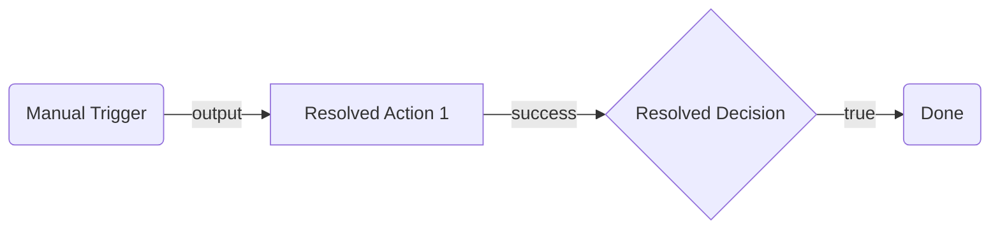

# Planning Phase 2: Implementation Resolution

Resolve all implementation details for the approved architectural plan. This phase takes the `.arch.plan.md` and produces an `.impl.plan.md` with concrete, build-ready values. The plugin `impl.md` files, wiring rules, and flow patterns below are also used during the build step.

> **Prerequisite:** The user must have explicitly approved the architectural plan (`.arch.plan.md`) before starting this phase.
>
> **Always validate with the registry,** even for OOTB nodes. This phase ensures that every node type (built-in or connector-based) is confirmed against the current registry state. Port names, input requirements, and output schemas can change — do not assume OOTB nodes match the planning guides without verification.

---

## Implementation Resolution Process

### Step 1 — Identify Nodes and Validate with Registry

Scan the approved `.arch.plan.md` node table and connector summary. Validate each node type against the registry to confirm ports, inputs, and outputs are current:

| Category          | How to identify                                                      | Action                                                                                                                                                                                                                                                                     |
| ----------------- | -------------------------------------------------------------------- | -------------------------------------------------------------------------------------------------------------------------------------------------------------------------------------------------------------------------------------------------------------------------- |
| Connector nodes   | Node type starts with `uipath.connector.*` or Notes say "connector:" | Run Step 2 (follow [connector/impl.md](plugins/connector/impl.md))                                                                                                                                                                                                         |
| Resource nodes    | Node type starts with `uipath.core.*` or Notes say "resource:"       | Run Step 3 (follow the relevant resource plugin: [rpa](plugins/rpa/impl.md), [agent](plugins/agent/impl.md), [agentic-process](plugins/agentic-process/impl.md), [flow](plugins/flow/impl.md), [api-workflow](plugins/api-workflow/impl.md), [hitl](plugins/hitl/impl.md)) |
| Mock placeholders | Node type is `core.logic.mock`                                       | Run Step 4 (check if published, replace if available)                                                                                                                                                                                                                      |
| OOTB nodes        | Everything else (Script, HTTP, Decision, Loop, etc.)                 | Run Step 1a below (validate with registry using the relevant plugin's `impl.md`)                                                                                                                                                                                           |

**All nodes, including OOTB, must be validated via registry in Step 1a before proceeding.**

#### Step 1a — Validate All Node Types with Registry

Even built-in nodes can change. For each node type in your plan, read the relevant plugin's `impl.md` for the registry validation command and expected ports/inputs:

```bash
uip maestro flow registry pull --force
uip maestro flow registry get <nodeType> --output json
```

**Plugin impl.md files for registry validation:**

| Node Type                       | Plugin impl.md                                                 |
| ------------------------------- | -------------------------------------------------------------- |
| `core.action.script`            | [script/impl.md](plugins/script/impl.md)                       |
| `core.action.http.v2`           | [http/impl.md](plugins/http/impl.md)                           |
| `core.action.transform`         | [transform/impl.md](plugins/transform/impl.md)                 |
| `core.logic.delay`              | [delay/impl.md](plugins/delay/impl.md)                         |
| `core.logic.decision`           | [decision/impl.md](plugins/decision/impl.md)                   |
| `core.logic.switch`             | [switch/impl.md](plugins/switch/impl.md)                       |
| `core.logic.loop`               | [loop/impl.md](plugins/loop/impl.md)                           |
| `core.logic.merge`              | [merge/impl.md](plugins/merge/impl.md)                         |
| `core.control.end`              | [end/impl.md](plugins/end/impl.md)                             |
| `core.logic.terminate`          | [terminate/impl.md](plugins/terminate/impl.md)                 |
| `core.subflow`                  | [subflow/impl.md](plugins/subflow/impl.md)                     |
| `core.trigger.scheduled`        | [scheduled-trigger/impl.md](plugins/scheduled-trigger/impl.md) |
| `core.action.queue.*`           | [queue/impl.md](plugins/queue/impl.md)                         |
| `uipath.agent.autonomous`       | [inline-agent/impl.md](plugins/inline-agent/impl.md)           |
| `uipath.core.agent.*`           | [agent/impl.md](plugins/agent/impl.md)                         |
| `uipath.core.rpa-workflow.*`    | [rpa/impl.md](plugins/rpa/impl.md)                             |
| `uipath.core.agentic-process.*` | [agentic-process/impl.md](plugins/agentic-process/impl.md)     |
| `uipath.core.flow.*`            | [flow/impl.md](plugins/flow/impl.md)                           |
| `uipath.core.api-workflow.*`    | [api-workflow/impl.md](plugins/api-workflow/impl.md)           |
| `uipath.core.hitl.*`            | [hitl/impl.md](plugins/hitl/impl.md)                           |
| `uipath.connector.uipath-uipath-dataservice.*` | [connector/data-fabric/impl.md](plugins/connector/data-fabric/impl.md) |
| `uipath.ixp.*`                  | [ixp/impl.md](plugins/ixp/impl.md)                             |
| `uipath.connector.*`            | [connector/impl.md](plugins/connector/impl.md)                 |
| `uipath.connector.trigger.*`    | [connector-trigger/impl.md](plugins/connector-trigger/impl.md) |

For each node type, record:

- Input port names (must match `targetPort` in edges)
- Output port names (must match `sourcePort` in edges)
- Required input fields (`required: true` in `inputDefinition`)
- Output variable schema (`outputDefinition`)

Update your node table if any ports or required fields differ from the planning guide.

### Step 2 — Resolve Connector Nodes

For each connector node, follow the Configuration Workflow in [connector/impl.md](plugins/connector/impl.md). The guide covers connection binding, metadata retrieval, field resolution, and validation.

Record the connection ID and resolved field values for the build step.

### Step 3 — Resolve Resource Nodes

For each resource node (RPA process, agent, flow, API workflow, human task), follow the discovery and validation steps in the relevant resource plugin's `impl.md`.

```bash
uip maestro flow registry get "<node-type>" --output json
```

Record `inputDefinition` and `outputDefinition` for the node table.

If Phase 1 flagged a resource as not found, check two sources:

**1. In-solution discovery (preferred — no login required):**
```bash
uip maestro flow registry list --local --output json
```
Run from the flow project directory. If the resource exists as a sibling project in the same `.uipx` solution, it appears here — use `registry get "<nodeType>" --local --output json` to get the full manifest.

**2. Tenant registry (if not in solution):**
```bash
uip maestro flow registry pull --force
uip maestro flow registry search "<resource-name>" --output json
```

If found in neither, keep the `core.logic.mock` placeholder and note the gap.

#### IxP nodes — context-dispatched, no bindings

IxP extraction nodes (`uipath.ixp.*`) skip binding resolution. Design-time configuration (`folderKey`, `modelName`) is emitted into the BPMN `model.context[]` array at build time (the serializer also pins `digitizationMode` to `"fileUpload"` internally), not into a separate `bindings_v2.json` file or a top-level `bindings[]` entry. Consequence for Phase 2:

- No connection ID to bind — the node carries its tenant context inline.
- `inputs.*` is the source of truth for runtime values; validate against `registry get` `inputDefinition.properties` rather than against a binding schema.
- The node instance also carries a structured `inputs.model` blob (extraction-model metadata) that the property panel's `ixp-model-taxonomy` component reads. Copy `inputDefaults.model` verbatim — omitting it crashes the panel with `Cannot destructure property 'modelName' of 't' as it is undefined`.
- See [plugins/ixp/impl.md](plugins/ixp/impl.md) for the full JSON shape.

### Step 4 — Replace Mock Nodes

For each `core.logic.mock` node in the architectural plan:

1. Check in-solution discovery first: `uip maestro flow registry list --local --output json`
2. If found locally: replace the mock with the in-solution resource node type, update inputs/outputs
3. If not found locally, check tenant registry: `uip maestro flow registry search "<name>" --output json`
4. If published: replace the mock with the real resource node type, update inputs/outputs
5. If not found in either: keep the mock and note it in the "Open Questions" section for user resolution

### Step 5 — Replace Placeholders

Update the node table from the `.arch.plan.md`:

- Replace `<PLACEHOLDER>` values with resolved IDs
- Replace `connector: <service>` annotations with actual node types
- Replace `resource: <name>` annotations with actual node types
- Update inputs with resolved reference field values
- Update outputs based on `outputDefinition` from registry

### Step 6 — Write the Implementation Plan

Generate a `<SolutionName>.impl.plan.md` file in the **solution directory** (same location as the `.arch.plan.md`).

#### Output Format

````markdown
# <SolutionName> Implementation Plan

## Summary

2-3 sentences describing what the flow does end-to-end and what was resolved in this phase (connectors bound, resources confirmed, registry validations performed).

## Flow Diagram (Mermaid)

Copy the mermaid diagram from `.arch.plan.md`, then update node labels if any node types changed due to mock replacement or connector resolution. Use the same diagram from architectural planning — it remains the visual reference for the flow structure.


````

## Resolved Node Table

| #   | Node ID | Name | Node Type | Inputs | Outputs | Connection ID | Notes |
| --- | ------- | ---- | --------- | ------ | ------- | ------------- | ----- |

## Resolved Edge Table

(Copy from `.arch.plan.md` — update only if node IDs changed due to mock replacement)

## Bindings

| Connector Key | Connection ID | Activity | Verified |
| ------------- | ------------- | -------- | -------- |

## Global Variables

(Copy from `.arch.plan.md` Inputs and Outputs section)

## Changes from Architectural Plan

- List what changed between `.arch.plan.md` and this plan
- Record any node type changes (connector resolutions, mock replacements)
- Note any port or input field changes discovered during registry validation

## Open Questions

Prefix each with `**[REQUIRED]**` or `**[OPTIONAL]**`. If there are no open questions, write "No open questions — all details resolved."

- **[REQUIRED]** Which connection should be used for the Slack connector?
- **[OPTIONAL]** Should the retry count be increased from the default?

````

#### Column Additions

The implementation plan adds these columns beyond the architectural plan:

- **Connection ID**: The bound connection UUID (connector nodes only)
- **Verified**: Whether the connection was pinged successfully

### Step 7 — Get Approval

Present a short summary in chat:

1. Registry validation results — confirm all OOTB node ports and inputs match the plan
2. How many connector/resource nodes were resolved
3. Any port or input field changes discovered during validation
4. Any mock placeholders remaining
5. Any required fields that need user input
6. Any connections that need to be created

Tell the user to review `<SolutionName>.impl.plan.md`, including the updated mermaid diagram and registry confirmations. Do NOT proceed to the build step until the user explicitly approves.

---

## Product Heuristics

These are org-wide "when to use what" rules that can't be encoded in individual node descriptions. They reflect how UiPath's products fit together and which approach to prefer for a given task.

### Connecting to External Services

See [planning-arch.md — Selecting External Service Nodes](planning-arch.md#selecting-external-service-nodes) for the 4-tier decision order (connector -> HTTP within connector -> standalone HTTP -> RPA).

### Agent Nodes vs Workflow Logic

See [agent/planning.md](plugins/agent/planning.md) for the full decision table. Summary:

- **Agent nodes** for ambiguous input, reasoning, judgment, NLG
- **Script/Decision/Switch** for structured input, deterministic logic, data transformation

**Anti-pattern:** Don't use an agent node for tasks that can be done with a Decision + Script. Agents are slower, more expensive (LLM tokens), and less predictable.

**Hybrid pattern:** Use workflow nodes for the deterministic parts (fetch data, transform, route) and agent nodes for the ambiguous parts (classify intent, draft response, extract entities). The flow orchestrates; the agent reasons.

---

## Expressions and Variables

For the **complete reference** on variables (declaration, types, scoping, variable updates) and expressions (`=js:`, templates, Jint constraints), see [variables-and-expressions.md](../../shared/variables-and-expressions.md).

### Quick Reference

Nodes communicate data through `$vars`. Every node's output is accessible downstream via `$vars.{nodeId}.{outputProperty}`.

```javascript
$vars.rollDice.output.roll              // Script return value
$vars.fetchData.output.body             // HTTP response body
$vars.fetchData.output.statusCode       // HTTP status code
$vars.someNode.error.message            // Error information
iterator.currentItem                     // Loop item (inside loop body)
````

**Expression prefixes:**

- `=js:` — Full JavaScript expression evaluated by Jint: `=js:$vars.count > 10`
- `{ }` — Template interpolation for string fields: `Order {$vars.orderId} is {$vars.status}`

**Variable directions** (`variables.globals`):

- `in` — External input (read-only after start)
- `out` — Workflow output (must be mapped on End nodes)
- `inout` — State variable (updated via `variableUpdates`)

---

## Wiring Rules

### Port Compatibility

- Edges connect a **source** port (output) on one node to a **target** port (input) on another
- Source handles have `type: "source"`, target handles have `type: "target"`
- You cannot wire two source ports together or two target ports together

### Connection Constraints

Some nodes enforce connection rules via `constraints` in their handle configuration:

| Constraint                               | Meaning                                                         |
| ---------------------------------------- | --------------------------------------------------------------- |
| `minConnections: N`                      | Handle must have at least N edges (validation error if not met) |
| `maxConnections: N`                      | Handle accepts at most N edges                                  |
| `forbiddenSourceCategories: ["trigger"]` | Cannot receive connections from trigger nodes                   |
| `forbiddenTargetCategories: ["trigger"]` | Cannot connect output to trigger nodes                          |

**Key rules:**

- Trigger nodes can only have outgoing connections (no input port)
- End/Terminate nodes can only have incoming connections (no output port)
- Control flow outputs generally cannot loop back to triggers
- Decision and Switch nodes cannot receive connections from agent resource nodes

### Dynamic Ports

Some nodes create ports based on their configuration:

- **HTTP Request** — One port per `branches` entry: `branch-{id}`. See [http/impl.md](plugins/http/impl.md).
- **Switch** — One port per `cases` entry: `case-{id}`. See [switch/impl.md](plugins/switch/impl.md).
- **Loop** — `success` port fires after completion, `output` port carries aggregated results. See [loop/impl.md](plugins/loop/impl.md).

When wiring to dynamic ports, the port ID must match the configured item's `id`.
