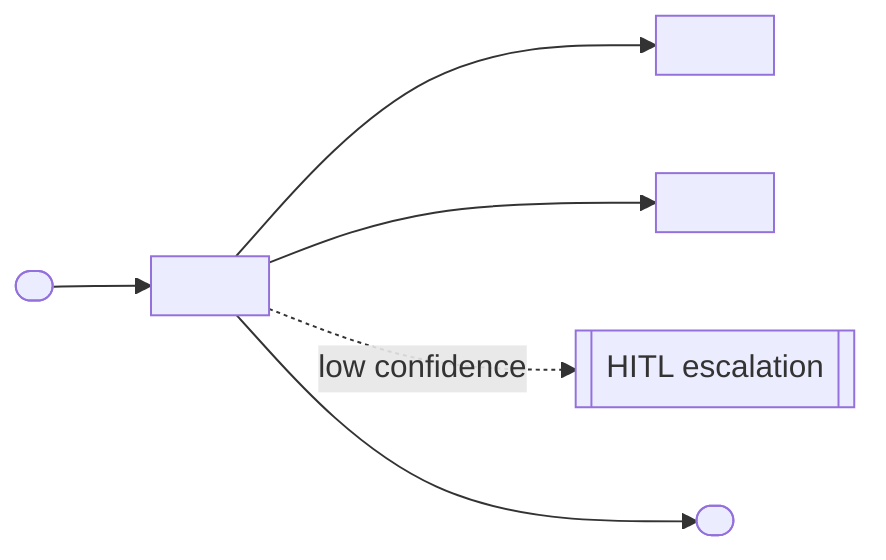

# Solution Design Document — <AGENT_NAME>

> **Template:** UiPath Agents (Python/coded or low-code). If chosen when the PDD lacked AI-specific details, gap-filling Q&A in Phase 1 should have filled: framework choice, tools, memory/RAG, evaluation criteria.
> **Phase 2 sections:** §2, §3, §4, §6, §9. **Phase 3 sections:** all others.

---

## Document History

| Date | Version | Author | Role | Comments |
|---|---|---|---|---|
| <DATE> | 1.0 | <AUTHOR> | Generated by AI Agent | Initial SDD generated from PDD |

---

<!-- DO NOT RENAME: uipath-planner detects SDDs via this exact heading or the marker below. -->
<!-- planner-handoff:v1 -->
## Planner Handoff

| Field | Value |
|---|---|
| **Status** | <draft \| ready — Lane A derives tasks only from ready> |
| **Execution autonomy** | <autonomous \| interactive> |
| **Delivery model** | <cloud \| automation-suite <VERSION_IF_KNOWN> \| standalone \| unspecified> |
| **SDD scope** | <single-product \| solution> |
| **Solution root SDD** | <PATH_TO_SOLUTION_ROOT_SDD — solution scope only; omit all four solution rows for single-product> |
| **Solution ID** | <SOLUTION_NAME_KEBAB> |
| **Project SDD role** | child |
| **Independently executable** | no — Lane A derives tasks only via the Solution root |
| **Project list section** | §9 Project Structure |
| **Tasks file** | `<AGENT_NAME_KEBAB>-tasks.md` |
| **Generated by** | uipath-planner |
| **Generation date** | <YYYY-MM-DD> |
| **Template validation** | <pending \| passed — set to passed with the ready flip> |

---

<!--
EMIT THIS BLOCK ONLY when Execution autonomy: autonomous.
Skip entirely in interactive mode (decisions were checkpoint-reviewed).
See sdd-generation-guide.md Phase 3 Step 2 item 3 for the format spec.
Non-RPA scope: rows collapse to scope + product-specific Level-1.5-equivalent.
-->
## Decisions Made

> Autonomous mode picked the architectural decisions below without a user checkpoint. Override by rerunning in Interactive mode or by editing the relevant SDD section.

| # | Decision | Picked | One-sentence reason |
|---|---|---|---|
| 1 | **Scope** (Level 1) | <SINGLE_PRODUCT_OR_SOLUTION_COMPOSITION> | <REASON> |
| 2 | **Agent framework** | <LANGGRAPH_OR_LLAMAINDEX_OR_OPENAI_AGENTS_OR_SIMPLE_FUNCTION> | <REASON_FROM_PDD> |

---

<!--
EMIT THIS BLOCK ALWAYS (both execution modes).
Durable copy of the Phase 1 Recommended Scope summary — the SDD record of the
Constraint Gate outcome. See product-selection-guide.md → Summary block for the full format.
-->
## Recommended Scope

**Recommendation:** <SINGLE_PRODUCT | SOLUTION(<PRODUCT_1>, ...)>
**Delivery model:** <cloud | automation-suite <version-if-known> | standalone | unspecified — assumed cloud [SME REVIEW]>
**Blocked by platform:** <PRODUCT → ALTERNATIVE_APPLIED (matrix | user exclusion), ... | none>
**Need profile:** <ONE_LINE_CORE_NEED_AND_TARGET_KPI>

---

<!--
EMIT THIS BLOCK ONLY when at least one [SME REVIEW] item remains after Step 1.5 resolution.
Skip entirely when no review items are open.
See sdd-generation-guide.md Phase 3 Step 2 item 4 for the format spec.
-->
## Action Required — SME Review Items

| # | Section | Item | Question | Default applied | Blocking |
|---|---|---|---|---|---|
| 1 | <SECTION> | <ITEM> | <QUESTION> | <DEFAULT> | <yes/no> |

> These items are marked `[SME REVIEW]` in the document. Default-carried items (Blocking = no) do not block task derivation — the automation is built on the recorded defaults, which must be verified before production sign-off. Any Blocking = yes item keeps the handoff at `Status: draft`.

---

## Table of Contents

1. Agent Overview
2. Agent Framework
3. Tools
4. Memory / RAG
5. Evaluation Criteria
6. Orchestrator Bindings
7. Error Handling & Escalation
8. Integrated Components
9. Project Structure
10. Testing Strategy
11. Next Steps

---

## 1. Agent Overview

| Field | Value |
|---|---|
| **Agent name** | <AGENT_NAME> |
| **Role** | <AGENT_ROLE — e.g., "Customer Analysis Agent"> |
| **Objective** | <OBJECTIVE> |
| **Trigger** | <HOW_IS_THE_AGENT_INVOKED> |
| **Expected LLM model** | <MODEL_NAME — e.g., claude-sonnet-4-5, gpt-4o> |
| **Expected volume** | <INVOCATIONS_PER_DAY> |
| **Source PDD** | <PATH_OR_LINK_TO_PDD> |

### In Scope

- <CAPABILITY_1>

### Out of Scope

- <CAPABILITY_1>

### Assumptions

<!-- Assumptions the design relies on. Verify before build; promote to [SME REVIEW] if unconfirmed. -->

- <ASSUMPTION_1>
- <ASSUMPTION_2>
- <ASSUMPTION_3>

---

## 2. Agent Framework

<!-- Framework choices per uipath-agents skill. If this was filled via gap-filling Q&A, capture the user's choice. -->

**Selected framework:** <LangGraph / LlamaIndex / OpenAI Agents / Simple Function>

| Framework | Best For | Chosen? |
|---|---|---|
| Simple Function | Single-turn Q&A, no tool chaining | <YES/NO> |
| LangGraph | Complex multi-step reasoning, state machines | <YES/NO> |
| LlamaIndex | RAG-heavy agents, document search | <YES/NO> |
| OpenAI Agents | OpenAI-native tool calling | <YES/NO> |

**Justification:** <2-3 sentences explaining the fit>

---

## 3. Tools

<!-- List every tool the agent can call. Tools can be: Python functions, RPA processes, API Workflows,
     Integration Service connectors, other agents. -->

| Tool Name | Tool Type | Repo / IS URL | Purpose | Input Schema | Output Schema |
|---|---|---|---|---|---|
| `<TOOL_NAME>` | <PYTHON_FN / RPA_PROCESS / API_WORKFLOW / CONNECTOR / AGENT> | <REPO_URL_OR_IS_CONNECTOR_URL_OR_—> | <PURPOSE> | <JSON_SCHEMA_SUMMARY> | <JSON_SCHEMA_SUMMARY> |

### Tool Invocation Policy

<!-- Describe when the agent should use each tool. -->

- <TOOL_NAME>: Use when <CONDITION>
- ...

### Agent Configuration

<!-- Agent-level configuration. Fields already captured elsewhere are not repeated: agent name and LLM model live in §1 Agent Overview; context grounding lives in §4 Memory / RAG; evaluation scenarios live in §5 Evaluation Criteria; per-tool type + repo/IS URL live in the Tools table above. -->

| Field | Value |
|---|---|
| **Agent type** | <CONVERSATIONAL / FUNCTIONAL> |
| **Primary function** | <ONE_LINE_PRIMARY_FUNCTION> |
| **Agent hosting** | <CLOUD / STAGING> |
| **Arguments — in** | <INPUT_ARGUMENTS_WITH_TYPES> |
| **Arguments — out** | <OUTPUT_ARGUMENTS_WITH_TYPES> |

### Agent Interaction Diagram

<!-- Agent core, the tools it calls (from the Tools table above), the external systems behind them, and the HITL escalation path (§7). Build from §3 Tools + §8 Integrated Components — do not invent tools. -->



---

## 4. Memory / RAG

<!-- Describe memory and retrieval-augmented generation needs. If none, mark as "Not required." -->

### Short-term Memory

- [ ] Required
- [ ] Not required

**Purpose:** <WITHIN_SESSION_CONTEXT / MULTI_TURN_HISTORY / NONE>

### Long-term Memory

- [ ] Required (via UiPath memory service or external store)
- [ ] Not required

**Purpose:** <CROSS_SESSION_PREFERENCES / USER_HISTORY / NONE>

### RAG Sources

| Source Name | Type | Description | Indexing Strategy |
|---|---|---|---|
| <SOURCE_NAME> | <DOCUMENT_STORE / VECTOR_DB / KNOWLEDGE_BASE> | <DESCRIPTION> | <CHUNKING_AND_INDEXING> |

---

## 5. Evaluation Criteria

<!-- UiPath Agents include an evaluation framework with trajectory similarity and LLM-judge. -->

### Success Metrics

| Metric | Target | Measurement |
|---|---|---|
| <METRIC_NAME> | <TARGET_VALUE> | <HOW_MEASURED> |

### Trajectory Evaluation

| Test Case | Expected Tool Sequence | Acceptable Variations |
|---|---|---|
| <TEST_CASE_NAME> | <TOOL_1 → TOOL_2 → TOOL_3> | <ALLOWED_ALTERNATIVE_SEQUENCES> |

### LLM-Judge Criteria

| Criterion | Description | Pass Threshold |
|---|---|---|
| <CRITERION> | <WHAT_THE_JUDGE_EVALUATES> | <THRESHOLD> |

---

## 6. Orchestrator Bindings

<!-- Agents need bindings for Orchestrator resources: assets, queues, connections, processes. -->

| Binding Name | Resource Type | Purpose |
|---|---|---|
| <BINDING_NAME> | <ASSET / QUEUE / CONNECTION / PROCESS> | <PURPOSE> |

---

## 7. Error Handling & Escalation

### Agent-level errors

| Error Scenario | Handling |
|---|---|
| Tool invocation fails | <RETRY / ESCALATE / RETURN_ERROR> |
| LLM refuses or returns invalid output | <RETRY / ESCALATE / RETURN_ERROR> |
| Rate limit hit | <BACKOFF_STRATEGY> |

### HITL Escalation

<!-- For coded agents, HITL is an escalation mechanism. Flag touchpoints. -->

| Scenario | Escalation Type | Who Resolves |
|---|---|---|
| <SCENARIO — e.g., "low confidence on decision"> | <ESCALATION_VIA_SDK> | <ROLE_OR_USER> |

**Note:** HITL escalation will be wired up by the `uipath-human-in-the-loop` skill during implementation.

---

## 8. Integrated Components

### RPA Processes Called as Tools

| Process Name | Tool Name | Purpose |
|---|---|---|
| `<PROCESS_NAME>` | `<TOOL_NAME>` | <PURPOSE> |

### API Workflows Called as Tools

| API Workflow Name | Tool Name | Purpose |
|---|---|---|
| `<API_WORKFLOW_NAME>` | `<TOOL_NAME>` | <PURPOSE> |

### Integration Service Connectors

| Connector | Tool Name | Operation |
|---|---|---|
| <CONNECTOR_NAME> | `<TOOL_NAME>` | <OPERATION> |

### Integration Service Connections

<!-- Every Integration Service connection and how it is provisioned: reuse an existing IS connector, custom-build a connector, or call the system over direct HTTP. Access Method values: `Integration Service — <CONNECTOR_SLUG>`, `Custom connector — <CONNECTOR_SLUG>`, or `Direct HTTP`. Complements the Integration Service Connectors table above (tool + operation). -->

| Connector | System | Access Method | Used By |
|---|---|---|---|
| <CONNECTOR_NAME> | <SYSTEM> | <ACCESS_METHOD> | <TOOLS> |

### IXP / Document Understanding Models

<!-- Extraction from semi-structured documents (invoices, forms) consumed by this project. Implementation routes to uipath-ixp; the model is built and published BEFORE its consumers. OPTIONAL subsection — omit entirely when no document extraction is in scope (exempt from the template-superset check). -->

| Model / Project | Used By Tool | Document Types | Purpose |
|---|---|---|---|
| `<IXP_PROJECT_NAME>` | `<TOOL_NAME>` | <DOCUMENT_TYPES> | <PURPOSE> |

### Coded Functions

<!-- Atomic deterministic logic in TypeScript, JavaScript, or Python (transform, parse, score, custom-auth API call, IS-connection query) invoked as agent tools. Implementation routes to uipath-functions; each function is built and published BEFORE its consumers. OPTIONAL subsection — omit entirely when no coded function is in scope (exempt from the template-superset check). -->

| Function | Used By Tool | Input → Output (typed) | Purpose / Dependencies |
|---|---|---|---|
| `<FUNCTION_NAME>` | `<TOOL_NAME>` | `<INPUT_MODEL>` → `<OUTPUT_MODEL>` | <PURPOSE_AND_DEPENDENCIES> |

---

## 9. Project Structure

### Implementation Mode

- [ ] **Coded Agent** (Python) — recommended for complex logic, custom frameworks
- [ ] **Low-code Agent** (agent.json via Agent Builder) — recommended for simple agents

### Coded Agent Structure

```text
<AGENT_PROJECT_NAME>/
├── pyproject.toml           # NO [build-system] section
├── agent.json
├── entry-points.json
├── src/
│   ├── agent.py             # main agent logic
│   └── tools/
│       └── <TOOL_NAME>.py
├── evaluations/
│   └── <EVAL_SET>.json
└── .venv/
```

### Low-code Agent Structure

```text
<AGENT_PROJECT_NAME>/
├── agent.json
└── entry-points.json
```

### Solution / Project Breakdown

<!-- Every buildable project in the solution: its product, source repo, Orchestrator folder, and run mode. One row per project (single row for a single-project solution). -->

| Project | Product (RPA / API / Agent / …) | GitHub Repository | Folder | Attended / Unattended |
|---|---|---|---|---|
| <PROJECT_NAME> | <PRODUCT> | <GIT_URL_OR_REPO> | <FOLDER_PATH> | <ATTENDED / UNATTENDED / N-A> |

### Reusable Components

<!-- Components reused from an existing library vs. new reusable components this build will publish. -->

| Type (reused / new-reusable) | Name | Details |
|---|---|---|
| reused | <COMPONENT_NAME> | <SOURCE_LIBRARY_AND_VERSION> |
| new-reusable | <COMPONENT_NAME> | <WHAT_IT_ENCAPSULATES_AND_CONSUMERS> |

### Environments (DEV / UAT / PROD)

<!-- Per-environment Orchestrator/tenant and folder targets. Fill with [SME REVIEW] if the deployment team has not confirmed. -->

| Item | DEV | UAT | PROD | Used By |
|---|---|---|---|---|
| Orchestrator + Tenant/Service | <URL_OR_TENANT> | <URL_OR_TENANT> | <URL_OR_TENANT> | <PROJECTS_OR_ALL> |
| Folder | <FOLDER_PATH> | <FOLDER_PATH> | <FOLDER_PATH> | <PROJECTS_OR_ALL> |

### Non-Functional Requirements

<!-- Consolidated NFRs for the agent and its tools. Fill each row with the concrete design decision; use [SME REVIEW] where unconfirmed. -->

| Dimension | Requirement / Design decision |
|---|---|
| **Security** | <LLM keys and tool credentials in Orchestrator credential / secret assets; least-privilege Integration Service connection scope for tools; do not expose tool / API calls in the trace; guardrails on prompt injection and PII> |
| **Performance** | <token budget and model latency; cache / batch tool calls; webhooks vs polling in tools; avoid license-consuming Windows processes in RPA tools> |
| **Scalability** | <expected concurrent invocations; rate-limit headroom; peak-window sizing> |
| **Availability / Resilience** | <retry / backoff on tool + LLM failures (§7); fallback when a tool is unavailable; graceful degradation> |
| **Logging & Monitoring** | <trace capture; alerting on failure / low-confidence escalations; eval pass-rate tracking (§5, §10)> |
| **Compliance** | <REGULATION_OR_—> |

---

## 10. Testing Strategy

### Canonical Test Case

| Input | Expected Output |
|---|---|
| <USER_QUERY> | <EXPECTED_RESPONSE_OR_ACTION> |

### Evaluation Dataset

| Test ID | Input | Expected Trajectory | LLM-Judge Criteria |
|---|---|---|---|
| T-01 | <INPUT> | <TOOL_SEQUENCE> | <CRITERIA> |

### Regression Strategy

- Run evaluation dataset on every code change
- Track pass rate over time
- Any drop below <THRESHOLD>% blocks deployment

---

## 11. Next Steps

This SDD captures architecture and decisions. To generate the implementation task list and execute the build, load `uipath-planner` with this SDD path:

> Load `uipath-planner`. SDD path: `<this-file>`.

The planner detects the `## Planner Handoff` header, parses the project structure, derives the per-skill task list (routing each task to `uipath-agents`, `uipath-rpa`, `uipath-platform`, etc.), writes `<AGENT_NAME_KEBAB>-tasks.md` alongside this SDD, and emits live `TaskCreate` calls. If `Execution autonomy: interactive`, it enters plan mode for task review before execution.

Implementation tasks **do not live in this SDD** — they live in the planner's output.

---

**End of Solution Design Document.**
