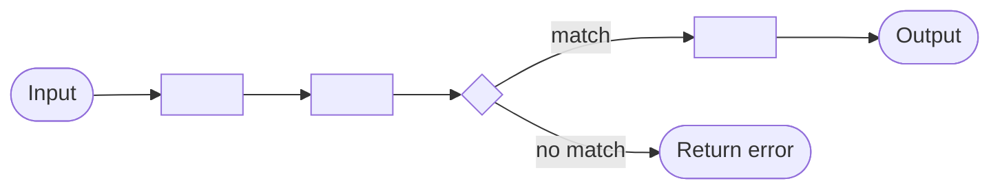

# Solution Design Document — <API_WORKFLOW_NAME>

> **Template:** UiPath API Workflows — serverless, bot-less, synchronous request-response integrations.
> **Phase 2 sections:** §2, §3, §4, §5, §10. **Phase 3 sections:** all others.

---

## Document History

| Date | Version | Author | Role | Comments |
|---|---|---|---|---|
| <DATE> | 1.0 | <AUTHOR> | Generated by AI Agent | Initial SDD generated from PDD |

---

<!-- DO NOT RENAME: uipath-planner detects SDDs via this exact heading or the marker below. -->
<!-- planner-handoff:v1 -->
## Planner Handoff

| Field | Value |
|---|---|
| **Status** | <draft \| ready — Lane A derives tasks only from ready> |
| **Execution autonomy** | <autonomous \| interactive> |
| **Delivery model** | <cloud \| automation-suite <VERSION_IF_KNOWN> \| standalone \| unspecified> |
| **SDD scope** | <single-product \| solution> |
| **Solution root SDD** | <PATH_TO_SOLUTION_ROOT_SDD — solution scope only; omit all four solution rows for single-product> |
| **Solution ID** | <SOLUTION_NAME_KEBAB> |
| **Project SDD role** | child |
| **Independently executable** | no — Lane A derives tasks only via the Solution root |
| **Project list section** | §10 Project Structure + §5 Connectors |
| **Tasks file** | `<API_WORKFLOW_NAME_KEBAB>-tasks.md` |
| **Generated by** | uipath-planner |
| **Generation date** | <YYYY-MM-DD> |
| **Template validation** | <pending \| passed — set to passed with the ready flip> |

---

<!--
EMIT THIS BLOCK ONLY when Execution autonomy: autonomous.
Skip entirely in interactive mode (decisions were checkpoint-reviewed).
See sdd-generation-guide.md Phase 3 Step 2 item 3 for the format spec.
Non-RPA scope: rows collapse to scope + product-specific Level-1.5-equivalent.
-->
## Decisions Made

> Autonomous mode picked the architectural decisions below without a user checkpoint. Override by rerunning in Interactive mode or by editing the relevant SDD section.

| # | Decision | Picked | One-sentence reason |
|---|---|---|---|
| 1 | **Scope** (Level 1) | <SINGLE_PRODUCT_OR_SOLUTION_COMPOSITION> | <REASON> |
| 2 | **Primary consumer** | <AGENT_TOOL_OR_FLOW_NODE_OR_CASE_TASK_OR_EXTERNAL_HTTP> | <REASON_FROM_PDD> |

---

<!--
EMIT THIS BLOCK ALWAYS (both execution modes).
Durable copy of the Phase 1 Recommended Scope summary — the SDD record of the
Constraint Gate outcome. See product-selection-guide.md → Summary block for the full format.
-->
## Recommended Scope

**Recommendation:** <SINGLE_PRODUCT | SOLUTION(<PRODUCT_1>, ...)>
**Delivery model:** <cloud | automation-suite <version-if-known> | standalone | unspecified — assumed cloud [SME REVIEW]>
**Blocked by platform:** <PRODUCT → ALTERNATIVE_APPLIED (matrix | user exclusion), ... | none>
**Need profile:** <ONE_LINE_CORE_NEED_AND_TARGET_KPI>

---

<!--
EMIT THIS BLOCK ONLY when at least one [SME REVIEW] item remains after Step 1.5 resolution.
Skip entirely when no review items are open.
See sdd-generation-guide.md Phase 3 Step 2 item 4 for the format spec.
-->
## Action Required — SME Review Items

| # | Section | Item | Question | Default applied | Blocking |
|---|---|---|---|---|---|
| 1 | <SECTION> | <ITEM> | <QUESTION> | <DEFAULT> | <yes/no> |

> These items are marked `[SME REVIEW]` in the document. Default-carried items (Blocking = no) do not block task derivation — the automation is built on the recorded defaults, which must be verified before production sign-off. Any Blocking = yes item keeps the handoff at `Status: draft`.

---

## Table of Contents

1. API Workflow Overview
2. Input Schema
3. Output Schema
4. Execution Flow
5. Connectors & External Calls
6. Error Handling
7. Performance & Scaling
8. Security & Authentication
9. Consumers
10. Project Structure
11. Testing Strategy
12. Next Steps

---

## 1. API Workflow Overview

| Field | Value |
|---|---|
| **API Workflow name** | <API_WORKFLOW_NAME> |
| **Objective** | <OBJECTIVE> |
| **Primary use case** | <COMPOSITE_SERVICE / DATA_RETRIEVAL / DATA_TRANSFORMATION / INTEGRATION> |
| **Invocation pattern** | Synchronous request-response |
| **Expected latency** | <MILLISECONDS_OR_SECONDS> |
| **Expected throughput** | <CALLS_PER_MINUTE> |
| **Source PDD** | <PATH_OR_LINK_TO_PDD> |

### In Scope

- <CAPABILITY_1>

### Out of Scope

- <CAPABILITY_1>

### Assumptions

<!-- Assumptions the design relies on. Verify before build; promote to [SME REVIEW] if unconfirmed. -->

- <ASSUMPTION_1>
- <ASSUMPTION_2>
- <ASSUMPTION_3>

---

## 2. Input Schema

<!-- JSON schema for the parameters the caller provides.
     Use a table for clarity; the implementation skill will generate the actual JSON schema. -->

| Field | Type | Required | Description | Example |
|---|---|---|---|---|
| <FIELD_NAME> | <string / number / boolean / object / array> | <YES/NO> | <DESCRIPTION> | `<EXAMPLE_VALUE>` |

### Sample Input

```json
{
  "<FIELD_NAME>": "<EXAMPLE_VALUE>"
}
```

---

## 3. Output Schema

<!-- JSON schema for the data returned to the caller. -->

| Field | Type | Always Present | Description | Example |
|---|---|---|---|---|
| <FIELD_NAME> | <TYPE> | <YES/NO> | <DESCRIPTION> | `<EXAMPLE_VALUE>` |

### Sample Output

```json
{
  "<FIELD_NAME>": "<EXAMPLE_VALUE>"
}
```

---

## 4. Execution Flow

<!-- High-level steps the API workflow performs. DO NOT include JavaScript — the implementation skill
     handles that. Describe logical steps and data flow. -->



### Step Details

| # | Step | Activity Type | Input | Output | Notes |
|---|---|---|---|---|---|
| 1 | <STEP_NAME> | <CONNECTOR / HTTP / SCRIPT / IF / FOR_EACH / TRY_CATCH> | <INPUT_FIELDS> | <OUTPUT_FIELDS> | <NOTES> |

---

## 5. Connectors & External Calls

### Integration Service Connectors

| Connector | Operation | Called In Step | Input | Output |
|---|---|---|---|---|
| <CONNECTOR_NAME> (Workday/Zendesk/Salesforce/etc.) | <OPERATION> | <STEP_NUMBER> | <INPUT> | <OUTPUT> |

### Direct HTTP Calls

<!-- Used when no connector exists for the target system. -->

| Target | Method | Endpoint | Called In Step | Purpose |
|---|---|---|---|---|
| <SYSTEM_NAME> | <GET/POST/PUT/DELETE> | <ENDPOINT_URL> | <STEP_NUMBER> | <PURPOSE> |

### Integration Service Connections

<!-- Consolidated view of every Integration Service connection and how it is provisioned: reuse an existing IS connector, custom-build a connector, or call the system over direct HTTP. Access Method values: `Integration Service — <CONNECTOR_SLUG>`, `Custom connector — <CONNECTOR_SLUG>`, or `Direct HTTP`. Ties the Integration Service Connectors and Direct HTTP Calls tables above to an explicit access method. -->

| Connector | System | Access Method | Used By |
|---|---|---|---|
| <CONNECTOR_NAME> | <SYSTEM> | <ACCESS_METHOD> | <STEPS> |

---

## 6. Error Handling

### Known Error Scenarios

| Error Type | Source | HTTP Status to Return | Response Body |
|---|---|---|---|
| <VALIDATION_ERROR> | Input validation | 400 | `{ "error": "<MESSAGE>" }` |
| <EXTERNAL_FAILURE> | Connector/HTTP call fails | 502 | `{ "error": "<MESSAGE>" }` |
| <NOT_FOUND> | Upstream resource missing | 404 | `{ "error": "<MESSAGE>" }` |

### Retry Policy

| Operation | Retry Count | Backoff | Timeout |
|---|---|---|---|
| <OPERATION> | <NUMBER> | <STRATEGY> | <SECONDS> |

---

## 7. Performance & Scaling

| Metric | Target |
|---|---|
| p50 latency | <MILLISECONDS> |
| p99 latency | <MILLISECONDS> |
| Max throughput | <CALLS_PER_SECOND> |
| Max payload size (input) | <BYTES> |
| Max payload size (output) | <BYTES> |

**Note:** API Workflows run on a serverless runtime that auto-scales. Optimization focuses on external call latency, not compute.

---

## 8. Security & Authentication

### Authentication to the API Workflow

<!-- How callers authenticate when invoking this workflow. -->

- [ ] UiPath Orchestrator token (default)
- [ ] Agent tool invocation (within agent context)
- [ ] Flow node invocation (within flow context)
- [ ] External HTTP (via Orchestrator-exposed endpoint)

### Authentication to External Systems

| External System | Auth Type | Credential Source |
|---|---|---|
| <SYSTEM_NAME> | <OAUTH / API_KEY / BASIC> | <UIPATH_ASSET / CONNECTOR_CONFIG> |

### Rate Limits

| Scope | Limit |
|---|---|
| Per caller | <CALLS_PER_MINUTE> |
| Global | <CALLS_PER_SECOND> |

### Non-Functional Requirements (supplement)

<!-- Performance / scaling → §7; security / auth → §8 above. These are the remaining cross-cutting NFRs. Fill each row; use [SME REVIEW] where unconfirmed. -->

| Dimension | Requirement / Design decision |
|---|---|
| **Availability / Resilience** | <serverless auto-scale (§7); idempotency so caller retries are safe; retry / timeout per §6 Retry Policy> |
| **Logging & Monitoring** | <request / response logging excluding sensitive fields; alerting on error-rate spikes; Insights / Orchestrator dashboards> |
| **Compliance** | <REGULATION_OR_—> |

---

## 9. Consumers

<!-- Who calls this API workflow? -->

| Consumer Type | Consumer Name | Usage Pattern |
|---|---|---|
| <AGENT / FLOW / CASE_MANAGEMENT / EXTERNAL_SYSTEM> | <NAME> | <WHEN_AND_WHY> |

---

## 10. Project Structure

<!-- Layout per the owning skill's scaffold (`uip api-workflow` inside a solution):
     Workflow.json carries the document.dsl definition; entry-points.json and bindings_v2.json
     are generated/CLI-managed. Never invent project.json / api-workflow.json / data-manager.json. -->

```text
<SOLUTION_NAME>/                     (API Workflow projects live inside a solution)
└── <API_WORKFLOW_PROJECT_NAME>/
    ├── project.uiproj
    ├── Workflow.json                (workflow definition — document.dsl)
    ├── entry-points.json
    └── bindings_v2.json
```

### Deployment Target

- Published to **Orchestrator** for consumption by agents, flows, or external callers

### Solution / Project Breakdown

<!-- Every buildable project in the solution: its product, source repo, Orchestrator folder, and run mode. One row per project (single row for a single-project solution). -->

| Project | Product (RPA / API / Agent / …) | GitHub Repository | Folder | Attended / Unattended |
|---|---|---|---|---|
| <PROJECT_NAME> | <PRODUCT> | <GIT_URL_OR_REPO> | <FOLDER_PATH> | <ATTENDED / UNATTENDED / N-A> |

### Reusable Components

<!-- Components reused from an existing library vs. new reusable components this build will publish. -->

| Type (reused / new-reusable) | Name | Details |
|---|---|---|
| reused | <COMPONENT_NAME> | <SOURCE_LIBRARY_AND_VERSION> |
| new-reusable | <COMPONENT_NAME> | <WHAT_IT_ENCAPSULATES_AND_CONSUMERS> |

### Environments (DEV / UAT / PROD)

<!-- Per-environment Orchestrator/tenant and folder targets. Fill with [SME REVIEW] if the deployment team has not confirmed. -->

| Item | DEV | UAT | PROD | Used By |
|---|---|---|---|---|
| Orchestrator + Tenant/Service | <URL_OR_TENANT> | <URL_OR_TENANT> | <URL_OR_TENANT> | <PROJECTS_OR_ALL> |
| Folder | <FOLDER_PATH> | <FOLDER_PATH> | <FOLDER_PATH> | <PROJECTS_OR_ALL> |

---

## 11. Testing Strategy

### Canonical Test Cases

| Test ID | Input | Expected Output | Expected Latency |
|---|---|---|---|
| T-01 | `<INPUT_JSON>` | `<OUTPUT_JSON>` | < <MILLISECONDS> |

### Error Path Tests

| Test ID | Input | Expected HTTP Status | Expected Error Body |
|---|---|---|---|
| T-E1 | `<INVALID_INPUT>` | 400 | `<EXPECTED_ERROR>` |

### Load Tests

<!-- For high-throughput API workflows. -->

| Scenario | Load Profile | Success Criteria |
|---|---|---|
| <SCENARIO> | <CALLS_PER_SECOND_AND_DURATION> | <p99_LATENCY_AND_ERROR_RATE> |

---

## 12. Next Steps

This SDD captures architecture and decisions. To generate the implementation task list and execute the build, load `uipath-planner` with this SDD path:

> Load `uipath-planner`. SDD path: `<this-file>`.

The planner detects the `## Planner Handoff` header, parses §10 Project Structure and §5 Connectors, derives the per-skill task list (routing each task to `uipath-api-workflow`, `uipath-platform`, etc.), writes `<API_WORKFLOW_NAME_KEBAB>-tasks.md` alongside this SDD, and emits live `TaskCreate` calls. If `Execution autonomy: interactive`, it enters plan mode for task review before execution.

Implementation tasks **do not live in this SDD** — they live in the planner's output.

---

**End of Solution Design Document.**
