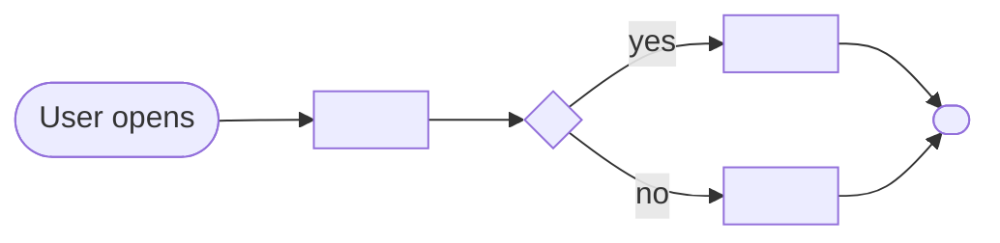

# Solution Design Document — <APP_NAME>

> **Template:** UiPath Apps (low-code). The on-prem alternative to Coded Apps and the documented fallback when Coded Apps is blocked (Automation Suite / standalone — see [platform-availability-guide.md](../../references/platform-availability-guide.md)).
> **Scope: a STANDALONE low-code App** (page/dashboard/data-entry web app). No CLI or skill in this toolchain builds one — this SDD designs it fully; the **build is a manual deliverable** in the UiPath Apps designer (a future `uipath-apps` builder skill is tracked separately). The app's data sources and bound processes ARE buildable and route to their specialists via Lane A.
> **Redirect — do NOT use this template** when the "app" is a HITL / approval form or an **agent-escalation** surface (Action Center task): route the HITL node to `uipath-human-in-the-loop`, an agent escalation to `uipath-agents`, or a Coded **Action** App to `uipath-coded-apps`. Those paths have real tooling; only the standalone case is a manual build. See §2.
> **Phase 2 sections:** §2, §3, §4, §5, §6, §9. **Phase 3 sections:** all others.

---

## Document History

| Date | Version | Author | Role | Comments |
|---|---|---|---|---|
| <DATE> | 1.0 | <AUTHOR> | Generated by AI Agent | Initial SDD generated from PDD |

---

<!-- DO NOT RENAME: uipath-planner detects SDDs via this exact heading or the marker below. -->
<!-- planner-handoff:v1 -->
## Planner Handoff

| Field | Value |
|---|---|
| **Execution autonomy** | <autonomous \| interactive> |
| **Delivery model** | <cloud \| automation-suite <VERSION_IF_KNOWN> \| standalone \| unspecified> |
| **SDD scope** | <single-product \| solution> |
| **Project list section** | §9 Integrated Components (the app itself is a manual Apps-designer build — see §10) |
| **Tasks file** | `<APP_NAME_KEBAB>-tasks.md` |
| **Generated by** | uipath-planner |
| **Generation date** | <YYYY-MM-DD> |

---

<!--
EMIT THIS BLOCK ONLY when Execution autonomy: autonomous. Skip in interactive mode.
-->
## Decisions Made

> Autonomous mode picked the architectural decisions below without a user checkpoint. Override by rerunning in Interactive mode or by editing the relevant SDD section.

| # | Decision | Picked | One-sentence reason |
|---|---|---|---|
| 1 | **Scope** (Level 1) | <SINGLE_PRODUCT_OR_SOLUTION_COMPOSITION> | <REASON> |
| 2 | **Low-code Apps vs Coded Apps** | UiPath Apps (low-code) | <REASON — usually: Coded Apps blocked on this delivery model> |

---

<!--
EMIT THIS BLOCK ALWAYS (both execution modes). Durable copy of the Phase 1 Recommended Scope summary.
-->
## Recommended Scope

**Recommendation:** <SINGLE_PRODUCT | SOLUTION(<PRODUCT_1>, ...)>
**Delivery model:** <cloud | automation-suite <version-if-known> | standalone | unspecified — assumed cloud [SME REVIEW]>
**Blocked by platform:** <e.g., Coded Apps → UiPath Apps (low-code) (matrix), ... | none>

---

<!-- EMIT THIS BLOCK ONLY when at least one [SME REVIEW] item remains. -->
## Action Required — SME Review Items

| # | Section | Item | Question |
|---|---|---|---|
| 1 | <SECTION> | <ITEM> | <QUESTION> |

> These items are marked `[SME REVIEW]` in the document. The app can be designed with defaults, but these must be verified before build.

---

## Table of Contents

1. App Overview
2. App Type
3. Pages & Layout
4. Controls & Data Binding
5. Data Sources
6. Events & Rules
7. User Flows
8. Error Handling
9. Integrated Components
10. Build & Delivery
11. Testing Strategy
12. Next Steps

---

## 1. App Overview

| Field | Value |
|---|---|
| **App name** | <APP_NAME> |
| **Objective** | <OBJECTIVE> |
| **Primary users** | <USER_ROLES> |
| **Trigger** | <HOW_IS_THE_APP_OPENED — user navigation / launched from an automation / Action Center task> |
| **Expected concurrent users** | <NUMBER> |

### In Scope

- <FEATURE_1>

### Out of Scope

- <FEATURE_1>

---

## 2. App Type

This template covers **standalone** low-code UiPath Apps only:

- [ ] **Page-based app** — users navigate pages / dashboards (most common)
- [ ] **Process-launcher app** — primarily starts/monitors Orchestrator processes

> **Redirect (not this template).** A **HITL / approval form** → `uipath-human-in-the-loop`. An **agent-escalation** Action Center surface → `uipath-agents` (it provisions the App solution-binding). A code-first **Action app** → `uipath-coded-apps` (`uip codedapp publish -t Action`). Those have tooling; a standalone low-code App does not.

**Built in:** UiPath Apps low-code designer (drag-and-drop). No source repository, no NuGet, no `.uipath/` project — the build is manual (§10).

---

## 3. Pages & Layout

| Page | Purpose | Who Sees It | Key Layout (containers / sections) |
|---|---|---|---|
| <PAGE_NAME> | <PURPOSE> | <ROLE> | <LAYOUT_NOTES> |

---

## 4. Controls & Data Binding

<!-- Major controls per page and what each binds to. Architectural, not pixel-level. -->

| Control | Type | On Page | Bound To (data source / entity field / process output) |
|---|---|---|---|
| <CONTROL_NAME> | <TABLE / FORM / BUTTON / DROPDOWN / CHART / etc.> | <PAGE> | <BINDING> |

---

## 5. Data Sources

<!-- Low-code Apps bind to Data Service entities, Orchestrator processes/queues, Integration Service, or app variables. -->

| Source | Type | Purpose | Read/Write |
|---|---|---|---|
| <SOURCE_NAME> | <DATA_SERVICE_ENTITY / ORCHESTRATOR_PROCESS / QUEUE / INTEGRATION_SERVICE / APP_VARIABLE> | <PURPOSE> | <READ / WRITE / READ-WRITE> |

> Data Service entities and processes listed here are **buildable** — they become tasks routed to `uipath-platform` (entities, queues) or `uipath-rpa` (processes) in §9 / Lane A.

---

## 6. Events & Rules

<!-- Low-code rules: on control event → action. No code; describe the rule intent. -->

| Trigger | Rule (intent) | Effect |
|---|---|---|
| <e.g., Submit button clicked> | <e.g., validate inputs, then start process X> | <NAVIGATE / START_PROCESS / SET_VALUE / OPEN_URL / CREATE_ENTITY_RECORD> |

---

## 7. User Flows

### Flow: <FLOW_NAME>

**Description:** <NARRATIVE_OF_THE_FLOW>

---

## 8. Error Handling

| Error Scenario | User-Facing Behavior | Notes |
|---|---|---|
| Data source unavailable | <SHOW_MESSAGE / DISABLE_CONTROL> | <NOTES> |
| Process start fails | <SHOW_MESSAGE / RETRY> | <NOTES> |
| Validation error | <INLINE_MESSAGE> | <NOTES> |

---

## 9. Integrated Components

> The app itself is a manual build (§10). Its **data sources and bound processes are buildable** and route to specialists via Lane A.

| Component | Type | Build route | Context |
|---|---|---|---|
| <ENTITY_NAME> | Data Service entity | `uipath-platform` | <WHY_THE_APP_NEEDS_IT> |
| <PROCESS_NAME> | RPA process | `uipath-rpa` → deploy via `uipath-solution`/`uipath-platform` | <WHEN_THE_APP_STARTS_IT> |
| <QUEUE_NAME> | Orchestrator queue | `uipath-platform` | <CONTEXT> |

---

## 10. Build & Delivery

> **Manual deliverable.** UiPath Apps (low-code) has no CLI or skill in this toolchain. The build is performed by a maker in the **UiPath Apps designer** (Cloud or Automation Suite), using this SDD as the specification. A future `uipath-apps` builder skill is tracked separately; until it exists, do not emit an automated build task for the app.

**Build steps (manual, for the maker):**

1. Open the UiPath Apps designer on the target tenant.
2. Recreate the pages (§3), controls and bindings (§4), data sources (§5), events/rules (§6) per this SDD.
3. Ensure the §9 integrated components (entities, queues, processes) are built and deployed first.
4. Publish the app; set visibility/permissions per the user roles in §1.

**Deployment target:** <CLOUD_TENANT | AUTOMATION_SUITE_TENANT>

---

## 11. Testing Strategy

### Canonical Test Cases

| Test ID | User Flow | Input | Expected Outcome |
|---|---|---|---|
| T-01 | <FLOW_NAME> | <INPUT> | <EXPECTED_APP_STATE> |

### Manual Test Checklist

- Each page renders with the correct controls and bindings.
- Each event/rule fires the intended effect (navigate / start process / write entity).
- Data-source read/write round-trips correctly.
- Error scenarios (§8) show the designed user-facing behavior.

> Low-code Apps are validated manually in the designer/preview — there is no unit/E2E harness in this toolchain. The bound processes and entities have their own tests via their specialists.

---

## 12. Next Steps

This SDD captures the app design and decisions. To generate the task list for the app's **buildable dependencies** (data sources, processes, queues), load `uipath-planner` with this SDD path:

> Load `uipath-planner`. SDD path: `<this-file>`.

Lane A parses §9 Integrated Components, derives tasks for the buildable dependencies (routed to `uipath-platform` / `uipath-rpa` / `uipath-solution`), and writes `<APP_NAME_KEBAB>-tasks.md`. **The app itself is built manually in the UiPath Apps designer per §10** — no automated build task is emitted for it.

Implementation tasks **do not live in this SDD** — they live in the planner's output.

---

**End of Solution Design Document.**
