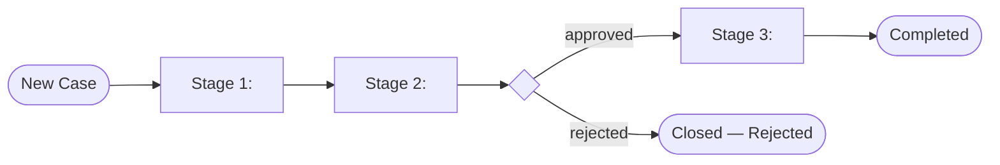

# Solution Design Document — <PROCESS_NAME>

> **Template:** Case Management — organizes work into stages with tasks, SLA rules, and escalation.
> **Phase 2 sections:** §3, §4, §7, §13, §14, §15. **Phase 3 sections:** all others.

---

## Document History

| Date | Version | Author | Role | Comments |
|---|---|---|---|---|
| <DATE> | 1.0 | <AUTHOR> | Generated by AI Agent | Initial SDD generated from PDD |

---

<!-- DO NOT RENAME: uipath-planner detects SDDs via this exact heading or the marker below. -->
<!-- planner-handoff:v1 -->
## Planner Handoff

| Field | Value |
|---|---|
| **Status** | <draft \| ready — Lane A derives tasks only from ready> |
| **Execution autonomy** | <autonomous \| interactive> |
| **Delivery model** | <cloud \| automation-suite <VERSION_IF_KNOWN> \| standalone \| unspecified> |
| **SDD scope** | <single-product \| solution> |
| **Solution root SDD** | <PATH_TO_SOLUTION_ROOT_SDD — solution scope only; omit all four solution rows for single-product> |
| **Solution ID** | <SOLUTION_NAME_KEBAB> |
| **Project SDD role** | child |
| **Independently executable** | no — Lane A derives tasks only via the Solution root |
| **Project list section** | §15 Project Structure + §14 Integrated Components |
| **Tasks file** | `<CASE_NAME_KEBAB>-tasks.md` |
| **Generated by** | uipath-planner |
| **Generation date** | <YYYY-MM-DD> |
| **Template validation** | <pending \| passed — set to passed with the ready flip> |

---

<!--
EMIT THIS BLOCK ONLY when Execution autonomy: autonomous.
Skip entirely in interactive mode (decisions were checkpoint-reviewed).
See sdd-generation-guide.md Phase 3 Step 2 item 3 for the format spec.
Non-RPA scope: rows collapse to scope + product-specific Level-1.5-equivalent.
-->
## Decisions Made

> Autonomous mode picked the architectural decisions below without a user checkpoint. Override by rerunning in Interactive mode or by editing the relevant SDD section.

| # | Decision | Picked | One-sentence reason |
|---|---|---|---|
| 1 | **Scope** (Level 1) | <SINGLE_PRODUCT_OR_SOLUTION_COMPOSITION> | <REASON> |
| 2 | **Stage model** | <NUMBER_OF_STAGES_AND_LINEAR_OR_BRANCHED> | <REASON_FROM_PDD> |

---

<!--
EMIT THIS BLOCK ALWAYS (both execution modes).
Durable copy of the Phase 1 Recommended Scope summary — the SDD record of the
Constraint Gate outcome. See product-selection-guide.md → Summary block for the full format.
-->
## Recommended Scope

**Recommendation:** <SINGLE_PRODUCT | SOLUTION(<PRODUCT_1>, ...)>
**Delivery model:** <cloud | automation-suite <version-if-known> | standalone | unspecified — assumed cloud [SME REVIEW]>
**Blocked by platform:** <PRODUCT → ALTERNATIVE_APPLIED (matrix | user exclusion), ... | none>
**Need profile:** <ONE_LINE_CORE_NEED_AND_TARGET_KPI>

---

<!--
EMIT THIS BLOCK ONLY when at least one [SME REVIEW] item remains after Step 1.5 resolution.
Skip entirely when no review items are open.
See sdd-generation-guide.md Phase 3 Step 2 item 4 for the format spec.
-->
## Action Required — SME Review Items

| # | Section | Item | Question | Default applied | Blocking |
|---|---|---|---|---|---|
| 1 | <SECTION> | <ITEM> | <QUESTION> | <DEFAULT> | <yes/no> |

> These items are marked `[SME REVIEW]` in the document. Default-carried items (Blocking = no) do not block task derivation — the automation is built on the recorded defaults, which must be verified before production sign-off. Any Blocking = yes item keeps the handoff at `Status: draft`.

---

## Table of Contents

1. Case Overview
2. Case Lifecycle Diagram
3. Stages
4. Tasks Grid
5. Entry / Exit Conditions
6. Business Rules
7. Data Definitions
8. SLA Rules
9. Escalations
10. Exception Handling
11. Compliance Constraints
12. Roles & RACI Matrix
13. Task Type Registry
14. Integrated Components
15. Project Structure
16. Testing Strategy
17. Next Steps

---

## 1. Case Overview

| Field | Value |
|---|---|
| **Case name** | <CASE_NAME> |
| **Objective** | <OBJECTIVE> |
| **Case type** | <CASE_TYPE — invoice case, ticket case, claim case, etc.> |
| **Expected volume** | <CASES_PER_DAY> |
| **Typical case duration** | <DURATION_RANGE> |
| **Maximum case duration** | <HARD_MAX_BEFORE_BREACH> |
| **Source PDD** | <PATH_OR_LINK_TO_PDD> |

### In Scope

- <ACTIVITY_1>

### Out of Scope

- <ACTIVITY_1>

### Assumptions

<!-- Assumptions the design relies on. Verify before build; promote to [SME REVIEW] if unconfirmed. -->

- <ASSUMPTION_1>
- <ASSUMPTION_2>
- <ASSUMPTION_3>

---

## 2. Case Lifecycle Diagram



---

## 3. Stages

<!-- Stages are BPMN-style phases in the case lifecycle. Each has entry/exit conditions and tasks. -->

| # | Stage Name | Purpose | Entry Condition | Exit Condition | SLA |
|---|---|---|---|---|---|
| 1 | <STAGE_NAME> | <PURPOSE> | <ENTRY_CONDITION> | <EXIT_CONDITION> | <SLA_DURATION> |

---

## 4. Tasks Grid

<!-- Tasks are organized as a 2D grid: tasks[lane][index].
     Lanes represent parallel execution tracks within a stage.
     Index is the sequence within a lane.
     Task Type — use the Case skill's lowercase enum EXACTLY (uipath-maestro-case consumes this SDD unchanged):
       action (human task — the only task type that may carry an SLA) · process · agent · rpa · api-workflow ·
       wait-for-timer · wait-for-connector · execute-connector-activity · case-management.
     Never invent uppercase kinds (API_WORKFLOW, HITL, RPA_PROCESS). Every task needs a prose description. -->

### Stage: <STAGE_NAME>

| Lane | Index | Task Name | Task Type | Purpose / Description | Inputs | Outputs |
|---|---|---|---|---|---|---|
| 0 | 0 | <TASK_NAME> | <action / process / agent / rpa / api-workflow / wait-for-timer / wait-for-connector / execute-connector-activity / case-management> | <PURPOSE> | <INPUT_FIELDS> | <OUTPUT_FIELDS> |
| 0 | 1 | <TASK_NAME> | <TASK_TYPE> | <PURPOSE> | <INPUT_FIELDS> | <OUTPUT_FIELDS> |
| 1 | 0 | <TASK_NAME> | <TASK_TYPE> | <PURPOSE> | <INPUT_FIELDS> | <OUTPUT_FIELDS> |

<!-- Repeat per stage. -->

---

## 5. Entry / Exit Conditions

<!-- Conditions use the Case skill's WHEN + IF format (uipath-maestro-case consumes this SDD unchanged):
     WHEN = a rule type from the Case schema — one of: case-entered · selected-stage-completed("Stage") ·
       selected-stage-exited("Stage") · selected-tasks-completed("Task",...) · current-stage-entered ·
       required-stages-completed · required-tasks-completed · wait-for-connector · adhoc ·
       runs-sequentially · user-selected-stage. Never a free-form expression in the WHEN cell.
     IF = optional JavaScript conditionExpression over case variables (e.g., applicationStatus == "Approved").
     Exit semantics are two separate fields: Exit Type (exit-only / return-to-origin / wait-for-user) AND
     Marks Complete (Yes/No). Pairing constraint (schema-enforced):
       stage exit Marks Complete: Yes → WHEN must be required-tasks-completed or wait-for-connector;
       case exit Marks Complete: Yes → WHEN must be required-stages-completed or wait-for-connector.
     No stage skip conditions exist in the schema. SLA only on the case, stages, and `action` tasks. -->

### Stage entry conditions

| Stage | WHEN (rule type) | IF (condition expression) | Notes |
|---|---|---|---|
| <STAGE_NAME> | <RULE_TYPE> | <JS_EXPRESSION_OR_—> | <NOTES> |

### Stage exit conditions

| Stage | WHEN (rule type) | IF (condition expression) | Exit Type | Marks Stage Complete | Next Stage |
|---|---|---|---|---|---|
| <STAGE_NAME> | <RULE_TYPE> | <JS_EXPRESSION_OR_—> | <exit-only / return-to-origin / wait-for-user> | <Yes / No> | <TARGET_STAGE_OR_—> |

### Case exit conditions

| WHEN (rule type) | IF (condition expression) | Marks Case Complete | Final Status |
|---|---|---|---|
| <RULE_TYPE — required-stages-completed typical> | <JS_EXPRESSION_OR_—> | <Yes / No> | <COMPLETED / REJECTED / CANCELLED> |

### Task entry conditions

| Task | WHEN (rule type) | IF (condition expression) |
|---|---|---|
| <TASK_NAME> | <RULE_TYPE> | <JS_EXPRESSION_OR_—> |

---

## 6. Business Rules

<!-- Extract every business rule from the PDD. Assign IDs if the PDD does not.
     Include the regulatory authority when the rule has a legal or compliance basis.
     Rules must reference the task(s) where they are enforced — this links rules to implementation. -->

| ID | Rule Name | Trigger Point | Condition | Action | Affected Tasks | Source / Authority |
|---|---|---|---|---|---|---|
| BR-01 | <RULE_NAME> | <STAGE_AND_TASK> | <WHEN_DOES_IT_APPLY> | <WHAT_TO_DO> | <TASK_NAMES_FROM_§4> | <REGULATORY_CITATION_OR_BUSINESS_SOURCE> |

---

## 7. Data Definitions

<!-- Define the data objects that flow through the case lifecycle.
     Use JSON schema style for Case Management (case data is JSON-based).
     Keep objects flat — no deep nesting. Max 15 fields per object.
     Default to `string` unless the PDD specifies numeric, date, or boolean operations. -->

### Case Data Object

<!-- The primary case record that persists across all stages. -->

| Field | Type | Source | Stage Written | Description | Sensitivity |
|---|---|---|---|---|---|
| <FIELD_NAME> | <string / number / boolean / date> | <SOURCE_SYSTEM_OR_STAGE> | <STAGE_NUMBER> | <DESCRIPTION> | <PHI / PII / Internal / Public> |

### Supporting Data Objects

<!-- Secondary objects created or consumed during the case lifecycle (e.g., notification records, compliance forms, care plans). -->

#### <OBJECT_NAME>

| Field | Type | Description |
|---|---|---|
| <FIELD_NAME> | <TYPE> | <DESCRIPTION> |

### Data Flow

<!-- How data moves between stages and external systems. -->

| From | To | Data | Trigger | Frequency |
|---|---|---|---|---|
| <SOURCE_STAGE_OR_SYSTEM> | <TARGET_STAGE_OR_SYSTEM> | <DATA_FIELDS> | <EVENT> | <PER_CASE / BATCH / SCHEDULED> |

---

## 8. SLA Rules

| SLA ID | Applies To | Type | Duration / Condition | At-Risk Threshold |
|---|---|---|---|---|
| SLA-01 | <STAGE_OR_CASE> | <TIME_BASED / CONDITION_BASED> | <DURATION_OR_EXPRESSION> | <PERCENTAGE_BEFORE_BREACH> |

---

## 9. Escalations

| Escalation ID | Trigger | Action | Notify |
|---|---|---|---|
| ESC-01 | <SLA_AT_RISK / SLA_BREACHED / CONDITION> | <REASSIGN / ESCALATE / AUTO_RESOLVE> | <ROLE_OR_EMAIL> |

---

## 10. Exception Handling

<!-- Business exceptions are anticipated process-level deviations (incomplete docs, duplicates, out-of-network).
     System errors are infrastructure failures (system outage, connector timeout, auth failure).
     Separate from §9 Escalations, which cover SLA-triggered actions. -->

### Business Exceptions

| ID | Exception Name | Trigger Task | Trigger Condition | Resolution | Escalation Path | SLA Impact |
|---|---|---|---|---|---|---|
| BX-01 | <EXCEPTION_NAME> | <TASK_NAME_FROM_§4> | <HOW_TO_DETECT> | <WHAT_TO_DO> | <WHO_TO_ESCALATE_TO> | <SLA_IMPACT_DESCRIPTION> |

**Default handler:** For any unanticipated business exception, <DEFAULT_ACTION>.

### System Errors

| ID | Error Name | Trigger Task | Trigger Condition | Retry Policy | Action |
|---|---|---|---|---|---|
| SE-01 | <ERROR_NAME> | <TASK_NAME_FROM_§4> | <HOW_TO_DETECT> | <RETRY_COUNT_AND_BACKOFF> | <WHAT_TO_DO> |

**Default handler:** For any unanticipated system error, <DEFAULT_ACTION>.

---

## 11. Compliance Constraints

<!-- Regulatory and compliance requirements that constrain implementation decisions.
     Only include constraints that directly affect how tasks are built or configured.
     Reference the task or stage where each constraint is enforced. -->

| Regulation / Standard | Applies To | Constraint | Implementation Impact |
|---|---|---|---|
| <REGULATION_NAME> | <STAGE_OR_TASK> | <WHAT_IS_REQUIRED_OR_PROHIBITED> | <HOW_THIS_CONSTRAINS_THE_BUILD> |

### Audit & Traceability Requirements

- <AUDIT_REQUIREMENT_1>

---

## 12. Roles & RACI Matrix

### Role Definitions

| Role | Primary Responsibilities | Key Decisions | Classification |
|---|---|---|---|
| <ROLE_NAME> | <RESPONSIBILITIES> | <DECISIONS> | <INTERNAL / EXTERNAL / REGULATORY> |

### RACI Matrix

<!-- R = Responsible, A = Accountable, C = Consulted, I = Informed.
     Map roles to stages. Use this to configure task assignments and notification targets. -->

| Stage | <ROLE_1> | <ROLE_2> | <ROLE_3> | <ROLE_4> |
|---|---|---|---|---|
| <STAGE_NAME> | <R/A/C/I/—> | <R/A/C/I/—> | <R/A/C/I/—> | <R/A/C/I/—> |

---

## 13. Task Type Registry

<!-- Each task maps to a taskTypeId from the registry. Registry resolution happens at implementation time;
     this section lists the *kinds* of tasks needed so the registry query can target them. -->

| Task Name (from §4) | Task Type Kind | Implementation |
|---|---|---|
| <TASK_NAME> | RPA | Invokes a Studio RPA process |
| <TASK_NAME> | AGENT | Invokes a UiPath Agent |
| <TASK_NAME> | API_WORKFLOW | Invokes an API Workflow |
| <TASK_NAME> | CONNECTOR_ACTIVITY | Integration Service connector action |
| <TASK_NAME> | CONNECTOR_TRIGGER | Integration Service connector trigger |
| <TASK_NAME> | HITL | Human-in-the-loop approval task |

---

## 14. Integrated Components

### RPA Processes Invoked

| Process Name | Called From Task | Purpose |
|---|---|---|
| `<PROCESS_NAME>` | <TASK_NAME> | <PURPOSE> |

### Agents Invoked

| Agent Name | Called From Task | Purpose |
|---|---|---|
| `<AGENT_NAME>` | <TASK_NAME> | <PURPOSE> |

### API Workflows Invoked

| API Workflow Name | Called From Task | Purpose |
|---|---|---|
| `<API_WORKFLOW_NAME>` | <TASK_NAME> | <PURPOSE> |

### Integration Service Connectors

| Connector | Called From Task | Operation |
|---|---|---|
| <CONNECTOR_NAME> | <TASK_NAME> | <OPERATION> |

### Integration Service Connections

<!-- Every Integration Service connection and how it is provisioned: reuse an existing IS connector, custom-build a connector, or call the system over direct HTTP. Access Method values: `Integration Service — <CONNECTOR_SLUG>`, `Custom connector — <CONNECTOR_SLUG>`, or `Direct HTTP`. Complements the Integration Service Connectors table above (connector + task + operation). -->

| Connector | System | Access Method | Used By |
|---|---|---|---|
| <CONNECTOR_NAME> | <SYSTEM> | <ACCESS_METHOD> | <TASKS> |

### IXP / Document Understanding Models

<!-- Extraction from semi-structured documents (invoices, forms) consumed by this project. Implementation routes to uipath-ixp; the model is built and published BEFORE its consumers. OPTIONAL subsection — omit entirely when no document extraction is in scope (exempt from the template-superset check). -->

| Model / Project | Called From Task | Document Types | Purpose |
|---|---|---|---|
| `<IXP_PROJECT_NAME>` | `<TASK_NAME>` | <DOCUMENT_TYPES> | <PURPOSE> |

### Coded Functions

<!-- Atomic deterministic logic in TypeScript, JavaScript, or Python (transform, parse, score, custom-auth API call, IS-connection query) invoked by this project. Implementation routes to uipath-functions; each function is built and published BEFORE its consumers. OPTIONAL subsection — omit entirely when no coded function is in scope (exempt from the template-superset check). -->

| Function | Called From Task | Input → Output (typed) | Purpose / Dependencies |
|---|---|---|---|
| `<FUNCTION_NAME>` | `<TASK_NAME>` | `<INPUT_MODEL>` → `<OUTPUT_MODEL>` | <PURPOSE_AND_DEPENDENCIES> |

### HITL Tasks

<!-- Inline in Case Management — use HITL task type with inline schema (do NOT route to HITL skill; Case Mgmt handles it directly). -->

| Task Name | Stage | Approval Schema | Who Approves |
|---|---|---|---|
| <TASK_NAME> | <STAGE_NAME> | <SCHEMA_SUMMARY> | <ROLE_OR_USER> |

---

## 15. Project Structure

```text
<CASE_PROJECT_NAME>/
├── caseplan.json
├── sdd.md                   (this file — uipath-maestro-case reads the literal name `sdd.md`; copy the generated SDD here under this exact name)
├── tasks.md                 (generated during planning)
├── registry-resolved.json   (audit trail)
└── content/
    └── <CASE_NAME>.bpmn     (auto-generated)
```

### Solution / Project Breakdown

<!-- Every buildable project in the solution: its product, source repo, Orchestrator folder, and run mode. One row per project (single row for a single-project solution). -->

| Project | Product (RPA / API / Agent / …) | GitHub Repository | Folder | Attended / Unattended |
|---|---|---|---|---|
| <PROJECT_NAME> | <PRODUCT> | <GIT_URL_OR_REPO> | <FOLDER_PATH> | <ATTENDED / UNATTENDED / N-A> |

### Reusable Components

<!-- Components reused from an existing library vs. new reusable components this build will publish. -->

| Type (reused / new-reusable) | Name | Details |
|---|---|---|
| reused | <COMPONENT_NAME> | <SOURCE_LIBRARY_AND_VERSION> |
| new-reusable | <COMPONENT_NAME> | <WHAT_IT_ENCAPSULATES_AND_CONSUMERS> |

### Environments (DEV / UAT / PROD)

<!-- Per-environment Orchestrator/tenant and folder targets. Fill with [SME REVIEW] if the deployment team has not confirmed. -->

| Item | DEV | UAT | PROD | Used By |
|---|---|---|---|---|
| Orchestrator + Tenant/Service | <URL_OR_TENANT> | <URL_OR_TENANT> | <URL_OR_TENANT> | <PROJECTS_OR_ALL> |
| Folder | <FOLDER_PATH> | <FOLDER_PATH> | <FOLDER_PATH> | <PROJECTS_OR_ALL> |

### Non-Functional Requirements

<!-- Consolidated NFRs. Compliance and SLA / timeliness have dedicated sections — cross-reference, do not duplicate. Fill each row with the concrete design decision; use [SME REVIEW] where unconfirmed. -->

| Dimension | Requirement / Design decision |
|---|---|
| **Security** | <credentials in Orchestrator credential / secret assets; least-privilege Integration Service connection scope; do not expose case data in the network trace; PHI / PII handling per §7 Sensitivity> |
| **Performance** | <database vs file storage; webhooks vs polling; avoid license-consuming Windows processes where a headless / cross-platform path exists> |
| **Scalability** | <expected concurrent cases; task-lane parallelism; peak-window sizing> |
| **Availability / Resilience** | <restart / retry behavior on task failure; idempotency of invoked components; timeliness targets in §8 SLA Rules> |
| **Logging & Monitoring** | <log level and sinks; alerting on SLA-at-risk / breach (§9 Escalations); Insights dashboards> |
| **Compliance** | <see §11 Compliance Constraints and its Audit & Traceability Requirements> |

---

## 16. Testing Strategy

### Canonical Test Case

| Field | Value |
|---|---|
| <FIELD_NAME> | `<TEST_VALUE>` |

### Happy Path Assertions

1. <ASSERTION_1>

### Exception Test Cases

| Exception ID | Test Setup | Trigger | Expected Outcome |
|---|---|---|---|
| BX-01 | <HOW_TO_SET_UP> | <WHAT_TRIGGERS_IT> | <EXPECTED_BEHAVIOR> |

### SLA Breach Scenarios

| Scenario | Setup | Expected Escalation |
|---|---|---|
| <SCENARIO> | <SETUP> | <EXPECTED> |

### Acceptance Criteria

<!-- Derived from PDD KPIs. Each criterion defines a measurable threshold the implementation must meet. -->

| # | Criterion | Measurement | Threshold |
|---|---|---|---|
| 1 | <CRITERION_NAME> | <HOW_MEASURED> | <PASS_THRESHOLD> |

---

## 17. Next Steps

This SDD captures architecture and decisions. To generate the implementation task list and execute the build, load `uipath-planner` with this SDD path:

> Load `uipath-planner`. SDD path: `<this-file>`.

The planner detects the `## Planner Handoff` header, parses §15 Project Structure and §14 Integrated Components, derives the per-skill task list (routing each task to `uipath-maestro-case`, `uipath-rpa`, `uipath-agents`, `uipath-platform`, etc.), writes `<CASE_NAME_KEBAB>-tasks.md` alongside this SDD, and emits live `TaskCreate` calls. If `Execution autonomy: interactive`, it enters plan mode for task review before execution.

Implementation tasks **do not live in this SDD** — they live in the planner's output.

---

**End of Solution Design Document.**
