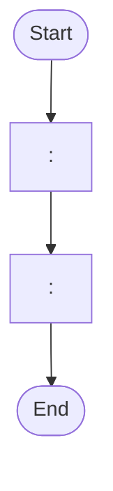
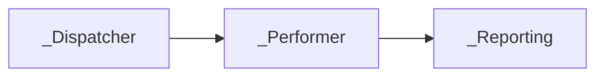

# Solution Design Document — <PROCESS_NAME>

> **Template:** RPA Process / Library / Test Automation.
> **Phase 2 sections:** §5, §9, §10, §11, §12, §13, §14. **Phase 3 sections:** all others.
> **Before filling §10-§11:** Run Level 2.5 Part A (RPA Decomposition Signals) from rpa-product-guide.md. The decomposition decision determines whether §10-§11 describe one project or a Master Project with multiple sub-projects.

---

## Document History

| Date | Version | Author | Role | Comments |
|---|---|---|---|---|
| <DATE> | 1.0 | <AUTHOR> | Generated by AI Agent | Initial SDD generated from PDD |

---

<!-- DO NOT RENAME: uipath-planner detects SDDs via this exact heading or the marker below. -->
<!-- planner-handoff:v1 -->
## Planner Handoff

| Field | Value |
|---|---|
| **Status** | <draft \| ready — Lane A derives tasks only from ready> |
| **Execution autonomy** | <autonomous \| interactive> |
| **Delivery model** | <cloud \| automation-suite <VERSION_IF_KNOWN> \| standalone \| unspecified> |
| **SDD scope** | <single-product \| solution> |
| **Solution root SDD** | <PATH_TO_SOLUTION_ROOT_SDD — solution scope only; omit all four solution rows for single-product> |
| **Solution ID** | <SOLUTION_NAME_KEBAB> |
| **Project SDD role** | child |
| **Independently executable** | no — Lane A derives tasks only via the Solution root |
| **Project list section** | <§11 \| §10 + §11 \| Project Inventory> |
| **Tasks file** | `<PROCESS_NAME_KEBAB>-tasks.md` |
| **Generated by** | uipath-planner |
| **Generation date** | <YYYY-MM-DD> |
| **Template validation** | <pending \| passed — set to passed with the ready flip> |

---

<!--
EMIT THIS BLOCK ONLY when Execution autonomy: autonomous.
Skip entirely in interactive mode (decisions were checkpoint-reviewed).
See sdd-generation-guide.md Phase 3 Step 2 item 3 for the format spec.
-->
## Decisions Made

> Autonomous mode picked the five architectural decisions below without a user checkpoint. Override by rerunning in Interactive mode or by editing the relevant SDD section.

| # | Decision | Picked | One-sentence reason |
|---|---|---|---|
| 1 | **Platform constraints** (Constraint Gate) | <DELIVERY_MODEL; BLOCKED_PRODUCTS_OR_NONE> | <REASON> |
| 2 | **Scope** (Level 1) | <SINGLE_PRODUCT_OR_SOLUTION_COMPOSITION> | <REASON> |
| 3 | **RPA sub-type** (Level 1.5) | <PROCESS_OR_LIBRARY_OR_TEST_AUTOMATION> | <REASON> |
| 4 | **Authoring mode** (Level 2) | <XAML_OR_CODED_OR_HYBRID> | <REASON> |
| 5 | **Framework** | <REFRAMEWORK_OR_SEQUENCE> | <REASON> |

---

<!--
EMIT THIS BLOCK ALWAYS (both execution modes).
Durable copy of the Phase 1 Recommended Scope summary — the SDD record of the
Constraint Gate outcome. See product-selection-guide.md → Summary block for the full format.
-->
## Recommended Scope

**Recommendation:** <SINGLE_PRODUCT | SOLUTION(<PRODUCT_1>, ...)>
**Delivery model:** <cloud | automation-suite <version-if-known> | standalone | unspecified — assumed cloud [SME REVIEW]>
**Blocked by platform:** <PRODUCT → ALTERNATIVE_APPLIED (matrix | user exclusion), ... | none>
**Need profile:** <ONE_LINE_CORE_NEED_AND_TARGET_KPI>

---

<!--
EMIT THIS BLOCK ONLY when at least one [SME REVIEW] item remains after Step 1.5 resolution.
Skip entirely when no review items are open.
See sdd-generation-guide.md Phase 3 Step 2 item 4 for the format spec.
-->
## Action Required — SME Review Items

| # | Section | Item | Question | Default applied | Blocking |
|---|---|---|---|---|---|
| 1 | <SECTION> | <ITEM> | <QUESTION> | <DEFAULT> | <yes/no> |

> These items are marked `[SME REVIEW]` in the document. Default-carried items (Blocking = no) do not block task derivation — the automation is built on the recorded defaults, which must be verified before production sign-off. Any Blocking = yes item keeps the handoff at `Status: draft`.

---

## Table of Contents

1. Process Overview
2. Process Map
3. Detailed Process Steps
4. Business Rules
5. Data Definitions
6. Value Mappings
7. Exception Handling
8. Error Handling
9. Application Inventory
10. Master Project Architecture
11. Project Structure
12. Queue Architecture
13. Implementation Mode
14. Packages
15. Credentials & Assets
16. Deployment Environment
17. Testing Strategy
18. Next Steps

---

## 1. Process Overview

| Field | Value |
|---|---|
| **Process name** | <PROCESS_NAME> |
| **Objective** | <OBJECTIVE> |
| **Department / Function** | <DEPARTMENT> — <FUNCTION> |
| **Schedule** | <FREQUENCY_AND_HOURS> |
| **Volume** | <ITEMS_PER_DAY> (peak: <PEAK_PERIOD>) |
| **Avg. handling time (manual)** | <MANUAL_TIME> |
| **Avg. handling time (automated target)** | <AUTOMATED_TIME> |
| **Exception rate** | <ESTIMATED_RATE> |
| **Source PDD** | <PATH_OR_LINK_TO_PDD> |

### Delivery Team

> Populate from the PDD's Key Contacts section. Include only roles the PDD lists — do not invent names. Omit any row where the PDD is silent. Operational runtime details (robot type, UiPath version, hosts, scalability) live in §16 Deployment Environment.

| Role | Name | Contact |
|---|---|---|
| Solution Architect | <NAME> | <EMAIL> |
| Business Analyst | <NAME> | <EMAIL> |
| Developer(s) | <NAME> | <EMAIL> |
| Project Manager | <NAME> | <EMAIL> |
| SME / Process Owner | <NAME> | <EMAIL> |

### In Scope

- <ACTIVITY_1>
- ...

### Out of Scope

- <ACTIVITY_1>
- ...

### Assumptions

<!-- Assumptions the design relies on. Verify before build; promote to [SME REVIEW] if unconfirmed. -->

- <ASSUMPTION_1>
- <ASSUMPTION_2>
- <ASSUMPTION_3>

---

## 2. Process Map

> **Build the process map STRICTLY from the steps extracted in Phase 1.** Do not invent steps. Use mermaid flowchart syntax. One node per extracted step.



| Step | Description | Application |
|---|---|---|
| <STEP_NUMBER> | <SHORT_DESCRIPTION> | <APP_NAME> |

---

## 3. Detailed Process Steps

> **Single summary table for ALL steps.** Add Step Details subsections ONLY for complex steps.

### Step Summary

| # | Action | Application | Input | Output | Rules | Errors |
|---|---|---|---|---|---|---|
| <STEP_NUMBER> | <ACTION> | <APP_NAME> | <INPUT> | <OUTPUT> | <BR_IDS> | <EXCEPTION_OR_ERROR_IDS> |

### Step Details

#### Step <STEP_NUMBER> — <STEP_TITLE>

<DETAILED_DESCRIPTION_FOR_COMPLEX_STEPS_ONLY>

---

## 4. Business Rules

> **Authoring rules — read before filling the table:**
> 1. **Extract rules from the PDD** — embedded in step descriptions, Remarks columns, exception conditions, validation prose, screenshots of expected output. Number them BR-01, BR-02, ... in extraction order. Zero rules is almost never correct — re-scan if the table ends empty.
> 2. **For every output field in §5 Data Definitions, write at least one BR row capturing its validation rule.** This is non-negotiable. Validation = the rule a coding agent or test author can encode in a regex / length check / type assertion / allowed-values check. Missing validation is an SDD defect, not an `[SME REVIEW]` item.
> 3. **Validation-rule shapes** — pick the tightest one the PDD supports:
>    - **Regex** for format-shaped strings (e.g., SHA1: `^[0-9a-f]{40}$`, ISO date: `^\d{4}-\d{2}-\d{2}$`, email, phone, hex, base64)
>    - **Length range** for free text where the PDD specifies bounds (e.g., 1–50 chars)
>    - **Type** for numeric / boolean / date values (e.g., `decimal >= 0`, `boolean`, `DateTime in UTC`)
>    - **Allowed values** (enum-shaped) when the PDD lists a closed set (e.g., `{ "Approved", "Rejected", "Pending" }`)
> 4. **Tie BR rows to test oracles.** Every validation BR with a concrete example in §17 Canonical Test Case becomes a test assertion. Use the canonical input/output values from Phase 1 extraction — do NOT invent.
> 5. **Embedded rules count.** A PDD that says "the hash must be 40 lowercase hex chars" is a BR even though the PDD has no dedicated Business Rules section.

| ID | Rule Name | Description | Trigger Condition | Validation (regex / range / type / allowed values) | Affected Steps |
|---|---|---|---|---|---|
| BR-01 | <RULE_NAME> | <DESCRIPTION> | <WHEN_DOES_IT_APPLY> | <REGEX_OR_RANGE_OR_TYPE_OR_ENUM_— `n/a` ONLY if the rule is purely behavioural> | <STEP_NUMBERS> |

---

## 5. Data Definitions

> **Universal constraints — apply to both Option A and Option B:**
> 1. Keep types flat — no inheritance, no nesting more than one level deep.
> 2. Prefer small entities — ~15 properties (Option A) or keys/columns (Option B) as a working guideline, not a hard cap. Split along a domain boundary when an entity accumulates unrelated concerns; keep a cohesive entity whole even past the guideline (e.g., a 20-column source record mapping 1:1 to one system) `[DEFAULT]`.
> 3. Default every property / key to `string` unless the PDD specifies a numeric, date, or boolean operation on it. Converting later is cheaper than guessing wrong.
> 4. Name properties / keys in the PDD's vocabulary (e.g., `InvoiceNumber`, not `doc_id`).
>
> **Which option to fill in:** Generate ONLY Option A or Option B based on §13 Implementation Mode. Delete the other entirely.
> - If §13 selects Coded C# or Hybrid → use **Option A**
> - If §13 selects XAML → use **Option B**

### Option A — Coded C# / Hybrid Mode

> **Option A-specific rule:** use `record` for immutable transaction/output data, `class` for mutable working state. Prefer `record` unless mutation is required mid-workflow.


#### Transaction Data

```csharp
public record <TransactionDataType>
{
    public <TYPE> <FIELD_NAME> { get; init; }
}
```

#### Output Data

```csharp
public record <OutputDataType>
{
    public <TYPE> <FIELD_NAME> { get; init; }
}
```

#### Enums

```csharp
public enum <EnumName>
{
    <VALUE_1>,
    <VALUE_2>,
}
```

### Option B — XAML Mode

#### Transaction Data (Dictionary)

| Key | Type | Source | Description |
|---|---|---|---|
| <KEY_NAME> | <TYPE> | <SOURCE_APP_AND_FIELD> | <DESCRIPTION> |

#### Output Data (Dictionary)

| Key | Type | Description |
|---|---|---|
| <KEY_NAME> | <TYPE> | <DESCRIPTION> |

#### Status/Category Values

| Variable | Allowed Values |
|---|---|
| <VARIABLE_NAME> | <COMMA_SEPARATED_VALUES> |

---

## 6. Value Mappings

### <MAPPING_NAME> — <SOURCE_APP> to <TARGET_APP>

| Source Value | Target Value |
|---|---|
| `<SOURCE_1>` | `<TARGET_1>` |

---

## 7. Exception Handling

| ID | Exception Name | Trigger Step | Trigger Condition | Action |
|---|---|---|---|---|
| B1 | <EXCEPTION_NAME> | <STEP_NUMBER> | <HOW_TO_DETECT> | <WHAT_TO_DO> |

**Default handler:** For any unanticipated business exception, <DEFAULT_ACTION>.

---

## 8. Error Handling

| ID | Error Name | Trigger Step | Trigger Condition | Retry Policy | Action |
|---|---|---|---|---|---|
| E1 | <ERROR_NAME> | <STEP_NUMBER> | <HOW_TO_DETECT> | <RETRY_COUNT_AND_BACKOFF> | <WHAT_TO_DO> |

**Default handler:** For any unanticipated system error, <DEFAULT_ACTION>.

---

## 9. Application Inventory

> **List all applications.** For SaaS integrations (Salesforce, Jira, etc.), flag `Integration Service — <CONNECTOR_SLUG>` in the Access Method column (e.g., `Integration Service — salesforce`) — the implementation plan will create a task to configure the connector, and §14 only needs `UiPath.IntegrationService.Activities` for all connectors combined. For email, specify the protocol (IMAP, O365 Graph API, Exchange/EWS, POP3) — do not default to O365. See the [Package Selection Guide](../../references/package-selection-guide.md) for the full Access Method → Package mapping.

| # | Application | Interface | Access Method | Role | Interaction Pattern | Session Management |
|---|---|---|---|---|---|---|
| 1 | <APP_NAME> | <WEB/DESKTOP/API> | <URL_OR_PROTOCOL_OR_INTEGRATION_SERVICE> | <SOURCE/TARGET/UTILITY> | <READ/WRITE/READ-WRITE/TRANSIENT> | <PER_RUN/PER_ITEM> |

### Interactive Authentication / Re-auth Handoff

<!-- Conditional subsection. Emit/omit rule and guidance: references/attended-reauth-pattern-guide.md, references/pdd-analysis-guide.md. -->

| Field | Value |
|---|---|
| **Application** | <APP requiring the human login> |
| **Factor the robot cannot supply** | <HARDWARE_TOKEN / SMART_CARD / BIOMETRIC / OTP_DEVICE> |
| **Handoff point** | <process step where the robot pauses for the human> |
| **Human action** | <what the person does — e.g., insert token, complete portal login> |
| **Resume condition (state anchor)** | <observable post-login state the robot verifies before continuing — e.g., authenticated URL reached, dashboard element present> |
| **No-completion behavior** | [DEFAULT] <e.g., wait 5 min, then abort with notification> |
| **Design shape** | <A: login-before-handoff \| B: mid-run pause + state-aware resume> |

### Integration Service Connections

<!-- List every Integration Service connection and how it is provisioned: reuse an existing IS connector, custom-build a connector, or call the system over direct HTTP. Access Method values: `Integration Service — <CONNECTOR_SLUG>`, `Custom connector — <CONNECTOR_SLUG>`, or `Direct HTTP`. This complements the Access Method column of the Application Inventory table above. -->

| Connector | System | Access Method | Used By |
|---|---|---|---|
| <CONNECTOR_NAME> | <SYSTEM> | <ACCESS_METHOD> | <STEPS_OR_APPS> |

### IXP / Document Understanding Models

<!-- Extraction from semi-structured documents (invoices, forms) consumed by this project. Implementation routes to uipath-ixp; the model is built and published BEFORE its consumers. OPTIONAL subsection — omit entirely when no document extraction is in scope (exempt from the template-superset check). -->

| Model / Project | Called From Workflow / Step | Document Types | Purpose |
|---|---|---|---|
| `<IXP_PROJECT_NAME>` | `<WORKFLOW_OR_STEP>` | <DOCUMENT_TYPES> | <PURPOSE> |

---

## 10. Master Project Architecture

> **This section is produced by Level 2.5 Part A (RPA Decomposition Signals) from rpa-product-guide.md.**
> Generate EITHER Option A (Master Project) OR Option B (Single Project). **Delete the other entirely.**
> Decision rule: if 2+ decomposition signals matched in Part A → Option A. Otherwise → Option B.

### Option A — Master Project (multiple queue-connected sub-projects)

**Pattern:** <PATTERN_NAME — e.g., Dispatcher / DU Performer / Output Performer / Reporting>

**Decomposition signals matched:**
- <SIGNAL_1_FROM_LEVEL_2.5>
- <SIGNAL_2_FROM_LEVEL_2.5>

#### Sub-projects overview

> **Sub-type column:** one of Process / Library / Test Automation. Libraries and Test Automation projects do not use Orchestrator queues — put `—` in Input Queue / Output Queue for those rows.

| # | Project Name | Sub-type | Role | Framework | Input Queue | Output Queue | PDD Steps |
|---|---|---|---|---|---|---|---|
| 1 | `<NAME>_Dispatcher` | Process | <ROLE_DESCRIPTION> | Sequence | — | `<QUEUE_1>` | <STEP_NUMBERS> |
| 2 | `<NAME>_Performer` | Process | <ROLE_DESCRIPTION> | REFramework | `<QUEUE_1>` | `<QUEUE_2>` | <STEP_NUMBERS> |
| 3 | `<NAME>_Reporting` | Process | <ROLE_DESCRIPTION> | Sequence | `<QUEUE_2>` | — | — |
| 4 | `<NAME>_SharedLib` | Library | <ROLE_DESCRIPTION> | — | — | — | — |
| 5 | `<NAME>_Regression` | Test Automation | <ROLE_DESCRIPTION> | — | — | — | <TEST_STEPS> |

#### Data flow diagram



> Each sub-project has its own §11 Project Structure, §13 Implementation Mode, and §14 Packages subsection below.

### Option B — Single Project

**Decomposition signals matched:** 0-1 (threshold not met)

> Skip this section. §11 describes a single project. §12 applies only when the project defines or consumes a queue — see §12's include rule.

---

## 11. Project Structure

### Solution / Project Breakdown

<!-- Every buildable project in the solution: its product, source repo, Orchestrator folder, and run mode. Solution-wide — fill once. One row per project (single row for a single-project solution). -->

| Project | Product (RPA / API / Agent / …) | GitHub Repository | Folder | Attended / Unattended |
|---|---|---|---|---|
| <PROJECT_NAME> | <PRODUCT> | <GIT_URL_OR_REPO> | <FOLDER_PATH> | <ATTENDED / UNATTENDED / N-A> |

### Reusable Components

<!-- Components reused from an existing library vs. new reusable components this build will publish. Solution-wide — fill once. -->

| Type (reused / new-reusable) | Name | Details |
|---|---|---|
| reused | <COMPONENT_NAME> | <SOURCE_LIBRARY_AND_VERSION> |
| new-reusable | <COMPONENT_NAME> | <WHAT_IT_ENCAPSULATES_AND_CONSUMERS> |

> **For Master Project (Option A in §10):** repeat this entire section per sub-project, with a heading like "### 11.1 ProjectName_Dispatcher", "### 11.2 ProjectName_Performer", etc.
> **For Single Project (Option B in §10):** use this section once.
>
> Framework AND authoring mode (§13) together determine folder layout:
> - REFramework + XAML → REFramework structure below
> - Sequence + XAML → Sequence structure below
> - Coded C# → Coded structure below — for atomic / non-transactional scope. A transactional (REFramework-semantics) project needing coded logic defaults to **Hybrid** — keep the XAML REFramework shell, put the bounded logic in coded workflows; never hand-roll a coded transaction framework
> - Hybrid → XAML structure (REFramework or Sequence shell) + a `Workflows/` coded subset (see Coded layout note)
> - Persistence = YES (§11 Project Mode Decision) → add persistence activities to the chosen layout; mark suspend/resume points in the Workflow Inventory

### Project Type

Select the sub-type **per project** (sourced from Level 1.5 / Level 1.75 Pass C). A Master Project may mix sub-types — for example, a Performer (Process) alongside a shared Library and a Test Automation project validating the Performer.

| # | Project Name | Sub-type |
|---|---|---|
| 1 | `<PROJECT_NAME_1>` | Process |
| 2 | `<PROJECT_NAME_2>` | Library |
| 3 | `<PROJECT_NAME_3>` | Test Automation |

Sub-type reference:

- **Process** — standard end-to-end automation (default)
- **Library** — reusable component consumed by other automations (no queue I/O; published as NuGet)
- **Test Automation** — test cases validating application behavior (Test Manager integration; no Master Project queue I/O)

### Project Mode Decision

<!-- INDEPENDENT dimensions per project — never let one choice silently decide another.
     Sources: Type ← Level 1.5 · Compatibility ← PDD/§16 (Cross-platform when no desktop-UI or Windows-only
     dependency exists — headless/web/API work; Windows otherwise; legacy only when unavoidable) ·
     Authoring ← §13 / Level 2 · Attendance + Initiation ← §16 Robot & Runtime (keep §16 Trigger row aligned) ·
     Framework ← rpa-product-guide R-04 · Persistence ← in-flight human approval / async wait
     (rpa-product-guide → Long-running workflows; a modifier on the framework, not a framework) ·
     Packaging ← §18 (solution for multi-project / cross-product / team standardization; standalone nupkg publish is the single-project default).
     "Unattended + queue-triggered" is Attendance=Unattended, Initiation=Queue trigger — two columns, one truth each. -->

| # | Project | Type | Compatibility | Authoring | Attendance | Initiation | Framework | Persistence (long-running) | Packaging |
|---|---|---|---|---|---|---|---|---|---|
| 1 | `<PROJECT_NAME>` | <Process / Library / Test Automation> | <Windows / Cross-platform> | <XAML / Coded C# / Hybrid> | <Attended / Unattended / Attended-start + unattended-resume> | <Manual / Scheduled / Queue trigger / Event / API> | <Sequence / REFramework> | <YES — suspend/resume points in Workflow Inventory / NO> | <Standalone package / Solution (.uipx)> |

> **For Master Project (Option A in §10):** repeat the Recommended Structure, Workflow Inventory, and Workflow Dependencies subsections below **per sub-project**, honoring the sub-type selected in the table above.
> **Libraries and Test Automation projects inside a Master Project do not consume or produce Orchestrator queues** — their rows in §10 and §12 use `—` for Input Queue / Output Queue.

### Recommended Structure

> **Choose the layout matching the project's framework.** REFramework projects use the REF folder structure. Sequence projects use a simple flat structure.

#### REFramework layout (for Performer projects)

```text
<PROJECT_NAME>/
├── project.json
├── Main.xaml
├── Framework/
│   ├── InitAllSettings.xaml
│   ├── InitAllApplications.xaml
│   ├── GetTransactionData.xaml
│   ├── Process.xaml
│   ├── SetTransactionStatus.xaml
│   ├── CloseAllApplications.xaml
│   └── KillAllProcesses.xaml
├── Process/
│   ├── <WORKFLOW_FILE>
│   └── ...
├── Data/
│   ├── Config.xlsx
│   └── ...
└── Tests/
    └── ...
```

#### Sequence layout (for Dispatcher / Reporting / simple projects)

```text
<PROJECT_NAME>/
├── project.json
├── Main.xaml
├── Process/
│   ├── <WORKFLOW_FILE>
│   └── ...
├── Data/
│   ├── Config.xlsx
│   └── ...
└── Tests/
    └── ...
```

#### Coded layout (for Coded C# projects — §13)

<!-- Coded workflows are .cs classes extending CodedWorkflow with an [Workflow]-attributed Execute
     entry point; entry points are registered in project.json, not discovered from Main.xaml.
     The uipath-rpa skill owns the scaffold — this layout sets the SDD's structural expectation only. -->

```text
<PROJECT_NAME>/
├── project.json          (coded entry points registered here)
├── Main.cs               (entry-point coded workflow)
├── Workflows/
│   ├── <WorkflowName>.cs
│   └── ...
├── Objects/              (typed DTOs / records / enums)
├── Data/
│   └── Config.xlsx
└── Tests/
    └── <CodedTestCase>.cs
```

> **Hybrid:** use the XAML layout (REFramework or Sequence) plus a `Workflows/` folder of coded `.cs` workflows invoked via Invoke Workflow File. Do NOT emit an XAML `Main.xaml` tree for a pure Coded C# project.

### Workflow Inventory

> **For Master Project:** one workflow inventory table per sub-project. **For Single Project:** one workflow inventory table total.

| # | Workflow File | Responsibility | PDD Steps | Inputs | Outputs |
|---|---|---|---|---|---|
| 1 | `<FILENAME>` | <RESPONSIBILITY> | <STEP_NUMBERS> | <INPUT_ARGS_WITH_TYPES> | <OUTPUT_ARGS_WITH_TYPES> |

### UI Element Groups (selector inventory)

> **Include this subsection only when the project does UI automation.** Skip for headless / API-only projects. One row per Object Repository **screen** (or logical UI element group). Plan capture order top-to-bottom — the developer runs `uia-configure-target` / Indicate on each row in sequence.
> Capture method choices: `uia-configure-target` (capture from live UI; default), `Indicate` (developer-driven indication in Studio; required when the element only appears after a hover/click), `Object Repository — existing` (already captured in a referenced UILibrary package).

| # | Application | Screen | Elements (names) | Capture method |
|---|---|---|---|---|
| 1 | <APP_FROM_§9> | <SCREEN_NAME> | <COMMA_SEPARATED_ELEMENT_NAMES> | <CAPTURE_METHOD> |

### Workflow Dependencies

```text
<MAIN_WORKFLOW>
├── calls <WORKFLOW_1>
└── calls <WORKFLOW_2>
```

---

## 12. Queue Architecture

> **Include this section whenever the design defines or consumes ANY Orchestrator queue** — always for Master Project (Option A in §10), AND for a Single Project that is queue-triggered, consumes an existing queue (owned by another team), or self-dispatches. Delete only when no queue is involved. For an existing external queue, fill the Configuration table with the observed settings and mark rows the owning team controls `[SME REVIEW]`.

### Queue Definitions

| Queue Name | Producer Project | Consumer Project | Trigger Type | Max Retries |
|---|---|---|---|---|
| `<QUEUE_NAME>` | `<PRODUCER_PROJECT>` | `<CONSUMER_PROJECT>` | <QUEUE_TRIGGER / SCHEDULED / MANUAL> | <MAX_RETRIES> |

### Queue Configuration

<!-- Orchestrator-level design decisions per queue — not implementation detail. One table per queue.
     Fill each row; [SME REVIEW] where the ops team must confirm. -->

#### `<QUEUE_NAME>` — configuration

| Setting | Decision |
|---|---|
| **Unique reference** | <YES / NO> — duplicate policy: <REJECT_DUPLICATES_VIA_REFERENCE_FORMAT / ALLOW> ; reference format: `<e.g., <InvoiceNo>-<VendorId>>` |
| **Retry ownership** | <Orchestrator auto-retry ×N / REFramework retry ×N — pick ONE owner; both active = double retries> |
| **Priority / Deadline / Postpone** | <DEFAULT_PRIORITY; deadline rule; postpone rule OR —> |
| **Queue SLA / risk SLA** | <SLA_TARGET; RISK_SLA_ALERT_THRESHOLD OR —> |
| **Encryption** | <YES for PII-bearing SpecificContent / NO> |
| **Analytics fields** | <FIELDS_PROMOTED_TO_ANALYTICS_OR_—> (affects Insights) |
| **Retention / archival** | <RETENTION_DAYS; archive target storage bucket OR [SME REVIEW]> |
| **Poison items** | <handling after final retry: reporting queue + alert; reconciliation procedure> |
| **Trigger threshold** | <e.g., 1 job per N new items, max M concurrent jobs — align with §16 sizing> |

### Queue Item Schema

#### `<QUEUE_NAME>` — SpecificContent fields

| Field Name | Type | Source | Description |
|---|---|---|---|
| `<FIELD_NAME>` | <STRING/INT/BOOL> | <SOURCE_STEP_OR_VARIABLE> | <DESCRIPTION> |

#### `<QUEUE_NAME>` — Output / Analytics fields

<!-- OutputData written on success; Analytics fields promoted for Insights. `—` when unused. -->

| Field Name | Kind (Output / Analytics) | Type | Description |
|---|---|---|---|
| `<FIELD_NAME>` | <OUTPUT / ANALYTICS> | <STRING/INT/BOOL> | <DESCRIPTION> |

> **Repeat the Queue Configuration and Queue Item Schema subsections for each queue.**

### Queue Processing Rules

- Each Performer project processes one queue item at a time via REFramework's `GetTransactionData`.
- On business exception: set queue item status to **Failed** (do not retry), push item to reporting queue with exception details.
- On system error: set queue item status to **Failed** (retry per the queue's **Retry ownership** decision above), then push to reporting queue if retries exhausted.
- Dispatcher must populate ALL SpecificContent fields listed above — missing fields cause Performer failures.
- When Queue Configuration sets **Unique reference = YES**: Dispatcher sets the Reference; duplicates are rejected by Orchestrator, never deduplicated in Performer code. When **NO**: name the duplicate/idempotency owner in §16 Operational Support.

---

## 13. Implementation Mode

> **For Master Project:** specify the mode per sub-project if they differ. A Dispatcher may be XAML while a Performer with heavy data logic is Hybrid.
>
> **Before recommending Coded C#:** verify at least two checklist items from the [RPA Product Guide § Selection checklist before recommending Coded C#](../../references/rpa-product-guide.md#selection-checklist-before-recommending-coded-c) are true. "Cleaner control flow over a UI loop" is **not** a sufficient justification — XAML already has Try/Catch + Retry Scope + For Each over UIA activities. If the process body is >70% UI automation with minimal data shaping, recommend **XAML** or **Hybrid**.

**Recommendation:** <XAML / Coded C# / Hybrid>

**Justification (2-3 sentences):** Cite at least one concrete process characteristic from §3 Detailed Process Steps that drives the choice (e.g., "§3 shows 9 of 11 steps are UI driving against a browser; only step 7 involves data shaping" → XAML; or "§3 step 5 needs JSON deserialization + LINQ aggregation across 200 records, the other 8 steps are UI" → Hybrid).

**If Coded C# selected:** list the satisfied checklist items inline (e.g., "Coded C# selected: significant data shaping (regex+hash pipeline) AND custom DTOs for `TransactionData`/`OutputData`").

> **Note:** This is a preliminary recommendation. Detailed decision criteria will be applied during implementation and may adjust this choice — but the architectural recommendation must already pass the checklist.

---

## 14. Packages

> **List required NuGet packages only.** For Master Project: one table per sub-project. Infer packages from §9 Application Inventory and the process steps using the [Package Selection Guide](../../references/package-selection-guide.md) — it contains the full Application-Type → Package matrix, Integration Service vs NuGet decision rules, and a selection checklist.
>
> **Do NOT list Integration Service connectors in this table.** Integration Service connections are declared in §9 Application Inventory (Access Method = `Integration Service — <CONNECTOR_SLUG>`) and run on `UiPath.IntegrationService.Activities` — that package is the only §14 entry needed for them. See the Package Selection Guide's "Integration Service Connectors vs NuGet Packages" section for side-by-side examples.

> **Pin exact versions — "Latest" is not reproducible.** When the version cannot be known at design time, write the literal `pin at build` — the build skill resolves it and writes the exact version back here. Verify pinned versions against the §16 Studio/Robot versions for compatibility.

| Package | Version | Purpose |
|---|---|---|
| `UiPath.System.Activities` | <VERSION_OR_PIN_AT_BUILD — e.g., 24.10.5 or "pin at build"> | Core activities (data tables, files, Orchestrator, workflow operators) |
| `<PACKAGE_NAME>` | <VERSION_OR_PIN_AT_BUILD> | <WHY_NEEDED_—_REFERENCE_APP_OR_STEP> |

---

## 15. Credentials & Assets

| Asset Name | Type | Description | Notes |
|---|---|---|---|
| `<ASSET_NAME>` | <CREDENTIAL/TEXT/INT/BOOL> | <WHAT_IT_STORES> | <NOTES> |

---

## 16. Deployment Environment

> **Operational / infrastructure details.** These fields typically come from the deployment team, not the PDD. If the PDD does not provide them, fill with `[SME REVIEW]` — do not invent values. This section drives robot provisioning, pre-production checks, and version compatibility.

### Robot & Runtime

| Field | Value |
|---|---|
| **Robot type** | <ATTENDED / UNATTENDED / BOR (Back-Office) / FOR (Front-Office)> |
| **Trigger** | <QUEUE_BASED / SCHEDULED / MANUAL / EVENT> |
| **Orchestrator tenant / folder** | <TENANT_NAME> / <FOLDER_PATH> |
| **UiPath Studio version** | <e.g., 24.10.5> |
| **UiPath Robot version** | <e.g., 24.10> |
| **Orchestrator** | <Cloud / On-prem version> |
| **Cross-platform / Windows-only** | <Windows Legacy / Windows / Cross-platform> |
| **Recommended screen resolution** | <e.g., 1920×1080> (UI automation projects only) |
| **Source repository** | <GIT_URL_OR_SME_REVIEW> |
| **Shared libraries referenced** | <COMMA_SEPARATED_LIBRARY_NAMES_OR_NONE — from Step 2.5 Tenant Library Discovery> |

### Environments (DEV / UAT / PROD)

<!-- Per-environment Orchestrator/tenant and folder targets. Fill with [SME REVIEW] if the deployment team has not confirmed. -->

| Item | DEV | UAT | PROD | Used By |
|---|---|---|---|---|
| Orchestrator + Tenant/Service | <URL_OR_TENANT> | <URL_OR_TENANT> | <URL_OR_TENANT> | <PROJECTS_OR_ALL> |
| Folder | <FOLDER_PATH> | <FOLDER_PATH> | <FOLDER_PATH> | <PROJECTS_OR_ALL> |

### Development & Production Hosts

| Environment | Machine Name(s) / VM Pool | Notes |
|---|---|---|
| Development | <VM_1>, <VM_2> | <NOTES> |
| UAT | <VM_1>, <VM_2> | <NOTES> |
| Production | <VM_1>, <VM_2> | <NOTES> |

### Runtime Prerequisites

List every prerequisite required on the robot machine before first run:

- <e.g., Microsoft Excel installed (Office 365 or 2019+)>
- <e.g., Microsoft Outlook installed if using Classic Outlook activities>
- <e.g., Chrome browser + UiPath Chrome Extension>
- <e.g., Network access to SharePoint / SAP endpoints>
- <e.g., Certificate trust for internal CAs>
- <e.g., Human operator present at the machine for an interactive token login>

### Scalability & Concurrency

<!-- Size unattended capacity from the numbers, not gut feel. Inputs come from §1 (volume, handling time)
     and the SLA; [SME REVIEW] for infrastructure values the deployment team owns. -->

| Field | Value |
|---|---|
| **Volume** | <ITEMS_PER_DAY — from §1> |
| **Avg handling time (automated)** | <MINUTES_PER_ITEM — from §1> |
| **Peak window** | <TIME_WINDOW — e.g., 08:00–12:00> |
| **Completion SLA** | <e.g., all items done by 17:00 / within 2h of arrival> |
| **Exception + retry factor** | <e.g., 1.15 = 10% exceptions × avg 1.5 retries> |
| **Utilization target** | <e.g., 0.8 — leave headroom for other processes on the pool [DEFAULT]> |
| **Required runtimes** | ceil(volume × avg-minutes × retry-factor ÷ (peak-window-minutes × utilization)) = **<N>** |
| **Concurrent job limit** | <N> (Orchestrator queue trigger concurrency — align with §12 Trigger threshold) |
| **Machine template / VM pool** | <MACHINE_TEMPLATE_NAME_OR_SME_REVIEW> |
| **Robot accounts** | <N accounts; naming; foreground (UI session) / background (headless)> |
| **Session requirements** | <console / RDP; resolution per §16 Robot & Runtime; sessions available in peak window> |
| **Calendars / time zone** | <BUSINESS_CALENDAR; TZ; non-working-day policy> |
| **Overlapping-job policy** | <e.g., Stop-after-N-minutes / skip when previous still running> |
| **License assumption** | <UNATTENDED_RUNTIME_COUNT / attended licenses — [SME REVIEW]> |

### Operational Support

<!-- Production-run design decisions — how the automation behaves when things go wrong and who owns it.
     Fill each row; [SME REVIEW] where the ops team must confirm. -->

| Concern | Design decision |
|---|---|
| **Idempotency** | <duplicate-write prevention PER TARGET SYSTEM — idempotency key / pre-write existence check / queue unique reference (§12)> |
| **Checkpoint & restart** | <resume point after mid-run failure; reconciliation query that proves no item was lost or double-processed> |
| **Session recovery** | <app/browser crash recovery: kill + re-login + resume transaction / fail item; KillAllProcesses scope> |
| **Correlation & logging** | <correlation ID carried across systems (e.g., queue Reference); structured log fields: <FIELD_LIST>> |
| **Alerting** | <thresholds: consecutive failures ≥N, queue SLA at risk (§12), zero items processed in window; alert channel> |
| **Dashboards** | <Orchestrator / Insights views the ops team watches; owner> |
| **Reprocessing** | <procedure to re-run failed/poison items after a fix — who triggers it, from which queue/status> |
| **Support ownership** | <L1/L2 owner; runbook location [SME REVIEW]> |
| **Business continuity** | <manual fallback while automation is down; rollback of partial writes> |

### Security & Data Handling

<!-- Security decisions come from the security team, not the PDD — [SME REVIEW] anything unconfirmed. -->

| Concern | Design decision |
|---|---|
| **Data classification & PII** | <classification; PII fields from §5; masking rule in logs and queue items> |
| **Credentials** | <Orchestrator credential / secret assets (§15); rotation owner + cadence; no secrets in Config.xlsx or logs> |
| **Service accounts & privilege** | <robot account privileges = least required per app; asset/queue folder scope> |
| **Encryption** | <in transit (TLS to all endpoints); at rest (queue encryption §12, storage buckets)> |
| **Retention & audit** | <data retention/purge per store; audit events required; log retention> |
| **Network** | <allowlists for robot VMs; proxy requirements; internal CA certificates — owner (§16 Runtime Prerequisites)> |

### Delivery Quality Gates

<!-- Gates between "compiles" and "runs in PROD". Decisions only — procedures live with the build/deploy skills. -->

| Gate | Decision |
|---|---|
| **Package versioning** | <pinned dependency versions (§14); project semver scheme; version bump rule> |
| **Workflow Analyzer** | <ruleset / profile; enforce on publish? [DEFAULT: yes]> |
| **Source control** | <repo (§11 Solution / Project Breakdown); branch strategy; review requirement> |
| **CI validation** | <analyze + test on PR / pre-publish; pipeline owner OR — for manual> |
| **Promotion path** | <DEV → UAT → PROD (§16 Environments); approval gate per hop> |
| **Rollback** | <previous package version retained; process rollback procedure> |
| **Production smoke test** | <first-run verification after each PROD deploy — scenario + owner> |

### Non-Functional Requirements

<!-- Consolidated NFRs. These usually come from the security / deployment team, not the PDD. Fill each row with the concrete design decision; use [SME REVIEW] where unconfirmed. -->

| Dimension | Requirement / Design decision |
|---|---|
| **Security** | <see Security & Data Handling above> |
| **Performance** | <database vs file storage; webhooks vs polling; avoid license-consuming Windows processes where a headless / cross-platform path exists> |
| **Scalability** | <see Scalability & Concurrency above — required runtimes, concurrent-job limit, peak sizing> |
| **Availability / Resilience** | <see Operational Support above — idempotent retry, checkpoint/restart, session recovery> |
| **Logging & Monitoring** | <see Operational Support above — correlation, alerting, dashboards> |
| **Compliance** | <REGULATION_OR_—> |

---

## 17. Testing Strategy

### Requirements Traceability

<!-- Every PDD step and business rule maps to at least one test below. Untested rules are an SDD defect. -->

| PDD Step / Rule | Covered By (test IDs) |
|---|---|
| <STEP_OR_RULE_REF> | <TEST_IDS> |

### Canonical Test Case

| Field | Value |
|---|---|
| <FIELD_NAME> | `<TEST_VALUE>` |

### Happy Path Assertions

1. <ASSERTION_1>

### Exception Test Cases

| Exception ID | Test Setup | Trigger | Expected Outcome |
|---|---|---|---|
| B1 | <HOW_TO_SET_UP> | <WHAT_TRIGGERS_IT> | <EXPECTED_BEHAVIOR> |

### System Error Scenarios

| Error ID | Testable in Dev? | How to Simulate | Expected Outcome |
|---|---|---|---|
| E1 | <YES/NO> | <SIMULATION_METHOD> | <EXPECTED_BEHAVIOR> |

### Non-Functional Tests

<!-- Prove the §16 design, not just the happy path. `—` a row only with a stated reason. -->

| Test | Scenario | Expected |
|---|---|---|
| Performance / load | <PEAK_VOLUME_FROM_§16 run within the peak window> | SLA met; runtimes ≤ sized count |
| Concurrent robots | <N robots on the same queue> | no duplicate processing (unique reference holds); no contention errors |
| Recovery / restart | <kill job mid-transaction, restart> | checkpoint/reconciliation per §16 Operational Support — no lost or doubled items |
| Credential expiration | <expired / rotated credential asset> | clean failure + alert, no lockout, no plaintext leak in logs |
| UI compatibility | <target app/browser versions from §16> | selectors hold; capture fallbacks fire |
| Security | <robot account with designed least privilege> | process completes; over-privilege not required; PII masked in logs |

### UAT Acceptance Criteria

<!-- Business sign-off conditions — measurable, agreed before UAT starts. -->

1. <CRITERION — e.g., 50 production-representative items processed with ≥98% straight-through rate>

### Test Data & Cleanup

| Item | Decision |
|---|---|
| **Test data source** | <synthetic / anonymized production / SME-provided [SME REVIEW]> |
| **Cleanup** | <how test artifacts (queue items, records, files, emails) are removed per environment> |

### Production Verification

<!-- Post-go-live checks — pairs with §16 Delivery Quality Gates smoke test. -->

1. <e.g., first N production items verified item-by-item against the target system before unattended ramp-up>

### End-to-End Pipeline Test (Master Project only)

> **Include this subsection only for Master Project (Option A in §10).** Delete for Single Project.

| Test Scenario | Setup | Trigger | Expected Flow | Assertions |
|---|---|---|---|---|
| Happy path | <SETUP> | <TRIGGER_DISPATCHER> | Dispatcher → Queue → Performer → Queue → Reporting | <FINAL_STATE_ASSERTIONS> |
| Performer failure + retry | <SETUP_BAD_ITEM> | <TRIGGER> | Item fails in Performer, retried, succeeds on retry | Queue item retry count incremented, final status Success |
| Business exception | <SETUP_BRE_ITEM> | <TRIGGER> | Item fails in Performer with BRE, pushed to reporting | Reporting queue has item with BRE details |

---

## 18. Next Steps

This SDD captures architecture and decisions. To generate the implementation task list and execute the build, load `uipath-planner` with this SDD path:

> Load `uipath-planner`. SDD path: `<this-file>`.

The planner will:

1. Detect the `## Planner Handoff` header and read the 6 fields above.
2. Parse the project list section (per the `Project list section` field) and derive a per-skill task list.
3. Write `<PROCESS_NAME_KEBAB>-tasks.md` alongside this SDD with the task list and dependencies.
4. Emit live `TaskCreate` calls that route each task to the correct specialist (`uipath-rpa`, `uipath-platform`, `uipath-solution`, `uipath-agents`, etc.).
5. If `Execution autonomy: interactive`, enter plan mode for task review before execution.

Implementation tasks **do not live in this SDD** — they live in the planner's output. The planner is the single source of truth for skill routing and task ordering.

### Terminal artefact — packaging per the §11 Project Mode Decision

<!-- CONSTRAINT GATE: if the platform-availability-guide blocks Solutions for this SDD's
     Delivery model (standalone, AS older than 2.2510, or user exclusion), the Solution path
     below is unavailable — use the standalone path; deploy tasks route to uipath-platform
     instead of uipath-solution. -->

The build is not finished when the project folder compiles — a bare `MyProject/` folder is not the deliverable. The terminal artefact follows the **Packaging** column of §11 Project Mode Decision:

**Packaging = Solution (`.uipx`)** — required for multi-project (Master Project) builds and cross-product compositions. After the implementation specialist reports its tasks complete, load the **`uipath-solution`** skill and run:

```bash
uip solution init <SOLUTION_NAME>
uip solution project add <PROJECT_PATH> [--solution-file <SOLUTION_FILE>]    # repeat per project in the unified list
uip solution resources refresh
uip solution pack <SOLUTION_DIR> <OUTPUT_DIR>
```

The `.uipx` promotes via `uip solution publish` / `uip solution deploy run`. Full lifecycle: `uipath-solution` skill.

**Packaging = Standalone package** — a single independently-published RPA project (`.nupkg` to an Orchestrator feed) is a valid terminal artefact; UiPath supports development with and without Solutions. Package/publish routes to `uipath-rpa` (build) + `uipath-platform` (feed publish, process creation). `[DEFAULT for a single-project scope]` — pick Solution instead only when cross-product composition or team standardization on Solutions applies.

---

**End of Solution Design Document.**
