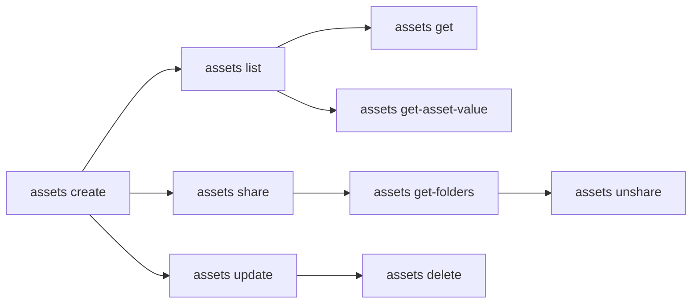

# Manage Assets

Create configuration assets, share them across folders, and manage credential rotation.

> For full option details on any command, use `--help` (e.g., `uip or assets create --help`).

## When to Use

- Setting up environment configuration (API URLs, feature flags, retry counts)
- Managing secrets and credentials used by automations at runtime
- Sharing configuration across multiple folders/teams
- Rotating credentials without redeploying processes

## Prerequisites

- Authenticated — verify with `uip login status`; if not logged in, ask the user to run `uip login` (it opens an interactive browser flow)
- Target folder exists (see [setup-environment.md](setup-environment.md))
- For Credential/Secret types: a credential store must exist (`uip or credential-stores list`)

## Flow



---

## Step 1: Create Assets

Create a named configuration value in a folder. Type defaults to Text.

```bash
uip or assets create "ApiBaseUrl" "https://api.example.com" \
  --folder-path "Finance" --type Text --output json

uip or assets create "MaxRetries" "3" \
  --folder-path "Finance" --type Integer --output json

uip or assets create "FeatureEnabled" "true" \
  --folder-path "Finance" --type Bool --output json
```

Key options:

| Option | Description |
|--------|-------------|
| `--type <type>` | `Text` (default), `Bool`, `Integer`, `Credential`, `Secret` |
| `--scope <scope>` | `Global` (default) or `PerRobot` |
| `--description <text>` | Human-readable description |
| `--tags <csv>` | Comma-separated tag names |
| `--has-default` | Asset has a default value (default: true) |
| `--credential-store-key <key>` | Required for Credential and Secret types |

For Credential and Secret types, you must provide `--credential-store-key`:

```bash
uip or assets create "DbPassword" "s3cret-value" \
  --folder-path "Finance" --type Secret \
  --credential-store-key <store-key> --output json

uip or assets create "ServiceAccount" "svc-user:p@ssw0rd" \
  --folder-path "Finance" --type Credential \
  --credential-store-key <store-key> --output json
```

## Step 2: List Assets

List assets in a folder. Requires `--folder-path` or `--folder-key`.

```bash
uip or assets list --folder-path "Finance" --output json

# Filter by name (contains match)
uip or assets list --folder-path "Finance" --name "Api" --output json

# Filter by type
uip or assets list --folder-path "Finance" --type Secret --output json

# List assets across all accessible folders
uip or assets list --all-folders --output json
```

If the user already gives a folder name or path, pass it directly as
`--folder-path`; do not call `uip or folders list` just to validate it. Stop
after the `assets list --name ... --folder-path ... --output json` result if
the asset is not present.

## Step 3: Get Asset Details

Get full asset metadata by key. Cross-folder -- no `--folder-path` needed.

```bash
uip or assets get <asset-key> --output json
```

**Note:** Credential and secret values are NOT returned by `get`. Use `get-asset-value` to retrieve decrypted values.

## Step 4: Get Asset Value

Returns the decrypted asset value for the current user. Requires `--folder-path` or `--folder-key`.

```bash
uip or assets get-asset-value <asset-key> \
  --folder-path "Finance" --output json
```

This is the only way to retrieve credential/secret values from the CLI. The response includes the resolved value based on the current user's context (relevant for PerRobot-scoped assets).

## Step 5: Update Asset

Update an existing asset's value, type, scope, or metadata. Cross-folder -- no `--folder-path` needed.

```bash
# Update value
uip or assets update <asset-key> "https://api-v2.example.com" --output json

# Update description and tags
uip or assets update <asset-key> --description "Updated endpoint" \
  --tags "production,api" --output json

# Change scope
uip or assets update <asset-key> --scope PerRobot --output json
```

Only provided fields are changed -- omitted fields keep their current values.

## Step 6: Share Asset with Another Folder

Make an asset accessible in an additional folder:

```bash
uip or assets share <asset-key> --folder-path "Production" --output json
```

## Step 7: Check Where Shared

List all folders where the asset is currently accessible:

```bash
uip or assets get-folders <asset-key> --output json
```

Returns `accessibleFolders` (array of folders you can see) and `totalFoldersCount` (total, including folders you lack permission to view).

## Step 8: Unshare

Remove the asset from a folder:

```bash
uip or assets unshare <asset-key> --folder-path "Production" --output json
```

## Step 9: Delete

Delete the asset entirely. Cross-folder -- no `--folder-path` needed.

```bash
uip or assets delete <asset-key> --yes --output json
```

---

## Credential Rotation Pattern

Rotate a secret without downtime:

```bash
# 1. Create the replacement secret
uip or assets create "DbPassword-v2" "new-s3cret" \
  --folder-path "Finance" --type Secret \
  --credential-store-key <store-key> --output json

# 2. Share with all folders that use it
uip or assets share <new-key> --folder-path "Production" --output json

# 3. Update consuming processes to reference the new asset name
#    (or update the original asset in-place if the name must stay the same)
uip or assets update <original-key> "new-s3cret" --output json

# 4. Verify the new value resolves correctly
uip or assets get-asset-value <asset-key> \
  --folder-path "Finance" --output json

# 5. Delete the old version (if you created a new asset instead of updating)
uip or assets delete <old-key> --yes --output json
```

---

## Complete Example

Set up environment configuration for a Finance folder with text, integer, and secret assets, then share the secret with Production:

```bash
# Create text asset
uip or assets create "ApiBaseUrl" "https://api.example.com" \
  --folder-path "Finance" --type Text \
  --description "Production API endpoint" --output json

# Create integer asset
uip or assets create "MaxRetries" "5" \
  --folder-path "Finance" --type Integer \
  --description "Maximum retry attempts" --output json

# Create secret asset (requires credential store)
uip or assets create "ApiKey" "sk-prod-abc123" \
  --folder-path "Finance" --type Secret \
  --credential-store-key <store-key> \
  --description "Production API key" --output json

# Share secret with Production folder
uip or assets share <api-key-asset-key> \
  --folder-path "Production" --output json

# Verify sharing
uip or assets get-folders <api-key-asset-key> --output json

# Confirm value is accessible from Production
uip or assets get-asset-value <api-key-asset-key> \
  --folder-path "Production" --output json
```

---

## Variations and Gotchas

### Credential format

Credential type assets require `username:password` format. The colon separates the username from the password:

```bash
uip or assets create "WinCred" "DOMAIN\\user:p@ssw0rd" \
  --folder-path "Finance" --type Credential \
  --credential-store-key <store-key> --output json
```

### `get` does NOT return credential/secret values

`assets get` returns metadata only -- credential and secret values are redacted for security. Use `assets get-asset-value` to retrieve the actual decrypted value.

### Cross-folder vs folder-scoped commands

| Command | Folder required? |
|---------|-----------------|
| `list` | Yes (`--folder-path` or `--folder-key`), or pass `--all-folders` to list across all accessible folders |
| `create` | Yes |
| `get-asset-value` | Yes |
| `get` | No (cross-folder) |
| `update` | No (cross-folder) |
| `delete` | No (cross-folder) |
| `get-folders` | No (cross-folder) |
| `share` | Yes (target folder via `--folder-path` or `--folder-key`) |
| `unshare` | Yes (target folder via `--folder-path` or `--folder-key`) |

### `--credential-store-key` is required for Credential and Secret types

If you omit it, the command fails with an explicit error. Use `uip or credential-stores list --output json` to find the key.

### Bool values must be literal `true` or `false`

Case-insensitive, but no other truthy/falsy values are accepted (not `1`, `0`, `yes`, `no`).

### Integer must be a whole number

Decimals and non-numeric strings are rejected.

---

## Related

- [resources.md](resources.md) -- Overview of all resource commands
- [setup-environment.md](setup-environment.md) -- Create folders before creating assets
