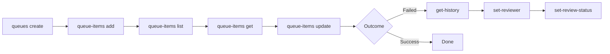

# Process Queues

Create work queues, add items for distributed processing, track progress, and manage review cycles.

> For full option details on any command, use `--help` (e.g., `uip or queues create --help`).

## When to Use

- Dispatcher-performer patterns, distributed work processing
- Queue item review workflows (assign reviewers, set review status)

## Prerequisites

- Authenticated — verify with `uip login status`; if not logged in, ask the user to run `uip login` (it opens an interactive browser flow)
- Target folder exists (`uip or folders list`)

## Flow



---

## Queue Management

### Create a Queue

```bash
uip or queues create "InvoiceQueue" \
  --folder-path "Finance" --max-retries 3 --auto-retry \
  --enforce-unique-reference --output json
```

Key options:

| Option | Description |
|--------|-------------|
| `--max-retries <n>` | Maximum retry attempts for failed items |
| `--auto-retry` / `--no-auto-retry` | Automatically retry items that fail with ApplicationException (default: true) |
| `--enforce-unique-reference` | Reject items with duplicate reference values |
| `--encrypted` | Store queue item data encrypted |
| `--retention-action` | Action for completed items: `Delete`, `Archive`, or `None` (default: Delete) |
| `--retention-period <days>` | Days to retain completed items (default: 30) |
| `--stale-retention-action` | Action for uncompleted items: `Delete`, `Archive`, or `None` (default: Delete) |
| `--stale-retention-period <days>` | Days to retain uncompleted items (default: 180) |

### List Queues

```bash
uip or queues list --folder-path "Finance" --output json
```

Filter by name with `--name` (contains match). Paginate with `--limit` / `--offset`.

### Get, Update, Delete

```bash
# Get queue details (cross-folder, no --folder-path needed)
uip or queues get <queue-key> --output json

# Update queue properties (cross-folder)
uip or queues update <queue-key> --max-retries 5 --no-auto-retry --output json

# Delete queue (cross-folder). Refuses if the queue still has items;
# pass --force to delete it and its items anyway.
uip or queues delete <queue-key> --yes --output json
uip or queues delete <queue-key> --force --output json
```

### Share a Queue Across Folders

```bash
# Share with another folder
uip or queues share <queue-key> --folder-path "Production" --output json

# Check which folders have access
uip or queues get-folders <queue-key> --output json

# Remove from a folder
uip or queues unshare <queue-key> --folder-path "Production" --output json
```

### Queue Processing Stats

```bash
# Stats for a specific queue (item counts, exception counts, processing times)
uip or queues get-stats --folder-path "Finance" --key <queue-key> --output json

# Stats across queues in a folder, narrowed by name and a processing-window
uip or queues get-stats --folder-path "Finance" \
  --name "Invoice" \
  --from "2026-04-01T00:00:00Z" --to "2026-04-30T23:59:59Z" \
  --output json
```

`get-stats` returns aggregate metrics (totals, successes, failures, average handling time) — useful for dashboards or capacity planning. Without `--key` or `--name` it stats every queue in the folder. `--from` / `--to` filter on last-processed date in ISO 8601.

---

## Queue Item Lifecycle

### Add a Single Item

```bash
uip or queue-items add "InvoiceQueue" \
  --folder-path "Finance" \
  --specific-content '{"InvoiceId":"INV-001","Amount":1500.00,"Vendor":"Acme"}' \
  --priority High --reference "INV-001" \
  --defer-date "2026-04-23T09:00:00Z" --due-date "2026-04-25T17:00:00Z" \
  --output json
```

The `add` command takes a **queue name** (not key). Key options: `--specific-content` (required, flat key-value JSON), `--priority` (High/Normal/Low, default Normal), `--reference` (max 128 chars), `--defer-date` / `--due-date` (ISO 8601).

### Bulk Add Items

```bash
uip or queue-items bulk-add "InvoiceQueue" \
  --folder-path "Finance" \
  --queue-items '[
    {"specificContent":{"InvoiceId":"INV-002","Amount":2000},"priority":"High"},
    {"specificContent":{"InvoiceId":"INV-003","Amount":750},"priority":"Normal"}
  ]' \
  --commit-type AllOrNothing \
  --output json
```

The `bulk-add` command also takes a **queue name**. Use `--commit-type` to control failure handling:

| Commit Type | Behavior |
|-------------|----------|
| `AllOrNothing` | Rolls back all items if any fail |
| `StopOnFirstFailure` | Commits items until the first failure, then stops |
| `ProcessAllIndependently` | Processes each item independently (default) |

> The bulk-add API returns only a success flag and the list of failed items -- it does **not** return the created item keys. If you need the keys (e.g. to attach data or dispatch jobs), add items one at a time with `add` (which returns the created item), or `list --queue-name` afterward.

### List and Get Items

```bash
# List items filtered by queue and status
uip or queue-items list --folder-path "Finance" \
  --queue-name "InvoiceQueue" --status Failed --output json

# List items across all accessible folders
uip or queue-items list --all-folders --status Failed --output json

# Get a single item by its unique key
uip or queue-items get <item-unique-key> --folder-path "Finance" --output json
```

Filter with `--queue-name` (exact match), `--queue-definition-key` (GUID), or `--status` (New, InProgress, Failed, Successful, Abandoned, Retried, Deleted).

### Update and Delete

```bash
# Update item properties (only provided fields change)
uip or queue-items update <item-unique-key> --folder-path "Finance" \
  --priority High --output json

# Delete a single item by key
uip or queue-items delete <item-unique-key> --folder-path "Finance" --yes --output json

# Delete several items in one call
uip or queue-items delete-bulk <key1> <key2> --folder-path "Finance" --yes --output json
```

`update` changes `--priority`, `--due-date`, `--defer-date`, and `--specific-content`. Progress is a work-in-progress message a running robot reports, so the CLI does not let you set it.

`delete` (one key) and `delete-bulk` (a list of keys) are a **soft-delete**: the item's status changes to `Deleted`; it is not permanently removed.

### Get History and Retry Info

```bash
uip or queue-items get-history <item-unique-key> --folder-path "Finance" --output json
uip or queue-items get-last-retry <item-key> --folder-path "Finance" --output json
uip or queue-items has-video <item-unique-key> --folder-path "Finance" --output json
```

Note: `get-last-retry` uses the item `Key` field (shared across retries), not `UniqueKey`. Curated list/get output includes both.

---

## Review Cycle

When queue items fail, a reviewer can inspect them and decide whether to retry, abandon, or delete.

### Assign a Reviewer

```bash
# List available reviewers in the folder
uip or queue-items get-reviewers --folder-path "Finance" --output json

# Assign a reviewer to one or more items
uip or queue-items set-reviewer <key1> <key2> \
  --folder-path "Finance" \
  --user-key <reviewer-key> \
  --output json
```

### Set Review Status

```bash
uip or queue-items set-review-status Retried <key1> <key2> \
  --folder-path "Finance" --output json
```

Valid review statuses: `None`, `InReview`, `Verified`, `Retried`. The status is the first positional argument, followed by one or more item keys.

### Remove Reviewer

```bash
uip or queue-items unset-reviewer <key1> <key2> \
  --folder-path "Finance" --output json
```

---

## Complete Example

```bash
# 1. Create the queue
uip or queues create "InvoiceQueue" \
  --folder-path "Finance" --max-retries 3 --auto-retry \
  --enforce-unique-reference --output json

# 2. Add work items (dispatcher)
uip or queue-items add "InvoiceQueue" --folder-path "Finance" \
  --specific-content '{"InvoiceId":"INV-001","Amount":1500}' \
  --reference "INV-001" --priority High --output json

# 3. Check for failed items (after performer runs)
uip or queue-items list --folder-path "Finance" \
  --queue-name "InvoiceQueue" --status Failed --output json

# 4. Investigate a failed item
uip or queue-items get-history <failed-item-key> \
  --folder-path "Finance" --output json

# 5. Assign reviewer and mark as reviewed
uip or queue-items set-reviewer <failed-item-key> \
  --folder-path "Finance" --user-key <reviewer-key> --output json
uip or queue-items set-review-status Retried <failed-item-key> \
  --folder-path "Finance" --output json
```

---

## Variations and Gotchas

### Queue Item States

Items progress through these states:

```
New --> InProgress --> Successful
                  --> Failed (retryable via ApplicationException)
                  --> Abandoned (manually abandoned)
                  --> Retried (auto-retry created a new attempt)
                  --> Deleted
```

### Exception Types

| Type | Retryable | When to use |
|------|-----------|-------------|
| `ApplicationException` | Yes (auto-retry) | Transient failures (timeout, network error) |
| `BusinessException` | No | Invalid data, business rule violations |

Items that fail with `ApplicationException` are automatically retried (up to `--max-retries`) when `--auto-retry` is enabled.

### Review Status Flow

```
None --> InReview (reviewer assigned) --> Verified | Retried
```

### Key Types

| Field | Scope | Use with |
|-------|-------|----------|
| `UniqueKey` | Unique per attempt | `get`, `update`, `delete`, `get-history`, `has-video` |
| `Key` | Shared across retries | `get-last-retry` |
| Queue definition key | Queue identifier | `list --queue-definition-key`, `queues get` |

Curated queue-item rows expose both `Key` and `UniqueKey` (PascalCase). With `--all-fields` you get the raw DTO instead, where the same fields are `key` / `uniqueKey`.

### Common Pitfalls

- `--specific-content` must be **flat key-value JSON** -- no nested objects or arrays.
- All `queue-items` commands require `--folder-path` or `--folder-key` (items are folder-scoped). Exception: `list` can take `--all-folders` instead to query across all accessible folders.
- `set-review-status` takes the **status first**, then the item key(s) -- not the other way around.
- `set-reviewer` requires `--user-key` (GUID, not a numeric ID). Use `get-reviewers` to find reviewer keys.
- Queue `get`, `update`, and `delete` are **cross-folder** (no `--folder-path` needed). Queue item commands are **not**.
- `--auto-retry` is enabled by default. Use `--no-auto-retry` to disable.

---

## Related

- [resources.md](resources.md) -- Orchestrator resources overview and libraries
- [Triggers & Webhooks](triggers-and-webhooks.md) -- Queue triggers fire automations when item count exceeds a threshold
- [Setup Environment](setup-environment.md) -- Folder and machine setup
