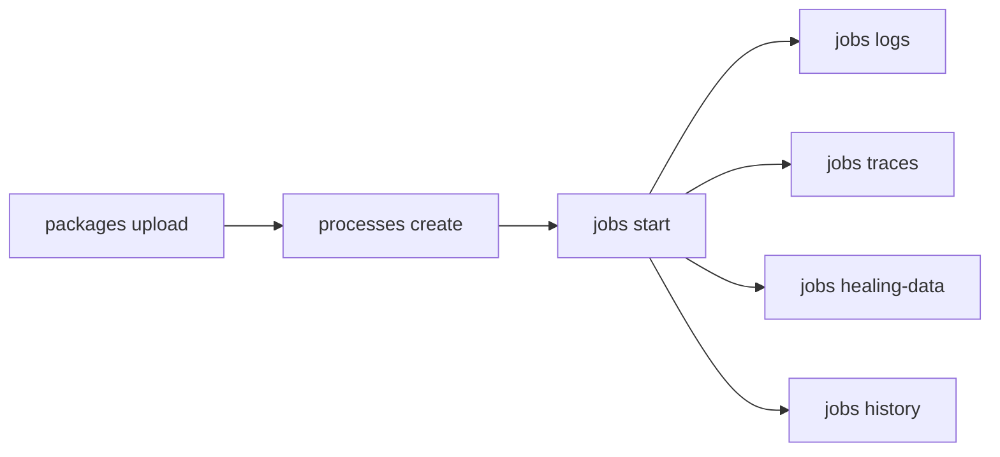

# Run Jobs

Upload automation packages, bind them as processes, start jobs, and monitor execution with logs, traces, and healing data.

> For full option details on any command, use `--help` (e.g., `uip or jobs start --help`)

## When to Use

- Deploying and running automations end-to-end
- Debugging failed or faulted jobs
- CI/CD pipeline execution and verification
- Monitoring long-running unattended processes

## Prerequisites

- Authenticated — verify with `uip login status`; if not logged in, ask the user to run `uip login` (it opens an interactive browser flow)
- Target folder exists with machines assigned (see [setup-environment.md](setup-environment.md))
- Automation package (.nupkg) built and ready to upload

## Flow



---

## Step 1: Upload Package

```bash
uip or packages upload ./MyProcess.1.0.0.nupkg --output json

# Target a custom feed instead of the tenant default
uip or packages upload ./MyProcess.1.0.0.nupkg --feed-id <feed-key> --output json
```

## Step 2: Inspect Package

Verify the upload and discover entry points before creating a process.

> **Feeds:** `packages get`, `packages versions`, and `processes create` look in the **tenant** feed by default. If the package lives in a folder-hierarchy feed (a standard folder with its own feed), pass `--feed-id <feed-key>` — otherwise these return empty / 404 even though the package exists. (`processes create` itself no longer pre-checks the feed, so it succeeds in a folder feed regardless.)

```bash
# Search for the uploaded package
uip or packages list --search "MyProcess" --output json

# List all versions of a package
uip or packages versions <package-id> --output json

# Inspect entry points (key format: PackageId:Version)
uip or packages entry-points "MyProcess:1.0.0" --output json

# Get one package version's full DTO (description, authors, target framework, ...)
uip or packages get "MyProcess:1.0.0" --output json

# Download the .nupkg back from the feed
uip or packages download "MyProcess:1.0.0" --destination ./MyProcess.1.0.0.nupkg --output json
```

Entry points show which workflows inside the package can be executed. Multi-entry-point packages require `--entry-point` when creating a process.

`packages get` accepts the `Id:Version` composite key returned by `packages list` / `packages versions`. The `--all-fields` flag returns the raw DTO including `tags`, `targetFramework`, `isCompiled`, etc.

## Step 3: Create Process

Bind the uploaded package to a folder as a runnable process:

```bash
# List published processes in a known folder path
uip or processes list --folder-path "Production" --output json

uip or processes create --name "MyProcess" \
  --package-key "MyProcess" \
  --package-version "1.0.0" \
  --folder-path "Production" \
  --output json
```

Key options:

| Option | Description |
|---|---|
| `--entry-point <path>` | Required for multi-entry-point packages |
| `--auto-update` / `--no-auto-update` | Auto-pick the latest package version on deploy |
| `--job-priority <Low\|Normal\|High>` | Default execution priority. The CLI sets the matching `SpecificPriorityValue` band (Low=25, Normal=45, High=65) — the API derives the band from that value, so the change actually applies. |
| `--specific-priority <1-100>` | Numeric priority override (mutually exclusive with `--job-priority`). Use when you need fine-grained ordering inside the same priority bucket. |
| `--robot-size <Small\|Standard\|Medium\|Large>` | Cloud robot sizing for serverless runtimes |
| `--input-arguments <json>` | Default input arguments (merged with per-job inputs) |
| `--environment-variables <json>` | Default environment variables (merged with per-job env) |
| `--tags <list>` | Comma-separated tags for filtering |
| `--hidden-for-attended` / `--visible-for-attended` | Toggle visibility to attended robot users |
| `--auto-create-triggers` / `--no-auto-create-triggers` | Auto-create connected triggers on deploy |
| `--retention-period <days>` + `--retention-action <Delete\|Archive\|None>` (+ `--retention-bucket <id>`) | Job retention policy. `--retention-period` must be 1-180 (validated client-side). |
| `--stale-retention-period <days>` + `--stale-retention-action <Delete\|Archive\|None>` | Stale-job retention policy |

> The runtime kind (Unattended / Headless / NonProduction / AgentService / Serverless) is **not** a process-level setting; it's chosen per-job on `jobs start --runtime-type`. The process binds the package to a folder; runtime selection happens at execution time.

#### Inspect / Edit / Roll back / Delete Processes

```bash
# Get one process by key (cross-folder; resolved through the release lookup)
uip or processes get <process-key-guid> --output json

# Validation report — what does the runtime see when it tries to start this process?
# Returns missing tools, missing assets, missing connections, schema mismatches.
uip or processes resources <process-key-guid> --output json

# Edit fields after creation. Same flag set as `processes create` minus name/package-key/package-version,
# plus --healing-agent / --no-healing-agent (Autopilot for Robots toggle).
uip or processes update <process-key-guid> --description "Updated description" --output json

# Walk the package version history (every package version this release ever pointed at)
uip or processes version-history <process-key-guid> --output json

# Pin to a specific package version (typically used to roll back after a regression)
uip or processes update-version <process-key-guid> --package-version 1.0.2 --output json

# Roll back to the previous version recorded in version-history
uip or processes rollback <process-key-guid> --output json

# Delete the process (release). Package itself stays in the feed.
uip or processes delete <process-key-guid> --yes --output json
```

`processes update` uses `Mapper.Map<ReleaseDto, UiRelease>(dto)` server-side, which means missing fields on the request body are nulled. The CLI works around this by spreading `currentRelease` as the baseline before applying overrides — but if you build the body yourself by hand, `tags`, `arguments`, `videoRecordingSettings`, `targetFramework`, `robotSize`, `resourceOverwrites`, `remoteControlAccess`, `targetRuntime`, `publisherLicense`, etc. will silently get nulled.

## Step 4: Start Job

Start execution from a process. The process key comes from `uip or processes list`.

```bash
uip or jobs start <process-key> --folder-path "Production" --output json

# With input arguments and wait
uip or jobs start <process-key> --folder-path "Production" \
  --input-arguments '{"invoiceId": "INV-001", "amount": 1500}' \
  --wait-for-completion --timeout 600 \
  --output json
```

Key options:

- `--input-arguments <json>` / `--input-file <path>` — pick one. `--input-arguments` inlines a JSON object (validated client-side — invalid JSON is rejected before the call); `--input-file` uploads a file as the job's `InputFile` argument.
  - **10K character cap on job arguments.** Orchestrator caps serialized input/output arguments at 10,240 characters for classic `StartJob` runs; an oversized output is silently dropped (the consuming workflow receives `null`, the job still reports Successful). `StartAgentJob` (agent runs) is not subject to the same cap in practice. Robot 2025.10.1+ removes the cap entirely ("Support for large input and output arguments"). If you hit it: pass big payloads via a storage bucket / queue item reference, or upgrade the Robot.
- `--attachment <[name=]path>` — upload one or more files and attach them to the job. Repeat the flag for multiple. Pair with `--attachment-id <guid>` to reuse an attachment that was previously uploaded.
- `--runtime-type <type>` — `Unattended`, `Headless`, `NonProduction`, `AgentService`, or `Serverless`. Picks the runtime kind the scheduler will use.
- `--strategy <strategy>` — one of `ModernJobsCount` (default; spawn N independent jobs, paired with `--jobs-count`), `All` (run on every available robot in the folder), `Specific` (use `--user-keys` / `--machine-keys`), or `JobsCount`. Validated client-side. `--jobs-count` must be a whole number greater than 0.
- `--user-keys <guids>` / `--machine-keys <guids>` — comma-separated GUIDs to pin the job to specific identities. With `--strategy ModernJobsCount` they restrict the candidate pool; with `Specific` they're required.
- `--healing-agent` — enable Autopilot for Robots (Healing Agent) just for this job, regardless of the process-level `--healing-agent` setting on `processes update`. Useful for one-off self-healing without flipping the process default.
- `--reference <text>` — user-set reference (free-form string) attached to the job. Useful for correlation with external systems.
- `--environment-variables <json>` — JSON object of per-job environment variables. Merged on top of folder-/process-level env.
- `--run-as-me` — run under the caller's identity instead of resolving an unattended robot account in the folder.
- `--wait-for-completion` + `--timeout <seconds>` (default 300) + `--poll-interval <seconds>` (default 5) — poll until the job reaches a terminal state.
- `--output-dir <path>` + `--no-download` — when `--wait-for-completion` is set, the CLI downloads the job's `OutputFile` to this directory automatically. Pass `--no-download` to opt out.
- `--job-priority <Low|Normal|High>` — execution priority on the runtime queue.

## Step 5: Monitor Job

Check job status. `jobs get` is cross-folder -- no `--folder-path` needed:

```bash
# Get a specific job by key
uip or jobs get <job-key> --output json

# List running jobs in a folder
uip or jobs list --state Running --folder-path "Production" --output json

# Filter by process name and date range
uip or jobs list --process-name "MyProcess" --folder-path "Production" --output json

# List jobs across all accessible folders
uip or jobs list --all-folders --state Faulted --output json
```

`jobs list` requires `--folder-path`, `--folder-key`, or `--all-folders` — a bare `jobs list` is rejected. (Older CLI versions listed tenant-wide by default; pass `--all-folders` for that behavior.)

## Step 6: Get Logs

```bash
uip or jobs logs <job-key> --output json                  # All logs
uip or jobs logs <job-key> --level Error --output json    # Error logs only
uip or jobs logs <job-key> --export --destination ./logs.csv  # Export to CSV file
```

`--export` writes a CSV file instead of terminal output. Combine with `--destination` (or `-d`) to set the file path. Logs are cross-folder -- no `--folder-path` required.

## Step 7: Get Traces

Retrieve LLM and agentic execution traces for Agent-type processes:

```bash
uip or jobs traces <job-key> --output json
```

Traces are only available for processes that use UiPath Autopilot or Agent capabilities. For a standard Process the result is an empty list, and the response adds an `Instructions` note saying so — that's how you tell "no traces recorded" apart from "this isn't an Agent process". For deeper span-level data, use `uip traces spans get [trace-id]` (or `uip traces spans get --job-key <key>`) — see [traces.md](../traces/traces.md).

Traces are cross-folder -- no `--folder-path` required.

## Step 8: Get Healing Data

Download Autopilot recovery data (screenshots + UI element data) as a ZIP:

```bash
uip or jobs healing-data <job-key> -o ./healing-data.zip
```

The ZIP contains screenshots and UI metadata from Autopilot self-healing attempts.

## Step 9: Job History

View the state transition timeline (e.g., Pending -> Running -> Faulted) with timestamps:

```bash
uip or jobs history <job-key> --output json
```

## Step 10: Stop, Restart, Resume

Control running or suspended jobs:

```bash
# Stop a running job (SoftStop is best-effort -- a job whose activity ignores
# the cancellation token can still run to completion)
uip or jobs stop <job-key> --strategy SoftStop --output json

# Force-kill a job
uip or jobs stop <job-key> --strategy Kill --output json

# Restart a finished job (any outcome -- faulted, stopped, or successful).
# Returns the new run in the same { Jobs: [...] } shape as `jobs start`.
uip or jobs restart <job-key> --output json

# Resume a suspended job with new input
uip or jobs resume <job-key> --input-arguments '{"approved": true}' --output json
```

Jobs are immutable audit records -- there is no `jobs delete`. They age out per the binding process's retention period.

## Step 11: Manage Processes

Update, rollback, or edit processes after deployment:

```bash
# Update to a newer package version
uip or processes update-version <process-key> --output json

# Rollback to previous version
uip or processes rollback <process-key> --output json

# Edit process properties
uip or processes update <process-key> --output json
```

---

## Complete Example

```bash
# Upload -> create process -> start job -> check logs
uip or packages upload ./InvoiceProcessor.1.0.0.nupkg --output json
uip or packages entry-points "InvoiceProcessor:1.0.0" --output json

uip or processes create --name "InvoiceProcessor" \
  --package-key "InvoiceProcessor" --package-version "1.0.0" \
  --folder-path "Finance" --job-priority Normal \
  --output json

uip or jobs start <process-key> --folder-path "Finance" \
  --input-arguments '{"batchDate": "2026-04-22"}' \
  --wait-for-completion --timeout 600 --output json

uip or jobs logs <job-key> --level Error --output json
uip or jobs logs <job-key> --export --destination ./invoice-logs.csv
```

---

## Variations and Gotchas

### "Process" vs "Release"

The CLI uses "process" but the Orchestrator API calls this entity a "Release". They are the same thing. When reading API docs, `ReleaseKey` = process key from `uip or processes list`.

### Process Key vs Package Key

These are different identifiers:

| Key | Source | Format |
|-----|--------|--------|
| Process key | `uip or processes list` | GUID (e.g., `a1b2c3d4-...`) |
| Package key | `uip or packages list` | String ID (e.g., `InvoiceProcessor`) |
| Package download key | `uip or packages download` | `PackageId:Version` (e.g., `InvoiceProcessor:1.0.0`) |

### Job States

Jobs progress through these states:

```
Pending -> Running -> Successful
                   -> Faulted
                   -> Stopped
                   -> Suspended (awaiting input)
```

Final states (Successful, Faulted, Stopped) are frozen -- no further transitions occur.

### Wait and Input Behavior

- `--wait-for-completion` polls at `--poll-interval` (default 5s) until a final state or `--timeout` (default 300s)
- `--input-arguments` accepts JSON; `--input-file` reads from a file path
- If JSON exceeds 10K characters, the CLI automatically offloads it to an InputFile (server-side)
- Use `uip or packages entry-points` to discover expected argument names and types

### Cross-Folder Commands

These commands resolve the folder from the job key -- no `--folder-path` needed:

- `uip or jobs get <key>`
- `uip or jobs logs <key>`
- `uip or jobs traces <key>`
- `uip or jobs history <key>`
- `uip or jobs healing-data <key>`

### Package Download

To download a package .nupkg, use the `PackageId:Version` format:

```bash
uip or packages download "MyProcess:1.0.0" --destination ./packages/ --output json
```

---

## Related

- [setup-environment.md](setup-environment.md) — Folder creation, machine assignment, user setup
- [traces.md](../traces/traces.md) — Deep-dive into LLM/agentic traces and spans
- Resources (assets, queues, buckets, triggers, webhooks, libraries) → [resources.md](resources.md)
