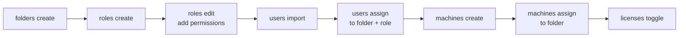

# Setup Environment

Create folders, assign users with roles, provision machines, and configure licenses.

---

## When to Use

- Setting up a new tenant for a team or project.
- Onboarding users into an existing Orchestrator environment.
- Provisioning machine templates and license slots for CI/CD pipelines.
- Scripting repeatable environment creation across dev/staging/prod.

## Prerequisites

1. Authenticated: `uip login`
2. Tenant selected: `uip login tenant set <tenant-name>`
3. Sufficient permissions: tenant-level admin or folder-create rights.

---

## Flow



Each step depends on output from the previous one -- folder keys feed into user assignments, user keys feed into role bindings, and machine keys feed into license toggles.

---

## Steps

### Step 1: Create Folders

Folders are the primary organizational unit. Create them first because every subsequent resource assignment targets a folder.

```bash
uip or folders create "Finance" --output json
```

Key options:
- `--parent <key-or-path>` -- Nest inside an existing folder (GUID key or path like `"Shared"`).
- `--description <text>` -- Human-readable description.
- `--permission-model <model>` -- `FineGrained` (default, per-folder RBAC) or `InheritFromTenant`.
- `--feed-type <type>` -- Package feed scope. The names don't describe the behavior, read them as:
  - `Processes` (default) -- folder shares the **tenant-level** processes feed.
  - `FolderHierarchy` -- folder has its **own folder-scoped** feed, inherited by sub-folders.
  - `Libraries` -- folder is backed by the tenant libraries feed (libraries instead of processes).

Save the `Key` from the response -- you will use it as `--folder-path` or `--folder-key` in later steps.

```bash
# Nested folder
uip or folders create "Invoicing" --parent "Finance" -d "Invoice processing" --output json
```

### Step 2: Explore Folders

Verify the folder structure before proceeding.

```bash
# Folders the current user can access
uip or folders list --output json

# All folders in the tenant (requires admin permissions)
uip or folders list --all --output json

# Filter: only standard top-level folders
uip or folders list --all --type standard --top-level --output json

# Get details for a specific folder
uip or folders get "Finance" --output json
uip or folders get <folder-key-guid> --output json

# Check runtime capacity in a folder
uip or folders runtimes "Finance" --output json

# Move a folder under a different parent (or to root)
uip or folders move "Finance/Invoicing" --parent "Operations" --output json
uip or folders move <folder-key-guid> --root --output json   # promote to top level

# Delete an empty folder (recursive removal must be explicit)
uip or folders delete "Finance/Invoicing" --output json
uip or folders delete <folder-key-guid> --output json
```

The `--all` flag enables filtering options (`--type`, `--name`, `--path`, `--top-level`, `--order-by`). Without `--all`, only folders the current user is assigned to are returned.

`folders move` and `folders delete` require admin permissions and accept either a path or a GUID. `delete` errors if the folder still contains processes, queues, assets, or sub-folders — clean those out first or move them with `folders move`.

### Step 3: Create Roles

Roles group permissions and are scoped to either the tenant or a folder. Create the role first (it starts with zero permissions), then add permissions to it.

```bash
# Create a folder-scoped role
uip or roles create --name "FinanceOperator" --type Folder --output json

# Add permissions to the role
uip or roles edit <role-key> \
  --add-permissions "Assets.View,Assets.Edit,Queues.View,Jobs.Create,Jobs.View" \
  --output json
```

Use `uip or roles permissions` to discover all grantable permission names. Use `uip or roles get <key>` to inspect a role's current grants.

Role types:

- **Tenant** — Applies across the entire tenant. Assigned via `uip or users assign-roles`.
- **Folder** — Applies only within specific folders. Assigned via `uip or users assign` or `uip or roles assign`.

> **⚠️ All three role-assign commands are destructive.** `users assign-roles`, `users assign`, and `roles assign` each **replace** the user's role list at their respective scope (tenant or per-folder). Roles not in `--role-keys` are removed silently. Always read the current roles first with `uip or roles user-roles list <user-key> --output json` and pass the full desired union. For purely additive *user* membership on a single role, use `uip or roles users <role-key> --add-users <user-key>` — that command does NOT replace the role's other assignees.

#### Inspect / Audit / Delete Roles

```bash
# List all roles in the tenant
uip or roles list --output json

# Full grantable-permissions catalogue (large — use --output-filter)
uip or roles permissions --output json

# Effective permissions for one user (tenant + folder roles merged)
uip or roles user-permissions <user-key-guid> --folder-path "Finance" --output json

# Roles assigned to a user (tenant + folder)
uip or roles user-roles <user-key-guid> --output json

# Manage user assignments on a single role (add/remove users at the role level)
uip or roles users <role-key> --add-users <user-key-1>,<user-key-2> --output json
uip or roles users <role-key> --remove-users <user-key-1> --output json

# Delete a role. Static built-in roles (Folder Administrator etc.) cannot be deleted.
uip or roles delete <role-key> --output json
```

`roles user-permissions` is the right command for "what can this user actually do here" debugging; it accounts for inherited folder roles and tenant overrides. `roles user-roles` is the inverse — given a user, which role assignments exist.

### Step 4: Import Users from Identity Service

Principals are managed in Identity Service (IS), not in Orchestrator. `users import` is the **single integration point** between IS and the tenant: it references an existing IS principal and provisions the matching tenant user record. Everything downstream (`users assign`, `users assign-roles`, `roles assign`, etc.) takes the resolved Orchestrator user-key — no further IS round-trips. (The legacy `users create` / `users delete` commands are gone — they called endpoints reserved for `ProvisionType=Manual`, which is not how cloud or IS-backed users are managed.)

```bash
# Human user (cloud SSO or AD)
uip or users import --username "jane.doe@example.com" --type DirectoryUser --domain "uipath" --output json

# Robot account — requires --directory-id (the IS UUID)
uip admin robot-accounts create "InvoiceRunner" --output json   # capture .Data.id
uip or users import --directory-id <id-from-above> --type DirectoryRobot --domain autogen --output json

# External application — requires --directory-id (the IS UUID)
uip admin external-apps list --search "MyApp" --output json   # capture .id
uip or users import --directory-id <id-from-above> --type DirectoryExternalApplication --domain autogen --output json
```

Required options:

- `--type <type>` — **Required**, no default. The CLI refuses to guess what kind of principal you're importing (otherwise a robot might silently land as a DirectoryUser in the tenant). Four values:
  - `DirectoryUser` — a real human user.
  - `DirectoryGroup` — a directory group; folder grants apply to every member.
  - `DirectoryRobot` — a **robot account** in IS. Standard way to give a folder an unattended robot identity. Without it (or a `DirectoryUser` with unattended permissions), `jobs start` returns `HTTP 409: Couldn't find any user with unattended robot permissions in the current folder.`
  - `DirectoryExternalApplication` — an IS-registered external app (client-credentials principal) for service-to-service flows.

- `--domain <domain>` — IS directory domain. `autogen` for `DirectoryRobot` / `DirectoryExternalApplication`. For `DirectoryUser` / `DirectoryGroup`, the tenant's IS directory domain (typically the cloud org slug or the on-prem AD domain).

Principal identifier — provide exactly one of:

- `--username <name>` — IS principal name. Works for `DirectoryUser` / `DirectoryGroup` when the principal resolves as `<domain>\<name>` in IS (on-prem AD setups, classic IS configurations). For cloud SSO users this lookup typically fails — use `--directory-id` instead.
- `--directory-id <uuid>` — IS UUID. **Required for `DirectoryRobot` and `DirectoryExternalApplication`** — the server-side `UserService.CreateAsync` rejects these types with HTTP 400 unless the tenant user-record `Key` matches the IS identifier, and `Key` is only populated when `--directory-id` is set. Find the UUID via:
  - `uip admin robot-accounts create <name>` — returns the new robot's `.Data.id`.
  - `uip admin robot-accounts list --search <name>` — `.Data[].id` of an existing robot.
  - `uip admin external-apps list` — `.Data[].appId` for IS-registered external apps.
  - `uip admin users list --search <name>` — `.Data[].id` for human users (when you'd prefer the UUID over `--username`).

Optional one-shot folder assignment:

- `--folder-path <path>` / `--folder-key <key>` + `--role-keys <guids>` — Imports the principal **and** assigns folder roles in a single call. Pass both together; pass neither for an import-only call.

Save the `Key` from the response (returned via `users list --username "<imported-name>"` once import succeeds) — that's the **Orchestrator user-key** you'll use in `users assign`, `users assign-roles`, `roles assign`, and similar commands.

### Step 4b: Inspect / Edit / Unassign / Remove Users

```bash
# Whoami — current authenticated principal
uip or users current --output json

# Get one user by key (or numeric id)
uip or users get <user-key-guid> --output json

# Filter the assignable set for a folder (not yet assigned, can be added with `users assign`)
uip or users list-available --folder-path "Finance" --search "jane" --output json

# Edit principal-level flags (this is the only place to grant unattended on a DirectoryUser)
uip or users edit <user-key-guid> \
  --allow-unattended \
  --license-type Unattended \
  --unattended-username "DOMAIN\\jane.doe" --unattended-password "<secret-or-cred-store-name>" \
  --output json

# Remove from a single folder (does NOT delete the principal in IS)
uip or users unassign <user-key-guid> --folder-path "Finance" --output json
```

Key flags on `users edit`:

- **License toggles** (mutually exclusive pairs): `--allow-unattended`/`--deny-unattended`, `--allow-attended`/`--deny-attended`, `--allow-login`/`--deny-login`, `--allow-personal-workspace`/`--deny-personal-workspace`, `--active`/`--inactive`.
- `--license-type <Attended|Unattended|...>` — assigned license profile.
- `--unattended-username <user>` and `--unattended-password <pass>` — Windows account + secret used for unattended execution. Required by the API as a pair when first toggling `--allow-unattended` on a `DirectoryUser`. Username typically `DOMAIN\\name` format. Password may be a literal secret or the name of an entry in a credential store (paired with `--credential-store-key <guid>`).
- `--credential-store-key <guid>` — credential store backing `--unattended-password` when the secret is stored externally.

`DirectoryRobot` principals don't need `--unattended-username` / `--unattended-password` on import — the robot identity already carries its own credentials in IS. Use `users edit --license-type Unattended` on the robot key to set the license profile.

> **`users edit` does NOT expose role assignments.** It only touches tenant-side flags (license, session flags, unattended credentials). To change roles, use `uip or users assign` (folder roles), `uip or users assign-roles` (tenant roles), or `uip or roles users <role-key> --add-users/--remove-users` (single-role membership). Identity attributes like `--name`, `--surname`, `--email` on directory principals are sourced from Identity Service via sync — editing them via `users edit` only updates the Orchestrator-side cached copy and may be overwritten on the next IS sync.

### Step 5: Assign Users to Folders

Assign the user to a folder, optionally with folder-level roles. This is what grants them access to the folder's resources.

```bash
uip or users assign \
  --user-key <user-key-guid> \
  --folder-path "Finance" \
  --role-keys <role-key-guid> \
  --output json
```

Key details:
- `--role-keys` is optional. Users can be assigned to a folder without roles (the API's `RoleId` is nullable). They will have access to the folder but no specific permissions until roles are added.
- Use `--folder-path` (e.g., `"Finance"` or `"Finance/Invoicing"`) or `--folder-key` (GUID).
- To verify: `uip or users list-in-folder --folder-path "Finance" --output json`.

> **⚠️ Destructive — REPLACE semantics.** `users assign` (and the equivalent `roles assign`) **replaces** the user's folder-level role list in the target folder with whatever you pass in `--role-keys`. Roles not in the payload are removed silently. To **add** a role without dropping others, first read the existing folder roles with `uip or roles user-roles list <user-key> --output json`, then pass the full desired union to `--role-keys`. The same applies to `users assign-roles` for tenant-level roles.

### Step 6: Create Machines

Machines define execution hosts and their license slot allocations. They are tenant-scoped and must be assigned to folders separately.

```bash
uip or machines create --name "finance-runner-01" --output json
```

Key options:

- `--serverless` — Create a serverless (cloud-hosted) machine instead of a standard template.
- `--unattended-slots <n>` — Number of unattended runtime slots.
- `--headless-slots <n>` — Number of headless runtime slots.
- `--non-production-slots <n>` — Non-production slots for testing.
- `--testing-slots <n>` — Test automation runtime slots.
- `-d, --description <text>` — Machine description.

### Step 7: Assign Machines to Folders

Machines must be assigned to a folder before jobs in that folder can use them. The assign command accepts one or more machine keys.

```bash
uip or machines assign <machine-key-guid> --folder-path "Finance" --output json

# Assign multiple machines at once
uip or machines assign <key1> <key2> <key3> --folder-path "Finance" --output json
```

Verify: `uip or machines list --folder-path "Finance" --output json`.

### Step 7b: Inspect / Edit / Unassign / Delete Machines

```bash
# Get one machine
uip or machines get <machine-key-guid> --output json

# Edit slots, name, description (PATCH semantics — only provided fields change)
uip or machines edit <machine-key-guid> \
  --unattended-slots 4 --headless-slots 2 \
  --name "finance-runner-01-renamed" --output json

# Remove a machine from a folder (machine still exists at tenant level)
uip or machines unassign <machine-key-guid> --folder-path "Finance" --output json

# Delete the machine template entirely (tenant-level)
uip or machines delete <machine-key-guid> --output json

# Bulk delete
uip or machines delete <key1> <key2> --output json
```

Notes:

- `machines edit` and `machines delete` resolve cross-folder by GUID — no `--folder-path` needed.
- Each folder accepts **one** Cloud Robots / Serverless machine. Trying to assign a second serverless to the same folder returns `HTTP 409: Only one Cloud Robots - Serverless is allowed per folder.`
- `machines list` defaults to all machines visible to the user. With `--folder-path` it lists only machines assigned to that folder. Use `--all-fields` for the raw DTO including slot subtypes (`automationCloudSlots`, `automationCloudTestAutomationSlots`, etc.).

### Step 8: Configure Licenses

Toggle machine licensing on or off for specific runtime types. Check tenant capacity first.

```bash
# Check overall license capacity
uip or licenses info --output json

# Enable unattended licensing for the machine
uip or licenses toggle <machine-key-guid> --type Unattended --enable --output json

# List current license assignments
uip or licenses list --type Unattended --output json
```

Toggle supports runtime types only: `Unattended`, `NonProduction`, `Headless`, `TestAutomation`. Named-user types (`Attended`, `Development`, `Studio`, etc.) are managed differently and cannot be toggled.

---

## Complete Example

End-to-end script setting up a "Finance" folder with a user, role, and machine:

```bash
# 1. Authenticate
uip login --output json
uip login tenant set "Production" --output json

# 2. Create the folder
uip or folders create "Finance" -d "Finance department automations" --output json
# Response: { "Data": { "Key": "a1b2c3d4-...", "Path": "Finance" } }

# 3. Create a folder role and add permissions
uip or roles create --name "FinanceOperator" --type Folder --output json
# Response: { "Data": { "Key": "r1r2r3r4-..." } }

uip or roles edit r1r2r3r4-... \
  --add-permissions "Assets.View,Assets.Edit,Queues.View,Jobs.Create,Jobs.View,Processes.View" \
  --output json

# 4. Import a user from Identity Service (--type is required; --directory-id required for Robot/ExtApp)
uip or users import --username "jane.doe@example.com" --type DirectoryUser --domain "uipath" --output json
# (Look up the assigned Key with: uip or users list --username "jane.doe@example.com")

# 5. Assign user to folder with role
uip or users assign \
  --user-key u1u2u3u4-... \
  --folder-path "Finance" \
  --role-keys r1r2r3r4-... \
  --output json

# 6. Create a machine
uip or machines create --name "finance-runner-01" \
  --unattended-slots 2 -d "Finance department runner" --output json
# Response: { "Data": { "Key": "m1m2m3m4-..." } }

# 7. Assign machine to folder
uip or machines assign m1m2m3m4-... --folder-path "Finance" --output json

# 8. Enable licensing
uip or licenses toggle m1m2m3m4-... --type Unattended --enable --output json

# 9. Verify the setup
uip or folders runtimes "Finance" --output json
uip or users list-in-folder --folder-path "Finance" --output json
uip or machines list --folder-path "Finance" --output json
```

---

## Variations and Gotchas

### Folder edit uses `edit`, not `update`

The verb is `edit` for both folders and machines: `uip or folders edit <key>`, not `update`.

### Users can be assigned without roles

The `--role-keys` flag on `uip or users assign` is optional. A user can be assigned to a folder with no roles -- they appear in the folder's user list but have no permissions until roles are added later.

### Machine scopes

Machines have a `scope` field that determines their nature:

| Scope | Description |
|-------|-------------|
| `Default` | Standard on-premises machine template. |
| `Shared` | Shared across folders. |
| `Serverless` | Cloud-hosted, created with `--serverless`. |
| `Cloud` | UiPath cloud machine. |
| `AutomationCloudRobot` | Automation Cloud Robot. |
| `ElasticRobot` | Elastic (auto-scaling) cloud machine. |
| `PersonalWorkspace` | Bound to a personal workspace. |

### Role resolver pages all roles client-side

The role-resolver utility fetches all roles to map GUIDs to numeric IDs. For tenants with many custom roles, this adds a brief delay on the first role-related command in a session.

### `--all` flag on folders list enables filtering

Filtering options (`--type`, `--name`, `--path`, `--top-level`, `--order-by`) only work with `--all`. Without `--all`, the command returns only folders the current user is assigned to and rejects filter flags.

### Personal workspaces are flat

`uip or folders list --all --type personal` returns personal workspaces with a different shape (`Key`, `Name`, `OwnerName`, `OwnerKey`, `LastLogin`). The `--path` and `--top-level` flags are not supported because personal workspaces have no hierarchy.

---

## Related

- [Run Jobs](run-jobs.md) — After setup, deploy packages and start jobs in the folder.
- Create assets, queues, and buckets in the folder → [`uipath-resources`](../resources/resources.md)
