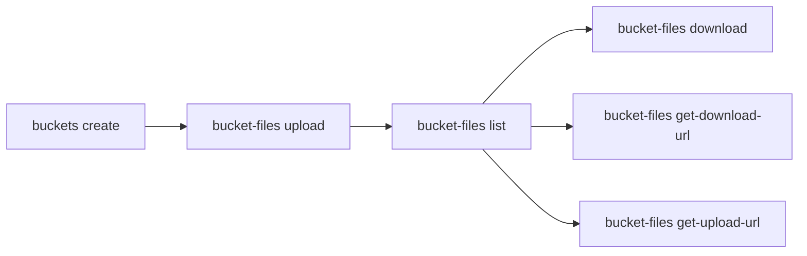

# Work with Storage

Create storage buckets, upload and download files, and generate presigned URLs for direct client access.

> For full option details on any command, use `--help` (e.g., `uip or buckets create --help`).

## When to Use

- Storing automation data, uploading/downloading files for workflows
- Sharing files via presigned URLs with external systems or users

## Prerequisites

- Authenticated — verify with `uip login status`; if not logged in, ask the user to run `uip login` (it opens an interactive browser flow)
- Target folder exists (`uip or folders list`)

## Flow



---

## Bucket Management

### Create a Bucket

```bash
uip or buckets create "invoices" \
  --folder-path "Finance" \
  --description "Invoice attachments and reports" \
  --output json
```

This creates a bucket using the default Orchestrator built-in storage. No extra configuration needed.

Key options:

| Option | Description |
|--------|-------------|
| `--storage-provider` | `Azure`, `Amazon`, `Minio`, `S3Compatible`, `FileSystem`. Omit for Orchestrator built-in. |
| `--storage-parameters` | Provider-specific connection string. Use `$Password` as placeholder for the secret. |
| `--storage-container` | Provider-specific container name (e.g., AWS bucket or Azure container). |
| `--credential-store-key` | Key (GUID) of the credential store holding the provider secret. Required for Azure and Amazon. |
| `--password` | Provider-specific secret inserted at the `$Password` placeholder. |
| `--options` | `None` (default), `ReadOnly`, `AuditReadAccess`, `AccessDataThroughOrchestrator` |
| `--tags` | JSON array, e.g. `'[{"name":"env","value":"prod"}]'` |

For external providers (Azure, Amazon):

```bash
uip or buckets create "cloud-reports" --folder-path "Finance" \
  --storage-provider Azure \
  --storage-parameters "DefaultEndpointsProtocol=https;AccountName=myaccount;AccountKey=$Password" \
  --storage-container "reports-container" \
  --credential-store-key <credential-store-key> --password "my-storage-account-key" \
  --output json
```

### List Buckets

```bash
# List buckets in a specific folder (folder required by default)
uip or buckets list --folder-path "Finance" --output json

# List across every accessible folder (with optional name filter)
uip or buckets list --all-folders --name "invoice" --output json
```

`buckets list` requires either `--folder-path` / `--folder-key` or `--all-folders`. Paginate with `--limit` / `--offset`. Sort with `--sort-by`. With `--all-folders`, use `--exclude-folder-path` / `--exclude-folder-key` to omit a folder.

### Get, Update, Delete

```bash
uip or buckets get <bucket-key> --folder-path "Finance" --output json
uip or buckets update <bucket-key> --folder-path "Finance" \
  --name "invoices-2026" --description "Updated invoice store" --output json
uip or buckets delete <bucket-key> --folder-path "Finance" --yes --output json
# A bucket that still has files is refused; pass --force to delete it and
# its files anyway.
uip or buckets delete <bucket-key> --folder-path "Finance" --force --output json
```

### Share Buckets Across Folders

```bash
# Share with another folder
uip or buckets share <bucket-key> --folder-path "Production" --output json

# List folders that have access
uip or buckets list-folders <bucket-key> --folder-path "Finance" --output json

# Remove from a folder
uip or buckets unshare <bucket-key> --folder-path "Production" --output json
```

---

## File Operations

### Upload a File

```bash
uip or bucket-files upload <bucket-key> "reports/summary.csv" \
  --folder-path "Finance" --file ./summary.csv --output json

# Specify content type explicitly
uip or bucket-files upload <bucket-key> "data/config.json" \
  --folder-path "Finance" --file ./config.json \
  --content-type "application/json" --output json
```

`--file` is required. `--content-type` is auto-detected if omitted.

### List Files

```bash
# List all files in a bucket
uip or bucket-files list <bucket-key> --folder-path "Finance" --output json

# Filter by path prefix
uip or bucket-files list <bucket-key> --folder-path "Finance" \
  --prefix "reports/" --output json
```

File listing uses **continuation-token pagination** (not offset/limit). Check the response for a continuation token and pass it back:

```bash
# Fetch next page
uip or bucket-files list <bucket-key> --folder-path "Finance" \
  --continuation-token "<token-from-previous-response>" --output json
```

Additional options: `--take-hint <n>` (items per page, default 500, max 1000), `--expiry-in-minutes` (presigned URL lifetime in the response).

### List Directories

```bash
uip or bucket-files list-dirs <bucket-key> --folder-path "Finance" --output json
uip or bucket-files list-dirs <bucket-key> --folder-path "Finance" \
  --directory "reports/" --file-name-glob "*.csv" --output json
```

Unlike `list`, `list-dirs` uses standard `--limit` / `--offset` pagination.

### Get Metadata, Download, Delete

```bash
# Get file metadata (no download)
uip or bucket-files get <bucket-key> "reports/summary.csv" \
  --folder-path "Finance" --output json

# Download to a local file
uip or bucket-files download <bucket-key> "reports/summary.csv" \
  --folder-path "Finance" --destination ./summary.csv --output json

# Write to stdout (pipe to another command)
uip or bucket-files download <bucket-key> "reports/summary.csv" \
  --folder-path "Finance" | jq .

# Delete a file
uip or bucket-files delete <bucket-key> "reports/summary.csv" \
  --folder-path "Finance" --output json
```

Without `--destination`, `download` writes content to stdout. Use `-d` as shorthand.

---

## Presigned URLs

Presigned URLs allow external systems or users to upload/download files directly without CLI authentication.

### Get a Download URL

```bash
uip or bucket-files get-download-url <bucket-key> "reports/summary.csv" \
  --folder-path "Finance" --expiry-in-minutes 15 --output json
```

Returns a presigned URL (GET verb). The URL expires after `--expiry-in-minutes`.

### Get an Upload URL

```bash
uip or bucket-files get-upload-url <bucket-key> "uploads/new-report.csv" \
  --folder-path "Finance" --expiry-in-minutes 30 \
  --content-type "text/csv" --output json
```

Returns a presigned URL (PUT verb) and any required headers (e.g., `x-ms-blob-type` for Azure). The caller must include those headers when uploading.

Use cases: share temporary download links, allow external systems to upload directly, time-limited CI/CD access.

### Upload via REST (when the CLI is not available)

`bucket-files upload` already does presign + PUT in one step — prefer it. If a non-CLI system must upload, mirror the same two steps:

```bash
# 1. Get a presigned PUT URL (GetWriteUri). Single-URL-encode the path.
curl -s -H "Authorization: Bearer $TOKEN" \
  -H "X-UIPATH-OrganizationUnitId: $FOLDER_ID" \
  "https://cloud.uipath.com/$ORG/$TENANT/orchestrator_/odata/Buckets($BUCKET_ID)/UiPath.Server.Configuration.OData.GetWriteUri?path=reports%2Fsummary.csv&contentType=text%2Fcsv"

# 2. PUT the file to the returned Uri, including every header the response
#    lists under RequiredHeaders (e.g. x-ms-blob-type: BlockBlob on Azure).
curl -s -X PUT -H "x-ms-blob-type: BlockBlob" -H "Content-Type: text/csv" \
  --data-binary @./summary.csv "$PRESIGNED_URI"
```

Caveats: the returned URI is short-lived (default 5–15 minutes); the `RequiredHeaders` differ per storage provider; and `GetWriteUri` corrupts paths containing `&`, `+`, `%`, or `?` (see Common Pitfalls below) — avoid those characters in file names.

---

## Complete Example

```bash
# 1. Create the bucket
uip or buckets create "monthly-reports" \
  --folder-path "Finance" --description "Monthly financial reports" --output json

# 2. Upload files
uip or bucket-files upload <bucket-key> "2026/04/revenue.csv" \
  --folder-path "Finance" --file ./revenue.csv --output json
uip or bucket-files upload <bucket-key> "2026/04/expenses.pdf" \
  --folder-path "Finance" --file ./expenses.pdf --output json

# 3. List files in the April directory
uip or bucket-files list <bucket-key> \
  --folder-path "Finance" --prefix "2026/04/" --output json

# 4. Download a file
uip or bucket-files download <bucket-key> "2026/04/revenue.csv" \
  --folder-path "Finance" --destination ./downloaded-revenue.csv --output json

# 5. Generate a presigned download URL for sharing
uip or bucket-files get-download-url <bucket-key> "2026/04/expenses.pdf" \
  --folder-path "Finance" --expiry-in-minutes 60 --output json
```

---

## Variations and Gotchas

### Storage Providers

| Provider | Config needed |
|----------|---------------|
| Orchestrator (default) | None -- built-in storage |
| Azure / Amazon | `--credential-store-key`, `--storage-parameters`, `--storage-container` |
| Minio / S3Compatible | `--storage-parameters`, `--storage-container` |
| FileSystem | `--storage-parameters` (local/network path) |

### Pagination Differences

- `bucket-files list` -- continuation-token based (`--continuation-token`, `--take-hint`)
- `bucket-files list-dirs` and `buckets list` -- offset/limit based (`--offset`, `--limit`)

### Common Pitfalls

- **`buckets list` requires either `--folder-path`/`--folder-key` or `--all-folders`.** No-flag invocations error out — there is no implicit cross-folder default.
- **File paths containing `&`, `+`, `%`, or `?` are rejected by the CLI.** The Orchestrator storage API builds presigned blob URIs without re-encoding URL-reserved characters, so such paths are silently corrupted server-side while the API reports success (`a&b.txt` is truncated to `a`; `+` and `%xx` decode to other characters; delete then operates on the corrupted name). The CLI refuses these paths up front on every path-taking command (`upload`, `download`, `delete`, `get`, `get-download-url`, `get-upload-url`). Rename files to avoid these characters. The same corruption applies when calling the REST API directly — the only REST workaround is double-URL-encoding the `path` parameter, which will break when the server-side fix lands; prefer renaming.
- **`download` without `--destination`** writes to stdout. For binary files, always use `--destination`.
- **External providers** (Azure, Amazon) require `--credential-store-key`. Use `uip or credential-stores list` to find keys.
- **Bucket keys** are GUIDs (the `identifier` field from list/create output). Do not confuse with numeric `id`.
- **File paths** use forward slashes regardless of OS (e.g., `"reports/2026/summary.csv"`).

---

## Related

- [resources.md](resources.md) — Orchestrator resources overview and libraries
- Credential stores used by external storage providers → [`uipath-orchestrator`](tenant-admin.md)
- Folder setup → [`uipath-orchestrator`](setup-environment.md)
