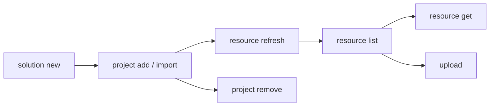

# Develop a Solution

Create a solution, add automation projects, and sync resource declarations.

> For full option details on any command, use `--help` (e.g., `uip solution project add --help`).

## When to Use

- Starting a new multi-project automation from scratch
- Organizing existing projects into a single deployable unit
- Managing resource declarations across projects before packing

## Prerequisites

- Authenticated (`uip login`) -- required for remote resource lookup during `resource refresh` and for `upload`
- Projects to add must contain `project.uiproj` or `project.json`

## Flow



---

## Step 1: Create a New Solution

```bash
uip solution new "InvoiceAutomation" --output json
```

Creates `InvoiceAutomation/InvoiceAutomation.uipx`. All projects must live inside this directory (or be imported into it).

> If the target folder already exists and is empty, `solution new` drops the `.uipx` inside without nesting or erroring. No need to pre-delete an empty target.

## Step 2: Add Existing Projects

Register a project that already lives inside the solution directory.

```bash
uip solution project add ./InvoiceAutomation/Processor --output json

# With explicit solution file
uip solution project add ./InvoiceAutomation/Reporter ./InvoiceAutomation/InvoiceAutomation.uipx --output json
```

The `.uipx` is auto-discovered by walking up from the project path if not specified. `Type` is auto-detected from `project.uiproj` / `project.json` — do not pass it.

`add` is transactional: on success, both the `.uipx` entry and the matching `resources/solution_folder/{package,process}/<name>.json` files are created together; on failure, nothing is mutated.

## Step 3: Import External Projects

Copy a project from outside the solution tree into the solution directory and register it.

```bash
uip solution project import --source /path/to/ExternalProject --output json
```

Unlike `add`, `import` copies source files into the solution directory first, then registers the copy.

> **Three names can diverge after `import`.** The destination folder name is the basename of `--source`. The `ProjectRelativePath` in `.uipx` matches the folder. The auto-generated package resource name is taken from the project metadata (e.g., `pyproject.toml [project].name` for Python coded agents) — which may differ from the folder. Rename the source directory to the intended project name **before** importing, or trace the relationship via the `projectKey` UUID inside the resource files.

## Step 4: Remove a Project

Unregister a project from the `.uipx` manifest. Does NOT delete files from disk.

```bash
uip solution project remove ./InvoiceAutomation/OldProject --output json
```

## Step 5: List Projects

Enumerate the projects registered in the local `.uipx` manifest. Reads only on-disk metadata — no backend call, so safe to use offline or in CI checks.

```bash
# from inside the solution dir
uip solution project list --output json

# or with an explicit solution folder
uip solution project list --solution-folder ./InvoiceAutomation --output json
```

`Name` is read from each project's `project.uiproj`, falling back to the directory basename if the manifest is missing or unreadable. Empty solutions return `Data: []`.

## Step 6: List Resources

Show resources of a given kind declared in the solution, available in Orchestrator, or both. `--kind` is required — pick one kind at a time. Run from inside the solution directory (default), or pass `--solution-folder <path>` to target another location.

```bash
# from inside the solution dir
uip solution resource list --kind Queue --output json
uip solution resource list --kind Process --source local --output json
uip solution resource list --kind Queue --search "Invoice" --output json

# explicit folder
uip solution resource list --kind App --solution-folder ./InvoiceAutomation --output json
```

| Option | Values | Default |
|--------|--------|---------|
| `--solution-folder <path>` | Path to solution root | Current working directory |
| `--kind <kind>` (required) | `Queue`, `Asset`, `Bucket`, `Process`, `Connection`, `App`, `Index`, `Trigger` (any RCS kind) | — |
| `--search <term>` | Name substring match | No filter |
| `--source <source>` | `all`, `local`, `remote` | `all` |
| `--login-validity <minutes>` | Minimum minutes left on token before refresh | `10` |

## Step 7: Refresh Resources

Re-scan all projects and sync resource declarations from their `bindings_v2.json` files. Refresh is the only way to reconcile a solution's local artefacts with cloud entities — run it after adding/importing projects, after editing `bindings_v2.json`, or before any `pack` / `upload`.

```bash
# from inside the solution dir
uip solution resource refresh --output json

# explicit folder
uip solution resource refresh --solution-folder ./InvoiceAutomation --output json
```

| Field | Meaning |
|-------|---------|
| `Created` | New local skeletons created (resource didn't exist in cloud) |
| `Imported` | Cloud resources imported into the solution (artefact files written + linked) |
| `Skipped` | Resources already tracked in the solution |
| `Warnings` | Bindings that couldn't be resolved (logged for follow-up) |

### What `refresh` actually does

> **`Result: Success` only means the CLI executed — not that the refresh service inside it succeeded.** The underlying service can fail (e.g., schema errors in `bindings_v2.json` logged to stderr as `ERROR [ResourceBuilder:BindingsMetadataSerializer] ...`) while the JSON still returns `Result: Success` with `Created: 0, Imported: 0, Skipped: 0`. Always inspect stderr for `ERROR` lines, and treat `Created==0 && Imported==0 && Skipped==0` while bindings exist on disk as a refresh failure.

## Step 7: Upload to Studio Web
1. **Discover bindings** — reads `bindings_v2.json` from each project (solution root copy is also read for agent projects).
2. **Discover cloud GUIDs** — for agent projects, supplements bindings with `<project>/resources/<X>/resource.json` files. These carry a `referenceKey` (GUID) for tools/escalations/contexts that the agent depends on; the GUID is the unambiguous cloud identity (binding names alone aren't unique across folders).
3. **Reconcile in-solution projects (`.uipx`)** — generates project artefact files (`process/<type>/`, `package/`) from SDK templates. Internal to the solution; no debug overwrite written.
4. **Sync external references** — for each cloud resource the solution depends on, calls Orchestrator/Apps APIs and writes:
   - The artefact files under `resources/solution_folder/<kind>/...`
   - A user-scoped debug overwrite at `userProfile/<userId>/debug_overwrites.json` linking the local skeleton to the cloud entity (key + folder + FQN). Studio Web's runtime needs the FQN populated to resolve "configured folder" lookups.

### App resources

When an agent's escalation channel (`channels[].properties.resourceKey`) points to an Action Center App, refresh imports four artefact files:

```
resources/solution_folder/app/<subType>/<AppName>.json
resources/solution_folder/appVersion/<AppVersionTitle>.json
resources/solution_folder/package/<AppVersionTitle>.json
resources/solution_folder/process/webApp/<AppName>.json
```

Plus debug overwrites for the App and its codeBehindProcess. The App's `spec.version` must match the cloud Apps service `semVersion` (current published) — otherwise Studio Web's Health Analyzer flags "App is no longer available".

### Folder disambiguation

When a name (e.g. `orders` queue) exists in multiple cloud folders, refresh prefers the folder declared in the binding's `folderPath`. Without a folder hint and multiple matches, refresh marks the binding unresolved and emits a warning rather than picking one silently.

The placeholder `solution_folder` (and `.`) in a binding's folder field means "no folder" / tenant scope — they're not real cloud folders.

## Step 8: Get a Single Resource Configuration

Fetch the full configuration (`spec`, `apiVersion`, `isOverridable`, `resourceOverwrite`) for a specific resource by key. Useful when you need the resolved server state for a binding — e.g., constructing a deploy override, resolving an entry-point ID, inspecting a connection's authentication mode.

```bash
# from inside the solution dir
uip solution resource get <resource-key> --output json

# explicit folder + transitive deps
uip solution resource get <resource-key> --solution-folder ./InvoiceAutomation --include-dependencies --output json
```

| Option | Purpose |
|--------|---------|
| `--solution-folder <path>` | Solution root (default cwd) |
| `--include-dependencies` | Return the resource **plus** every dependency configuration in one shot |
| `--login-validity <minutes>` | Minimum minutes left on token before refresh (default `10`) |

### How resolution works

`get` accepts any key from `solution resource list` — local or remote — and dispatches accordingly:

1. **Local first** — calls SDK `getConfigurationAsync(key)`, which reads `resources/solution_folder/**/<resource>.json` and returns the design-time spec (plus any debug overwrite). This is what's bundled at pack time. Output is a subset of the cloud spec — good enough for most planning work.
2. **Fallback to RCS + FPS** — if the key isn't in the local solution, the CLI scans the resource catalog (`searchFolderEntities`) for it. On match, it builds a `ResourceReferenceModel` and calls the SDK's `IImportResourceHelper.exportResourceAsync` (the same workhorse `refresh` uses). The returned `ResourceDefinition` is mapped to the same `ResourceConfiguration` shape, so callers get a uniform output regardless of source.
3. **No match anywhere** → exits with `Failure` and `Resource '<key>' was not found in the solution or in the resource catalog`.

### Local vs remote spec — they're not identical

The local file is what `refresh` (and `solution project add`) wrote to disk: a declarative subset of the cloud entity. The remote (FPS) spec includes server-resolved fields the local can't have:

| Field | Local | Remote (FPS) |
|-------|-------|--------------|
| `name`, `package`, basic metadata | ✅ | ✅ |
| `apiVersion` | ✅ | ✅ |
| `entryPointUniqueId` / `entryPoints` | ❌ usually `null` | ✅ alocate de server la deploy |
| `inputArgumentsSchemaV2` / `outputArgumentsSchemaV2` | ❌ | ✅ |
| `agentMemory`, `targetRuntime`, `environmentVariables` | ❌ | ✅ runtime defaults |

If you need the full server spec for a resource that's already in the solution (e.g., for a deploy override), `--include-dependencies` paired with manual inspection of the dependency graph is one option; the cleaner path is to delete the local file and let `refresh` re-import it from the cloud.

### Why `solution resource list` and `get` aren't symmetric

`list --source remote` returns entities from RCS that are **visible to your user** — including ones not bound to this solution. `get` is solution-context-aware: it considers anything in your `.uipx`'s solution_folder as "local", and falls back to RCS for everything else. A key shown by `list --source remote` that isn't bound to the solution will resolve via the FPS fallback.

## Step 9: Upload to Studio Web

Upload the solution for browser-based editing. Accepts a directory, `.uipx` file, or `.uis` archive.

```bash
uip solution upload ./InvoiceAutomation --output json
```

If the `SolutionId` in `.uipx` matches an existing Studio Web solution, the upload overwrites it.

## Step 10: Delete from Studio Web

Remove a solution from Studio Web by its UUID (returned by `upload`).

```bash
uip solution delete <solution-id> --output json
```

Deletes the Studio Web copy only -- local files and published packages are not affected.

---

## Complete Example

Create a solution with two projects, sync resources, and verify:

```bash
# 1. Create the solution
uip solution new "InvoiceAutomation" --output json

# 2. Add projects (already inside the solution directory)
uip solution project add ./InvoiceAutomation/Processor --output json
uip solution project add ./InvoiceAutomation/Reporter --output json

# 3. Move into the solution dir so subsequent commands default --solution-folder
cd ./InvoiceAutomation

# 4. Sync resource declarations from project bindings
uip solution resource refresh --output json

# 5. Verify resources are tracked (per kind)
uip solution resource list --kind Process --source local --output json
uip solution resource list --kind Queue --source local --output json

# 6. Inspect one resource's full configuration (local + RCS fallback)
uip solution resource get <resource-key> --output json
```

---

## Field-tested gotchas

Durable CLI behaviors that have caught agents in practice. Treat each as a hard rule.

### Always verify state after every mutation

`add`, `remove`, and `refresh` can succeed in stdout but fail (or partially fail) on disk. After every mutation:

```bash
# 1. What does .uipx claim?
cat ./MySolution/MySolution.uipx | grep -A 2 ProjectRelativePath

# 2. What resource files actually exist?
ls -1 ./MySolution/resources/solution_folder/package/
ls -1 ./MySolution/resources/solution_folder/process/

# 3. The two sets MUST agree by name. If not, the solution is corrupt.
```

If `.uipx` and `resources/solution_folder/` disagree, follow the recovery procedure in the matching gotcha below.

### `bindings.json` vs `bindings_v2.json` — different files, different schemas

| File | Created by | Read by |
|---|---|---|
| `bindings.json` | `uipath init` (coded agent) | the agent at runtime |
| `bindings_v2.json` | `uip maestro flow new`, Maestro Case scaffold, Studio Web (mirrors agent bindings up to solution root) | `uip solution resource refresh` |

Copying `bindings.json` → `bindings_v2.json` does **not** work — the schemas differ, and `resource refresh` will silently fail (see "false success" gotcha above). Naive hand-authoring or copy-paste from `bindings.json` produces the opaque error `TypeError: Cannot read properties of undefined (reading 'toLowerCase')`. When a project's tooling already manages `bindings_v2.json` (Flow / Case / agent solutions), edit through that product's commands rather than the file directly, then run `resource refresh` to reconcile.

### `resource refresh` reports false success on schema errors

See [Step 6](#step-6-refresh-resources). Always capture stderr and grep for `ERROR`. The `Warnings` field stays empty even when the underlying parser throws.

### `project remove` leaves orphan package resources

See [Step 4](#step-4-remove-a-project). After `remove`, manually delete `resources/solution_folder/package/<name>.json` if you plan to re-add with the same name. To fully delete a project, also remove the project folder — `remove` does not touch source files.

---

## Variations and Gotchas

### `add` vs `import`

| | `project add` | `project import` |
|-|----------------|-------------------|
| Project location | Must already be inside the solution directory | Can be anywhere on disk |
| File handling | Registers only (no file copy) | Copies into solution tree, then registers |
| Use case | Project created inside the solution | Bringing in an external project |

### `remove` does not delete files

`project remove` unregisters from `.uipx` but leaves the project directory intact. Delete files manually if needed.

### `resource refresh` is the sync mechanism

Adding a project does not automatically sync its resources. The refresh scans all registered projects for `bindings_v2.json`, creates solution resources for untracked bindings, imports from Orchestrator when a match exists, and skips already-tracked bindings.

### Virtualizable vs non-virtualizable resources

| Virtualizable | Non-virtualizable |
|---------------|-------------------|
| Queue, Asset, Bucket | Process, Connection, App |
| Can exist as local placeholders (created at deploy time) | Must reference an existing Orchestrator/IS/Apps resource |

If a non-virtualizable resource isn't found in cloud, refresh emits a warning and the deployment will fail until the resource is provisioned (or the binding is fixed/removed).

### `bindings_v2.json` locations

Studio Web writes bindings in two places depending on project type:
- `<project>/bindings_v2.json` — for flow / RPA projects
- Solution root `bindings_v2.json` — added for agent projects (Studio Web mirrors them up)

Refresh reads both. Don't hand-edit these — they're regenerated whenever Studio Web saves the project.

### Per-user debug overwrites

`userProfile/<userId>/debug_overwrites.json` is per-user state (the `userId` is your UiPath user GUID). Refresh writes only your own entries; another user opening the bundled solution would have separate entries. The bundle (`.uis`) carries `userProfile/` for everyone who ran refresh; Studio Web picks the active user's at runtime.

### `upload` overwrites on matching SolutionId

The `SolutionId` in `.uipx` determines identity. If a Studio Web solution with the same ID exists, `upload` replaces it. To upload as a new solution, change the `SolutionId`.

### `delete` uses the solution UUID, not the name

Get the UUID from `upload` output or Studio Web -- the name string is not accepted.

### `.uipx` auto-discovery

When `[solutionFile]` is omitted, the CLI walks up from the project path looking for a single `.uipx` file. If multiple `.uipx` files exist in the same directory, specify which one explicitly.

### `--solution-folder` defaults to cwd

`resource list / refresh / get` default `--solution-folder` to the current working directory. Run them from inside the solution dir for the shortest invocation (`uip solution resource list --kind <kind>`) or pass `--solution-folder <path>` explicitly.

### `resource get` for cross-folder inspection

Because `get` falls back to RCS + FPS export when the key isn't local, it works as a quick way to fetch the full server spec for any resource your tenant exposes — even ones that aren't yet bound to this solution. Pair with `solution resource list --kind <kind> --source remote` to discover keys.

---

## Cheat sheet

| Want to... | Command | Watch for |
|---|---|---|
| Create a fresh solution | `uip solution new <name>` | Accepts an existing empty directory; drops `.uipx` inside |
| Add a project already in the solution dir | `uip solution project add ./<dir>` | Transactional — `.uipx` and `resources/solution_folder/{package,process}/` agree on success |
| Pull in an external project | `uip solution project import --source <path>` | Rename source folder first to avoid 3-name divergence |
| Sync resource bindings | `uip solution resource refresh --solution-folder <solution-dir>` | **Check stderr for ERROR**; `Result: Success` with 0/0/0 counts is suspicious if `bindings_v2.json` exists |
| Remove a project | `uip solution project remove ./<dir>` | Manually delete `resources/.../package/<name>.json` afterwards |
| List resources | `uip solution resource list --kind <kind> --solution-folder <solution-dir> --source local` | Good sanity check after any mutation; pick one kind per call |
| Pack | `uip solution pack <solution-dir> <output-dir>` | See [pack-and-deploy.md](pack-and-deploy.md) for full pack/publish/deploy flow |

---

## Related

- [Pack & Deploy](pack-and-deploy.md) -- Next step: pack, publish, and deploy the solution
- [Scenarios](scenarios.md) -- Multi-project recipes: same-name across folders, cross-ref intra-solution, shared cloud resources, virtual assets
- [solution.md](solution.md) -- Solution tool overview and full command tree
