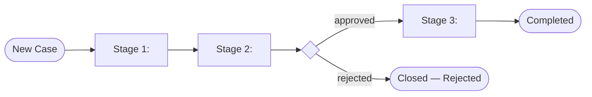

# Solution Design Document — <PROCESS_NAME>

> **Template:** Case Management — organizes work into stages with tasks, SLA rules, and escalation.
> **Phase 2 sections:** §3, §4, §7, §13, §14, §15. **Phase 3 sections:** all others.

---

## Document History

| Date | Version | Author | Role | Comments |
|---|---|---|---|---|
| <DATE> | 1.0 | <AUTHOR> | Generated by AI Agent | Initial SDD generated from PDD |

---

<!-- DO NOT RENAME: uipath-planner detects SDDs via this exact heading or the marker below. -->
<!-- planner-handoff:v1 -->
## Planner Handoff

| Field | Value |
|---|---|
| **Execution autonomy** | <autonomous \| interactive> |
| **SDD scope** | <single-product \| solution> |
| **Project list section** | §15 Project Structure + §14 Integrated Components |
| **Tasks file** | `<CASE_NAME_KEBAB>-tasks.md` |
| **Generated by** | uipath-solution v<VERSION> |
| **Generation date** | <YYYY-MM-DD> |

---

<!--
EMIT THIS BLOCK ONLY when Execution autonomy: autonomous.
Skip entirely in interactive mode (decisions were checkpoint-reviewed).
See sdd-generation-guide.md Phase 3 Step 3a for the format spec.
Non-RPA scope: rows collapse to scope + product-specific Level-1.5-equivalent.
-->
## Decisions Made

> Autonomous mode picked the architectural decisions below without a user checkpoint. Override by rerunning in Interactive mode or by editing the relevant SDD section.

| # | Decision | Picked | One-sentence reason |
|---|---|---|---|
| 1 | **Scope** (Level 1) | <SINGLE_PRODUCT_OR_SOLUTION_COMPOSITION> | <REASON> |
| 2 | **Stage model** | <NUMBER_OF_STAGES_AND_LINEAR_OR_BRANCHED> | <REASON_FROM_PDD> |

---

<!--
EMIT THIS BLOCK ONLY when at least one [SME REVIEW] item remains after Step 1.5 resolution.
Skip entirely when no review items are open.
See sdd-generation-guide.md Phase 3 Step 3 for the format spec.
-->
## Action Required — SME Review Items

| # | Section | Item | Question |
|---|---|---|---|
| 1 | <SECTION> | <ITEM> | <QUESTION> |

> These items are marked `[SME REVIEW]` in the document. The automation can be built with defaults, but these must be verified before production.

---

## Table of Contents

1. Case Overview
2. Case Lifecycle Diagram
3. Stages
4. Tasks Grid
5. Entry / Exit Conditions
6. Business Rules
7. Data Definitions
8. SLA Rules
9. Escalations
10. Exception Handling
11. Compliance Constraints
12. Roles & RACI Matrix
13. Task Type Registry
14. Integrated Components
15. Project Structure
16. Testing Strategy
17. Next Steps

---

## 1. Case Overview

| Field | Value |
|---|---|
| **Case name** | <CASE_NAME> |
| **Objective** | <OBJECTIVE> |
| **Case type** | <CASE_TYPE — invoice case, ticket case, claim case, etc.> |
| **Expected volume** | <CASES_PER_DAY> |
| **Typical case duration** | <DURATION_RANGE> |
| **Maximum case duration** | <HARD_MAX_BEFORE_BREACH> |

### In Scope

- <ACTIVITY_1>

### Out of Scope

- <ACTIVITY_1>

---

## 2. Case Lifecycle Diagram



---

## 3. Stages

<!-- Stages are BPMN-style phases in the case lifecycle. Each has entry/exit conditions and tasks. -->

| # | Stage Name | Purpose | Entry Condition | Exit Condition | SLA |
|---|---|---|---|---|---|
| 1 | <STAGE_NAME> | <PURPOSE> | <ENTRY_CONDITION> | <EXIT_CONDITION> | <SLA_DURATION> |

---

## 4. Tasks Grid

<!-- Tasks are organized as a 2D grid: tasks[lane][index].
     Lanes represent parallel execution tracks within a stage.
     Index is the sequence within a lane. -->

### Stage: <STAGE_NAME>

| Lane | Index | Task Name | Task Type | Purpose | Inputs | Outputs |
|---|---|---|---|---|---|---|
| 0 | 0 | <TASK_NAME> | <TASK_TYPE> | <PURPOSE> | <INPUT_FIELDS> | <OUTPUT_FIELDS> |
| 0 | 1 | <TASK_NAME> | <TASK_TYPE> | <PURPOSE> | <INPUT_FIELDS> | <OUTPUT_FIELDS> |
| 1 | 0 | <TASK_NAME> | <TASK_TYPE> | <PURPOSE> | <INPUT_FIELDS> | <OUTPUT_FIELDS> |

<!-- Repeat per stage. -->

---

## 5. Entry / Exit Conditions

### Stage entry conditions

| Stage | Condition | Notes |
|---|---|---|
| <STAGE_NAME> | <JSON_PATH_OR_EXPRESSION> | <NOTES> |

### Stage exit conditions

| Stage | Condition | Next Stage (on true) |
|---|---|---|
| <STAGE_NAME> | <EXPRESSION> | <TARGET_STAGE> |

### Case exit conditions

| Condition | Final Status |
|---|---|
| <EXPRESSION> | <COMPLETED / REJECTED / CANCELLED> |

### Task entry conditions

| Task | Condition |
|---|---|
| <TASK_NAME> | <EXPRESSION> |

---

## 6. Business Rules

<!-- Extract every business rule from the PDD. Assign IDs if the PDD does not.
     Include the regulatory authority when the rule has a legal or compliance basis.
     Rules must reference the task(s) where they are enforced — this links rules to implementation. -->

| ID | Rule Name | Trigger Point | Condition | Action | Affected Tasks | Source / Authority |
|---|---|---|---|---|---|---|
| BR-01 | <RULE_NAME> | <STAGE_AND_TASK> | <WHEN_DOES_IT_APPLY> | <WHAT_TO_DO> | <TASK_NAMES_FROM_§4> | <REGULATORY_CITATION_OR_BUSINESS_SOURCE> |

---

## 7. Data Definitions

<!-- Define the data objects that flow through the case lifecycle.
     Use JSON schema style for Case Management (case data is JSON-based).
     Keep objects flat — no deep nesting. Max 15 fields per object.
     Default to `string` unless the PDD specifies numeric, date, or boolean operations. -->

### Case Data Object

<!-- The primary case record that persists across all stages. -->

| Field | Type | Source | Stage Written | Description | Sensitivity |
|---|---|---|---|---|---|
| <FIELD_NAME> | <string / number / boolean / date> | <SOURCE_SYSTEM_OR_STAGE> | <STAGE_NUMBER> | <DESCRIPTION> | <PHI / PII / Internal / Public> |

### Supporting Data Objects

<!-- Secondary objects created or consumed during the case lifecycle (e.g., notification records, compliance forms, care plans). -->

#### <OBJECT_NAME>

| Field | Type | Description |
|---|---|---|
| <FIELD_NAME> | <TYPE> | <DESCRIPTION> |

### Data Flow

<!-- How data moves between stages and external systems. -->

| From | To | Data | Trigger | Frequency |
|---|---|---|---|---|
| <SOURCE_STAGE_OR_SYSTEM> | <TARGET_STAGE_OR_SYSTEM> | <DATA_FIELDS> | <EVENT> | <PER_CASE / BATCH / SCHEDULED> |

---

## 8. SLA Rules

| SLA ID | Applies To | Type | Duration / Condition | At-Risk Threshold |
|---|---|---|---|---|
| SLA-01 | <STAGE_OR_CASE> | <TIME_BASED / CONDITION_BASED> | <DURATION_OR_EXPRESSION> | <PERCENTAGE_BEFORE_BREACH> |

---

## 9. Escalations

| Escalation ID | Trigger | Action | Notify |
|---|---|---|---|
| ESC-01 | <SLA_AT_RISK / SLA_BREACHED / CONDITION> | <REASSIGN / ESCALATE / AUTO_RESOLVE> | <ROLE_OR_EMAIL> |

---

## 10. Exception Handling

<!-- Business exceptions are anticipated process-level deviations (incomplete docs, duplicates, out-of-network).
     System errors are infrastructure failures (system outage, connector timeout, auth failure).
     Separate from §9 Escalations, which cover SLA-triggered actions. -->

### Business Exceptions

| ID | Exception Name | Trigger Task | Trigger Condition | Resolution | Escalation Path | SLA Impact |
|---|---|---|---|---|---|---|
| BX-01 | <EXCEPTION_NAME> | <TASK_NAME_FROM_§4> | <HOW_TO_DETECT> | <WHAT_TO_DO> | <WHO_TO_ESCALATE_TO> | <SLA_IMPACT_DESCRIPTION> |

**Default handler:** For any unanticipated business exception, <DEFAULT_ACTION>.

### System Errors

| ID | Error Name | Trigger Task | Trigger Condition | Retry Policy | Action |
|---|---|---|---|---|---|
| SE-01 | <ERROR_NAME> | <TASK_NAME_FROM_§4> | <HOW_TO_DETECT> | <RETRY_COUNT_AND_BACKOFF> | <WHAT_TO_DO> |

**Default handler:** For any unanticipated system error, <DEFAULT_ACTION>.

---

## 11. Compliance Constraints

<!-- Regulatory and compliance requirements that constrain implementation decisions.
     Only include constraints that directly affect how tasks are built or configured.
     Reference the task or stage where each constraint is enforced. -->

| Regulation / Standard | Applies To | Constraint | Implementation Impact |
|---|---|---|---|
| <REGULATION_NAME> | <STAGE_OR_TASK> | <WHAT_IS_REQUIRED_OR_PROHIBITED> | <HOW_THIS_CONSTRAINS_THE_BUILD> |

### Audit & Traceability Requirements

- <AUDIT_REQUIREMENT_1>

---

## 12. Roles & RACI Matrix

### Role Definitions

| Role | Primary Responsibilities | Key Decisions | Classification |
|---|---|---|---|
| <ROLE_NAME> | <RESPONSIBILITIES> | <DECISIONS> | <INTERNAL / EXTERNAL / REGULATORY> |

### RACI Matrix

<!-- R = Responsible, A = Accountable, C = Consulted, I = Informed.
     Map roles to stages. Use this to configure task assignments and notification targets. -->

| Stage | <ROLE_1> | <ROLE_2> | <ROLE_3> | <ROLE_4> |
|---|---|---|---|---|
| <STAGE_NAME> | <R/A/C/I/—> | <R/A/C/I/—> | <R/A/C/I/—> | <R/A/C/I/—> |

---

## 13. Task Type Registry

<!-- Each task maps to a taskTypeId from the registry. Registry resolution happens at implementation time;
     this section lists the *kinds* of tasks needed so the registry query can target them. -->

| Task Name (from §4) | Task Type Kind | Implementation |
|---|---|---|
| <TASK_NAME> | RPA | Invokes a Studio RPA process |
| <TASK_NAME> | AGENT | Invokes a UiPath Agent |
| <TASK_NAME> | API_WORKFLOW | Invokes an API Workflow |
| <TASK_NAME> | CONNECTOR_ACTIVITY | Integration Service connector action |
| <TASK_NAME> | CONNECTOR_TRIGGER | Integration Service connector trigger |
| <TASK_NAME> | HITL | Human-in-the-loop approval task |

---

## 14. Integrated Components

### RPA Processes Invoked

| Process Name | Called From Task | Purpose |
|---|---|---|
| `<PROCESS_NAME>` | <TASK_NAME> | <PURPOSE> |

### Agents Invoked

| Agent Name | Called From Task | Purpose |
|---|---|---|
| `<AGENT_NAME>` | <TASK_NAME> | <PURPOSE> |

### API Workflows Invoked

| API Workflow Name | Called From Task | Purpose |
|---|---|---|
| `<API_WORKFLOW_NAME>` | <TASK_NAME> | <PURPOSE> |

### Integration Service Connectors

| Connector | Called From Task | Operation |
|---|---|---|
| <CONNECTOR_NAME> | <TASK_NAME> | <OPERATION> |

### HITL Tasks

<!-- Inline in Case Management — use HITL task type with inline schema (do NOT route to HITL skill; Case Mgmt handles it directly). -->

| Task Name | Stage | Approval Schema | Who Approves |
|---|---|---|---|
| <TASK_NAME> | <STAGE_NAME> | <SCHEMA_SUMMARY> | <ROLE_OR_USER> |

---

## 15. Project Structure

```text
<CASE_PROJECT_NAME>/
├── caseplan.json
├── sdd.md                   (this file — input to planning)
├── tasks.md                 (generated during planning)
├── registry-resolved.json   (audit trail)
└── content/
    └── <CASE_NAME>.bpmn     (auto-generated)
```

---

## 16. Testing Strategy

### Canonical Test Case

| Field | Value |
|---|---|
| <FIELD_NAME> | `<TEST_VALUE>` |

### Happy Path Assertions

1. <ASSERTION_1>

### Exception Test Cases

| Exception ID | Test Setup | Trigger | Expected Outcome |
|---|---|---|---|
| BX-01 | <HOW_TO_SET_UP> | <WHAT_TRIGGERS_IT> | <EXPECTED_BEHAVIOR> |

### SLA Breach Scenarios

| Scenario | Setup | Expected Escalation |
|---|---|---|
| <SCENARIO> | <SETUP> | <EXPECTED> |

### Acceptance Criteria

<!-- Derived from PDD KPIs. Each criterion defines a measurable threshold the implementation must meet. -->

| # | Criterion | Measurement | Threshold |
|---|---|---|---|
| 1 | <CRITERION_NAME> | <HOW_MEASURED> | <PASS_THRESHOLD> |

---

## 17. Next Steps

This SDD captures architecture and decisions. To generate the implementation task list and execute the build, load `uipath-planner` with this SDD path:

> Load `uipath-planner`. SDD path: `<this-file>`.

The planner detects the `## Planner Handoff` header, parses §15 Project Structure and §14 Integrated Components, derives the per-skill task list (routing each task to `uipath-maestro-case`, `uipath-rpa`, `uipath-agents`, `uipath-platform`, etc.), writes `<CASE_NAME_KEBAB>-tasks.md` alongside this SDD, and emits live `TaskCreate` calls. If `Execution autonomy: interactive`, it enters plan mode for task review before execution.

Implementation tasks **do not live in this SDD** — they live in the planner's output.

---

**End of Solution Design Document.**
