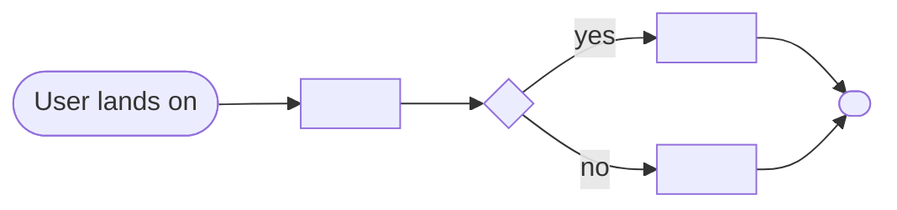

# Solution Design Document — <APP_NAME>

> **Template:** Coded Apps (web applications). If chosen when the PDD lacked UI details, gap-filling Q&A in Phase 1 should have filled: framework, app type, pages/routes, state management.
> **Phase 2 sections:** §2, §3, §4, §5, §6, §10. **Phase 3 sections:** all others.

---

## Document History

| Date | Version | Author | Role | Comments |
|---|---|---|---|---|
| <DATE> | 1.0 | <AUTHOR> | Generated by AI Agent | Initial SDD generated from PDD |

---

<!-- DO NOT RENAME: uipath-planner detects SDDs via this exact heading or the marker below. -->
<!-- planner-handoff:v1 -->
## Planner Handoff

| Field | Value |
|---|---|
| **Execution autonomy** | <autonomous \| interactive> |
| **SDD scope** | <single-product \| solution> |
| **Project list section** | §10 Project Structure + §9 Integrated Components |
| **Tasks file** | `<APP_NAME_KEBAB>-tasks.md` |
| **Generated by** | uipath-solution v<VERSION> |
| **Generation date** | <YYYY-MM-DD> |

---

<!--
EMIT THIS BLOCK ONLY when Execution autonomy: autonomous.
Skip entirely in interactive mode (decisions were checkpoint-reviewed).
See sdd-generation-guide.md Phase 3 Step 3a for the format spec.
Non-RPA scope: rows collapse to scope + product-specific Level-1.5-equivalent.
-->
## Decisions Made

> Autonomous mode picked the architectural decisions below without a user checkpoint. Override by rerunning in Interactive mode or by editing the relevant SDD section.

| # | Decision | Picked | One-sentence reason |
|---|---|---|---|
| 1 | **Scope** (Level 1) | <SINGLE_PRODUCT_OR_SOLUTION_COMPOSITION> | <REASON> |
| 2 | **App type & framework** | <WEB_OR_ACTION + REACT_OR_ANGULAR_OR_VUE> | <REASON_FROM_PDD> |

---

<!--
EMIT THIS BLOCK ONLY when at least one [SME REVIEW] item remains after Step 1.5 resolution.
Skip entirely when no review items are open.
See sdd-generation-guide.md Phase 3 Step 3 for the format spec.
-->
## Action Required — SME Review Items

| # | Section | Item | Question |
|---|---|---|---|
| 1 | <SECTION> | <ITEM> | <QUESTION> |

> These items are marked `[SME REVIEW]` in the document. The automation can be built with defaults, but these must be verified before production.

---

## Table of Contents

1. App Overview
2. App Type & Tech Stack
3. Pages & Routes
4. Components
5. State Management
6. API Integration
7. User Flows
8. Error Handling
9. Integrated Components
10. Project Structure
11. Testing Strategy
12. Next Steps

---

## 1. App Overview

| Field | Value |
|---|---|
| **App name** | <APP_NAME> |
| **Objective** | <OBJECTIVE> |
| **Primary users** | <USER_ROLES> |
| **Trigger** | <HOW_IS_THE_APP_OPENED — user navigation / action from automation / HITL form> |
| **Expected concurrent users** | <NUMBER> |

### In Scope

- <FEATURE_1>

### Out of Scope

- <FEATURE_1>

---

## 2. App Type & Tech Stack

### App Type

- [ ] **Web** — standalone web app users navigate to
- [ ] **Action** — triggered by an automation, receives and returns data

### Tech Stack

**Framework:** <React / Angular / Vue>
**Build tool:** <Vite / Webpack / etc.>
**UI library:** <Material UI / Ant Design / Tailwind / etc.>
**State management:** <Redux / Zustand / Pinia / Context / etc.>

**Justification:** <2-3 sentences on why this stack fits>

---

## 3. Pages & Routes

| Route | Page Name | Purpose | Who Sees It |
|---|---|---|---|
| `/` | <PAGE_NAME> | <PURPOSE> | <ROLE> |
| `/<PATH>` | <PAGE_NAME> | <PURPOSE> | <ROLE> |

---

## 4. Components

<!-- List major components. Keep it architectural, not implementation-level. -->

| Component Name | Type | Used On Pages | Purpose |
|---|---|---|---|
| `<COMPONENT_NAME>` | <LAYOUT / FORM / TABLE / MODAL / etc.> | <PAGE_NAMES> | <PURPOSE> |

---

## 5. State Management

### Global State

| State Slice | Type | Purpose |
|---|---|---|
| <SLICE_NAME> | <USER / DATA / UI> | <WHAT_IT_HOLDS> |

### Local Component State

<!-- Describe where local state is appropriate vs. global. -->

- <COMPONENT_NAME>: uses local state for <REASON>

---

## 6. API Integration

<!-- Which backends the app calls. -->

| Backend | Type | Purpose | Auth |
|---|---|---|---|
| <BACKEND_NAME> | <UIPATH_API_WORKFLOW / REST / GRAPHQL> | <PURPOSE> | <AUTH_MECHANISM> |

### UiPath API Workflow Calls

<!-- If the app calls API Workflows, list them. -->

| API Workflow | Called From | Input | Output |
|---|---|---|---|
| `<API_WORKFLOW_NAME>` | <COMPONENT_OR_PAGE> | <INPUT_SCHEMA> | <OUTPUT_SCHEMA> |

---

## 7. User Flows

<!-- Describe key user journeys through the app. One diagram per flow. -->

### Flow: <FLOW_NAME>



**Description:** <NARRATIVE_OF_THE_FLOW>

---

## 8. Error Handling

| Error Scenario | User-Facing Behavior | Logging |
|---|---|---|
| API call fails | <SHOW_ERROR_MESSAGE / RETRY_UI / FALLBACK> | <LOG_TO_WHERE> |
| Validation error | <INLINE_ERROR_MESSAGE> | <YES/NO> |
| Session expired | <REDIRECT_TO_LOGIN> | <YES/NO> |

---

## 9. Integrated Components

### Called By (if Action app)

<!-- If this is an Action app triggered by automation, describe the caller. -->

| Caller | Type | Context |
|---|---|---|
| <CALLER_NAME> | <RPA_PROCESS / FLOW / AGENT> | <WHEN_AND_WHY> |

### HITL Form Role

<!-- If the coded app serves as a HITL form renderer for another product. -->

- [ ] This app is a HITL form renderer (called from `uipath-human-in-the-loop` touchpoints)
- [ ] This app is standalone

---

## 10. Project Structure

```text
<APP_PROJECT_NAME>/
├── .uipath/
│   ├── app.config.json
│   ├── bindings.json
│   ├── entry-points.json
│   └── package-descriptor.json
├── src/
│   ├── pages/
│   ├── components/
│   ├── state/
│   └── api/
├── public/
├── package.json
└── dist/                    (build output — required before pack)
```

### Deployment Target

- [ ] Studio Web (default)
- [ ] Orchestrator (for production)

---

## 11. Testing Strategy

### Canonical Test Cases

| Test ID | User Flow | Input | Expected Outcome |
|---|---|---|---|
| T-01 | <FLOW_NAME> | <INPUT> | <EXPECTED_UI_STATE> |

### Unit Tests

- Component rendering
- State management logic
- API error handling

### E2E Tests

<!-- Use a framework like Playwright or Cypress. -->

- <E2E_TEST_DESCRIPTION>

---

## 12. Next Steps

This SDD captures architecture and decisions. To generate the implementation task list and execute the build, load `uipath-planner` with this SDD path:

> Load `uipath-planner`. SDD path: `<this-file>`.

The planner detects the `## Planner Handoff` header, parses §10 Project Structure and §9 Integrated Components, derives the per-skill task list (routing each task to `uipath-coded-apps`, `uipath-platform`, etc.), writes `<APP_NAME_KEBAB>-tasks.md` alongside this SDD, and emits live `TaskCreate` calls. If `Execution autonomy: interactive`, it enters plan mode for task review before execution.

Implementation tasks **do not live in this SDD** — they live in the planner's output.

---

**End of Solution Design Document.**
