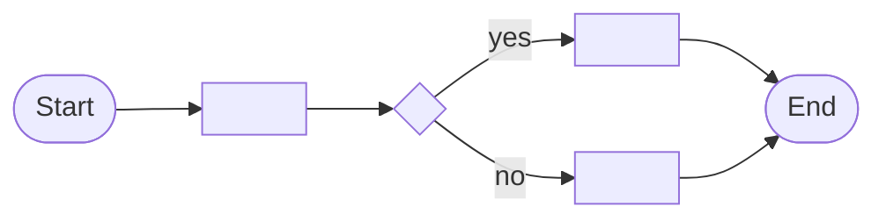

# Solution Design Document — <PROCESS_NAME>

> **Template:** Maestro Flow — orchestrates multiple automation types (RPA, agents, apps, API workflows, HITL).
> **Phase 2 sections:** §3, §4, §5, §7, §9. **Phase 3 sections:** all others.

---

## Document History

| Date | Version | Author | Role | Comments |
|---|---|---|---|---|
| <DATE> | 1.0 | <AUTHOR> | Generated by AI Agent | Initial SDD generated from PDD |

---

<!-- DO NOT RENAME: uipath-planner detects SDDs via this exact heading or the marker below. -->
<!-- planner-handoff:v1 -->
## Planner Handoff

| Field | Value |
|---|---|
| **Execution autonomy** | <autonomous \| interactive> |
| **SDD scope** | <single-product \| solution> |
| **Project list section** | §3 Nodes Inventory + §7 Integrated Components |
| **Tasks file** | `<FLOW_NAME_KEBAB>-tasks.md` |
| **Generated by** | uipath-solution v<VERSION> |
| **Generation date** | <YYYY-MM-DD> |

---

<!--
EMIT THIS BLOCK ONLY when Execution autonomy: autonomous.
Skip entirely in interactive mode (decisions were checkpoint-reviewed).
See sdd-generation-guide.md Phase 3 Step 3a for the format spec.
Non-RPA scope: rows collapse to scope + product-specific Level-1.5-equivalent.
-->
## Decisions Made

> Autonomous mode picked the architectural decisions below without a user checkpoint. Override by rerunning in Interactive mode or by editing the relevant SDD section.

| # | Decision | Picked | One-sentence reason |
|---|---|---|---|
| 1 | **Scope** (Level 1) | <SINGLE_PRODUCT_OR_SOLUTION_COMPOSITION> | <REASON> |
| 2 | **Flow trigger type** | <MANUAL_OR_SCHEDULED_OR_EVENT_OR_HTTP> | <REASON_FROM_PDD> |

---

<!--
EMIT THIS BLOCK ONLY when at least one [SME REVIEW] item remains after Step 1.5 resolution.
Skip entirely when no review items are open.
See sdd-generation-guide.md Phase 3 Step 3 for the format spec.
-->
## Action Required — SME Review Items

| # | Section | Item | Question |
|---|---|---|---|
| 1 | <SECTION> | <ITEM> | <QUESTION> |

> These items are marked `[SME REVIEW]` in the document. The automation can be built with defaults, but these must be verified before production.

---

## Table of Contents

1. Flow Overview
2. Flow Diagram
3. Nodes Inventory
4. Variables
5. Subflows
6. Triggers
7. Integrated Components
8. Error Handling
9. Project Structure
10. Testing Strategy
11. Next Steps

---

## 1. Flow Overview

| Field | Value |
|---|---|
| **Flow name** | <FLOW_NAME> |
| **Objective** | <OBJECTIVE> |
| **Department / Function** | <DEPARTMENT> — <FUNCTION> |
| **Trigger type** | <MANUAL / SCHEDULED / EVENT / HTTP> |
| **Expected execution volume** | <EXECUTIONS_PER_DAY> |

### In Scope

- <ACTIVITY_1>

### Out of Scope

- <ACTIVITY_1>

---

## 2. Flow Diagram

<!-- Build from the Phase 1 extracted steps. One node per logical step.
     Show decision points as diamond shapes, parallel branches with fork/join. -->



---

## 3. Nodes Inventory

<!-- List every node in execution order. Node types include:
     - Trigger (manual, scheduled, event)
     - Logic (if, loop, switch)
     - RPA invocation (calls a Studio process)
     - Agent invocation (calls a UiPath Agent)
     - API Workflow invocation (calls an API Workflow)
     - Connector (Integration Service)
     - Coded App (launches or receives from a coded app)
     - Transform (data map, filter, group-by)
     - HITL (QuickForm or AppTask) — flag for uipath-human-in-the-loop skill
     - Subflow (calls a subflow) -->

| # | Node Key | Node Type | Description | Inputs | Outputs | Notes |
|---|---|---|---|---|---|---|
| 1 | `start` | Trigger | <DESCRIPTION> | — | — | Trigger type: <MANUAL/SCHEDULED/EVENT> |
| 2 | `<NODE_KEY>` | <NODE_TYPE> | <DESCRIPTION> | <INPUTS> | <OUTPUTS> | <NOTES_INCLUDING_HITL_FLAGS> |

---

## 4. Variables

<!-- Flow variables are declared at flow scope with in/inout/out direction. -->

| Name | Direction | Type | Default | Description |
|---|---|---|---|---|
| <VAR_NAME> | <IN / INOUT / OUT> | <TYPE> | <DEFAULT_VALUE> | <DESCRIPTION> |

---

## 5. Subflows

<!-- Only include if the flow uses subflows. Subflows have isolated scope. -->

| Subflow Name | Purpose | Inputs | Outputs | Called From Nodes |
|---|---|---|---|---|
| `<SUBFLOW_NAME>` | <PURPOSE> | <INPUT_VARS> | <OUTPUT_VARS> | <NODE_KEYS> |

---

## 6. Triggers

<!-- How the flow is invoked. -->

| Trigger Type | Configuration | Notes |
|---|---|---|
| <MANUAL/SCHEDULED/EVENT/HTTP> | <CRON_OR_EVENT_SPEC> | <NOTES> |

---

## 7. Integrated Components

<!-- Flag the automation types the flow orchestrates. Each flagged item creates an implementation task. -->

### RPA Processes Invoked

| Process Name | Called From Node | Purpose |
|---|---|---|
| `<PROCESS_NAME>` | `<NODE_KEY>` | <PURPOSE> |

### Agents Invoked

| Agent Name | Called From Node | Purpose |
|---|---|---|
| `<AGENT_NAME>` | `<NODE_KEY>` | <PURPOSE> |

### API Workflows Invoked

| API Workflow Name | Called From Node | Purpose |
|---|---|---|
| `<API_WORKFLOW_NAME>` | `<NODE_KEY>` | <PURPOSE> |

### Integration Service Connectors

| Connector | Called From Node | Operation |
|---|---|---|
| <CONNECTOR_NAME> (Salesforce/Jira/etc.) | `<NODE_KEY>` | <OPERATION> |

### HITL Touchpoints

<!-- Flag HITL nodes. Implementation routes to uipath-human-in-the-loop skill. -->

| Node Key | HITL Type | Purpose | Approval Criteria |
|---|---|---|---|
| `<NODE_KEY>` | <QUICKFORM / APPTASK> | <PURPOSE> | <WHO_APPROVES_AND_WHAT_CRITERIA> |

### Coded Apps Referenced

| App Name | Called From Node | Role |
|---|---|---|
| `<APP_NAME>` | `<NODE_KEY>` | <HITL_FORM / DASHBOARD / ACTION_CENTER_TASK> |

---

## 8. Error Handling

| Scope | Error Type | Trigger | Action |
|---|---|---|---|
| Flow-level | Unhandled exception | Any node fails | <FAIL_FLOW / NOTIFY / RETRY> |
| Node-level | <SPECIFIC_ERROR> | <CONDITION> | <RETRY_POLICY> |

---

## 9. Project Structure

```text
<FLOW_PROJECT_NAME>/
├── project.json
├── flow_files/
│   └── <FLOW_NAME>.flow
├── entry-points.json
├── bindings_v2.json
└── content/
    └── <FLOW_NAME>.bpmn  (auto-generated)
```

### Orchestrator Deployment Target

- [ ] Studio Web (default)
- [ ] Orchestrator (requires `uipath-platform` skill)

---

## 10. Testing Strategy

### Canonical Test Case

| Input Variable | Value |
|---|---|
| <VAR_NAME> | `<TEST_VALUE>` |

### Happy Path Assertions

1. <ASSERTION_1>

### Error Path Scenarios

| Scenario | Setup | Expected Flow Behavior |
|---|---|---|
| <SCENARIO_NAME> | <SETUP> | <EXPECTED> |

---

## 11. Next Steps

This SDD captures architecture and decisions. To generate the implementation task list and execute the build, load `uipath-planner` with this SDD path:

> Load `uipath-planner`. SDD path: `<this-file>`.

The planner detects the `## Planner Handoff` header, parses §3 Nodes Inventory and §7 Integrated Components, derives the per-skill task list (routing each task to `uipath-maestro-flow`, `uipath-rpa`, `uipath-agents`, `uipath-platform`, `uipath-human-in-the-loop`, etc.), writes `<FLOW_NAME_KEBAB>-tasks.md` alongside this SDD, and emits live `TaskCreate` calls. If `Execution autonomy: interactive`, it enters plan mode for task review before execution.

Implementation tasks **do not live in this SDD** — they live in the planner's output.

---

**End of Solution Design Document.**
