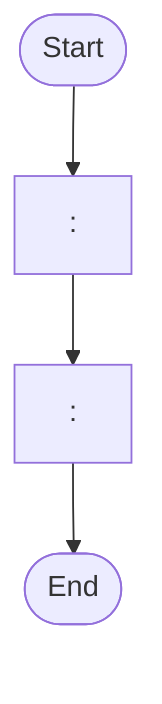
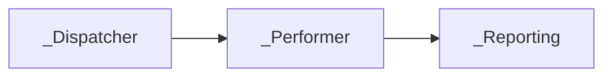

# Solution Design Document — <PROCESS_NAME>

> **Template:** RPA Process / Library / Test Automation.
> **Phase 2 sections:** §5, §9, §10, §11, §12, §13, §14. **Phase 3 sections:** all others.
> **Before filling §10-§11:** Run Level 2.5 Part A (RPA Decomposition Signals) from rpa-product-guide.md. The decomposition decision determines whether §10-§11 describe one project or a Master Project with multiple sub-projects.

---

## Document History

| Date | Version | Author | Role | Comments |
|---|---|---|---|---|
| <DATE> | 1.0 | <AUTHOR> | Generated by AI Agent | Initial SDD generated from PDD |

---

<!-- DO NOT RENAME: uipath-planner detects SDDs via this exact heading or the marker below. -->
<!-- planner-handoff:v1 -->
## Planner Handoff

| Field | Value |
|---|---|
| **Execution autonomy** | <autonomous \| interactive> |
| **SDD scope** | <single-product \| solution> |
| **Project list section** | <§10 \| §3 \| Project Inventory> |
| **Tasks file** | `<PROCESS_NAME_KEBAB>-tasks.md` |
| **Generated by** | uipath-solution v<VERSION> |
| **Generation date** | <YYYY-MM-DD> |

---

<!--
EMIT THIS BLOCK ONLY when Execution autonomy: autonomous.
Skip entirely in interactive mode (decisions were checkpoint-reviewed).
See sdd-generation-guide.md Phase 3 Step 3a for the format spec.
-->
## Decisions Made

> Autonomous mode picked the four architectural decisions below without a user checkpoint. Override by rerunning in Interactive mode or by editing the relevant SDD section.

| # | Decision | Picked | One-sentence reason |
|---|---|---|---|
| 1 | **Scope** (Level 1) | <SINGLE_PRODUCT_OR_SOLUTION_COMPOSITION> | <REASON> |
| 2 | **RPA sub-type** (Level 1.5) | <PROCESS_OR_LIBRARY_OR_TEST_AUTOMATION> | <REASON> |
| 3 | **Authoring mode** (Level 2) | <XAML_OR_CODED_OR_HYBRID> | <REASON> |
| 4 | **Framework** | <REFRAMEWORK_OR_SEQUENCE> | <REASON> |

---

<!--
EMIT THIS BLOCK ONLY when at least one [SME REVIEW] item remains after Step 1.5 resolution.
Skip entirely when no review items are open.
See sdd-generation-guide.md Phase 3 Step 3 for the format spec.
-->
## Action Required — SME Review Items

| # | Section | Item | Question |
|---|---|---|---|
| 1 | <SECTION> | <ITEM> | <QUESTION> |

> These items are marked `[SME REVIEW]` in the document. The automation can be built with defaults, but these must be verified before production.

---

## Table of Contents

1. Process Overview
2. Process Map
3. Detailed Process Steps
4. Business Rules
5. Data Definitions
6. Value Mappings
7. Exception Handling
8. Error Handling
9. Application Inventory
10. Master Project Architecture
11. Project Structure
12. Queue Architecture
13. Implementation Mode
14. Packages
15. Credentials & Assets
16. Deployment Environment
17. Testing Strategy
18. Next Steps

---

## 1. Process Overview

| Field | Value |
|---|---|
| **Process name** | <PROCESS_NAME> |
| **Objective** | <OBJECTIVE> |
| **Department / Function** | <DEPARTMENT> — <FUNCTION> |
| **Schedule** | <FREQUENCY_AND_HOURS> |
| **Volume** | <ITEMS_PER_DAY> (peak: <PEAK_PERIOD>) |
| **Avg. handling time (manual)** | <MANUAL_TIME> |
| **Avg. handling time (automated target)** | <AUTOMATED_TIME> |
| **Exception rate** | <ESTIMATED_RATE> |

### Delivery Team

> Populate from the PDD's Key Contacts section. Include only roles the PDD lists — do not invent names. Omit any row where the PDD is silent. Operational runtime details (robot type, UiPath version, hosts, scalability) live in §16 Deployment Environment.

| Role | Name | Contact |
|---|---|---|
| Solution Architect | <NAME> | <EMAIL> |
| Business Analyst | <NAME> | <EMAIL> |
| Developer(s) | <NAME> | <EMAIL> |
| Project Manager | <NAME> | <EMAIL> |
| SME / Process Owner | <NAME> | <EMAIL> |

### In Scope

- <ACTIVITY_1>
- ...

### Out of Scope

- <ACTIVITY_1>
- ...

---

## 2. Process Map

> **Build the process map STRICTLY from the steps extracted in Phase 1.** Do not invent steps. Use mermaid flowchart syntax. One node per extracted step.



| Step | Description | Application |
|---|---|---|
| <STEP_NUMBER> | <SHORT_DESCRIPTION> | <APP_NAME> |

---

## 3. Detailed Process Steps

> **Single summary table for ALL steps.** Add Step Details subsections ONLY for complex steps.

### Step Summary

| # | Action | Application | Input | Output | Rules | Errors |
|---|---|---|---|---|---|---|
| <STEP_NUMBER> | <ACTION> | <APP_NAME> | <INPUT> | <OUTPUT> | <BR_IDS> | <EXCEPTION_OR_ERROR_IDS> |

### Step Details

#### Step <STEP_NUMBER> — <STEP_TITLE>

<DETAILED_DESCRIPTION_FOR_COMPLEX_STEPS_ONLY>

---

## 4. Business Rules

> **Authoring rules — read before filling the table:**
> 1. **Extract rules from the PDD** — embedded in step descriptions, Remarks columns, exception conditions, validation prose, screenshots of expected output. Number them BR-01, BR-02, ... in extraction order. Zero rules is almost never correct — re-scan if the table ends empty.
> 2. **For every output field in §5 Data Definitions, write at least one BR row capturing its validation rule.** This is non-negotiable. Validation = the rule a coding agent or test author can encode in a regex / length check / type assertion / allowed-values check. Missing validation is an SDD defect, not an `[SME REVIEW]` item.
> 3. **Validation-rule shapes** — pick the tightest one the PDD supports:
>    - **Regex** for format-shaped strings (e.g., SHA1: `^[0-9a-f]{40}$`, ISO date: `^\d{4}-\d{2}-\d{2}$`, email, phone, hex, base64)
>    - **Length range** for free text where the PDD specifies bounds (e.g., 1–50 chars)
>    - **Type** for numeric / boolean / date values (e.g., `decimal >= 0`, `boolean`, `DateTime in UTC`)
>    - **Allowed values** (enum-shaped) when the PDD lists a closed set (e.g., `{ "Approved", "Rejected", "Pending" }`)
> 4. **Tie BR rows to test oracles.** Every validation BR with a concrete example in §17 Canonical Test Case becomes a test assertion. Use the canonical input/output values from Phase 1 extraction — do NOT invent.
> 5. **Embedded rules count.** A PDD that says "the hash must be 40 lowercase hex chars" is a BR even though the PDD has no dedicated Business Rules section.

| ID | Rule Name | Description | Trigger Condition | Validation (regex / range / type / allowed values) | Affected Steps |
|---|---|---|---|---|---|
| BR-01 | <RULE_NAME> | <DESCRIPTION> | <WHEN_DOES_IT_APPLY> | <REGEX_OR_RANGE_OR_TYPE_OR_ENUM_— `n/a` ONLY if the rule is purely behavioural> | <STEP_NUMBERS> |

---

## 5. Data Definitions

> **Universal constraints — apply to both Option A and Option B:**
> 1. Keep types flat — no inheritance, no nesting more than one level deep.
> 2. Maximum 15 properties (Option A) or 15 keys / columns (Option B) per entity. If more are needed, split the entity along a domain boundary.
> 3. Default every property / key to `string` unless the PDD specifies a numeric, date, or boolean operation on it. Converting later is cheaper than guessing wrong.
> 4. Name properties / keys in the PDD's vocabulary (e.g., `InvoiceNumber`, not `doc_id`).
>
> **Which option to fill in:** Generate ONLY Option A or Option B based on §13 Implementation Mode. Delete the other entirely.
> - If §13 selects Coded C# or Hybrid → use **Option A**
> - If §13 selects XAML → use **Option B**

### Option A — Coded C# / Hybrid Mode

> **Option A-specific rule:** use `record` for immutable transaction/output data, `class` for mutable working state. Prefer `record` unless mutation is required mid-workflow.


#### Transaction Data

```csharp
public record <TransactionDataType>
{
    public <TYPE> <FIELD_NAME> { get; init; }
}
```

#### Output Data

```csharp
public record <OutputDataType>
{
    public <TYPE> <FIELD_NAME> { get; init; }
}
```

#### Enums

```csharp
public enum <EnumName>
{
    <VALUE_1>,
    <VALUE_2>,
}
```

### Option B — XAML Mode

#### Transaction Data (Dictionary)

| Key | Type | Source | Description |
|---|---|---|---|
| <KEY_NAME> | <TYPE> | <SOURCE_APP_AND_FIELD> | <DESCRIPTION> |

#### Output Data (Dictionary)

| Key | Type | Description |
|---|---|---|
| <KEY_NAME> | <TYPE> | <DESCRIPTION> |

#### Status/Category Values

| Variable | Allowed Values |
|---|---|
| <VARIABLE_NAME> | <COMMA_SEPARATED_VALUES> |

---

## 6. Value Mappings

### <MAPPING_NAME> — <SOURCE_APP> to <TARGET_APP>

| Source Value | Target Value |
|---|---|
| `<SOURCE_1>` | `<TARGET_1>` |

---

## 7. Exception Handling

| ID | Exception Name | Trigger Step | Trigger Condition | Action |
|---|---|---|---|---|
| B1 | <EXCEPTION_NAME> | <STEP_NUMBER> | <HOW_TO_DETECT> | <WHAT_TO_DO> |

**Default handler:** For any unanticipated business exception, <DEFAULT_ACTION>.

---

## 8. Error Handling

| ID | Error Name | Trigger Step | Trigger Condition | Retry Policy | Action |
|---|---|---|---|---|---|
| E1 | <ERROR_NAME> | <STEP_NUMBER> | <HOW_TO_DETECT> | <RETRY_COUNT_AND_BACKOFF> | <WHAT_TO_DO> |

**Default handler:** For any unanticipated system error, <DEFAULT_ACTION>.

---

## 9. Application Inventory

> **List all applications.** For SaaS integrations (Salesforce, Jira, etc.), flag `Integration Service — <CONNECTOR_SLUG>` in the Access Method column (e.g., `Integration Service — salesforce`) — the implementation plan will create a task to configure the connector, and §14 only needs `UiPath.IntegrationService.Activities` for all connectors combined. For email, specify the protocol (IMAP, O365 Graph API, Exchange/EWS, POP3) — do not default to O365. See the [Package Selection Guide](../../references/design/package-selection-guide.md) for the full Access Method → Package mapping.

| # | Application | Interface | Access Method | Role | Interaction Pattern | Session Management |
|---|---|---|---|---|---|---|
| 1 | <APP_NAME> | <WEB/DESKTOP/API> | <URL_OR_PROTOCOL_OR_INTEGRATION_SERVICE> | <SOURCE/TARGET/UTILITY> | <READ/WRITE/READ-WRITE/TRANSIENT> | <PER_RUN/PER_ITEM> |

---

## 10. Master Project Architecture

> **This section is produced by Level 2.5 Part A (RPA Decomposition Signals) from rpa-product-guide.md.**
> Generate EITHER Option A (Master Project) OR Option B (Single Project). **Delete the other entirely.**
> Decision rule: if 2+ decomposition signals matched in Part A → Option A. Otherwise → Option B.

### Option A — Master Project (multiple queue-connected sub-projects)

**Pattern:** <PATTERN_NAME — e.g., Dispatcher / DU Performer / Output Performer / Reporting>

**Decomposition signals matched:**
- <SIGNAL_1_FROM_LEVEL_2.5>
- <SIGNAL_2_FROM_LEVEL_2.5>

#### Sub-projects overview

> **Sub-type column:** one of Process / Library / Test Automation. Libraries and Test Automation projects do not use Orchestrator queues — put `—` in Input Queue / Output Queue for those rows.

| # | Project Name | Sub-type | Role | Framework | Input Queue | Output Queue | PDD Steps |
|---|---|---|---|---|---|---|---|
| 1 | `<NAME>_Dispatcher` | Process | <ROLE_DESCRIPTION> | Sequence | — | `<QUEUE_1>` | <STEP_NUMBERS> |
| 2 | `<NAME>_Performer` | Process | <ROLE_DESCRIPTION> | REFramework | `<QUEUE_1>` | `<QUEUE_2>` | <STEP_NUMBERS> |
| 3 | `<NAME>_Reporting` | Process | <ROLE_DESCRIPTION> | Sequence | `<QUEUE_2>` | — | — |
| 4 | `<NAME>_SharedLib` | Library | <ROLE_DESCRIPTION> | — | — | — | — |
| 5 | `<NAME>_Regression` | Test Automation | <ROLE_DESCRIPTION> | — | — | — | <TEST_STEPS> |

#### Data flow diagram



> Each sub-project has its own §11 Project Structure, §13 Implementation Mode, and §14 Packages subsection below.

### Option B — Single Project

**Decomposition signals matched:** 0-1 (threshold not met)

> Skip this section. §11 describes a single project. §12 Queue Architecture is not applicable.

---

## 11. Project Structure

> **For Master Project (Option A in §10):** repeat this entire section per sub-project, with a heading like "### 11.1 ProjectName_Dispatcher", "### 11.2 ProjectName_Performer", etc.
> **For Single Project (Option B in §10):** use this section once.
>
> Framework determines folder layout:
> - REFramework → use the REFramework structure below
> - Sequence → use the Sequence structure below

### Project Type

Select the sub-type **per project** (sourced from Level 1.5 / Level 1.75 Pass C). A Master Project may mix sub-types — for example, a Performer (Process) alongside a shared Library and a Test Automation project validating the Performer.

| # | Project Name | Sub-type |
|---|---|---|
| 1 | `<PROJECT_NAME_1>` | Process |
| 2 | `<PROJECT_NAME_2>` | Library |
| 3 | `<PROJECT_NAME_3>` | Test Automation |

Sub-type reference:

- **Process** — standard end-to-end automation (default)
- **Library** — reusable component consumed by other automations (no queue I/O; published as NuGet)
- **Test Automation** — test cases validating application behavior (Test Manager integration; no Master Project queue I/O)

> **For Master Project (Option A in §10):** repeat the Recommended Structure, Workflow Inventory, and Workflow Dependencies subsections below **per sub-project**, honoring the sub-type selected in the table above.
> **Libraries and Test Automation projects inside a Master Project do not consume or produce Orchestrator queues** — their rows in §10 and §12 use `—` for Input Queue / Output Queue.

### Recommended Structure

> **Choose the layout matching the project's framework.** REFramework projects use the REF folder structure. Sequence projects use a simple flat structure.

#### REFramework layout (for Performer projects)

```text
<PROJECT_NAME>/
├── project.json
├── Main.xaml
├── Framework/
│   ├── InitAllSettings.xaml
│   ├── InitAllApplications.xaml
│   ├── GetTransactionData.xaml
│   ├── Process.xaml
│   ├── SetTransactionStatus.xaml
│   ├── CloseAllApplications.xaml
│   └── KillAllProcesses.xaml
├── Process/
│   ├── <WORKFLOW_FILE>
│   └── ...
├── Data/
│   ├── Config.xlsx
│   └── ...
└── Tests/
    └── ...
```

#### Sequence layout (for Dispatcher / Reporting / simple projects)

```text
<PROJECT_NAME>/
├── project.json
├── Main.xaml
├── Process/
│   ├── <WORKFLOW_FILE>
│   └── ...
├── Data/
│   ├── Config.xlsx
│   └── ...
└── Tests/
    └── ...
```

### Workflow Inventory

> **For Master Project:** one workflow inventory table per sub-project. **For Single Project:** one workflow inventory table total.

| # | Workflow File | Responsibility | PDD Steps | Inputs | Outputs |
|---|---|---|---|---|---|
| 1 | `<FILENAME>` | <RESPONSIBILITY> | <STEP_NUMBERS> | <INPUT_ARGS_WITH_TYPES> | <OUTPUT_ARGS_WITH_TYPES> |

### UI Element Groups (selector inventory)

> **Include this subsection only when the project does UI automation.** Skip for headless / API-only projects. One row per Object Repository **screen** (or logical UI element group). Plan capture order top-to-bottom — the developer runs `uia-configure-target` / Indicate on each row in sequence.
> Capture method choices: `uia-configure-target` (capture from live UI; default), `Indicate` (developer-driven indication in Studio; required when the element only appears after a hover/click), `Object Repository — existing` (already captured in a referenced UILibrary package).

| # | Application | Screen | Elements (names) | Capture method |
|---|---|---|---|---|
| 1 | <APP_FROM_§9> | <SCREEN_NAME> | <COMMA_SEPARATED_ELEMENT_NAMES> | <CAPTURE_METHOD> |

### Workflow Dependencies

```text
<MAIN_WORKFLOW>
├── calls <WORKFLOW_1>
└── calls <WORKFLOW_2>
```

---

## 12. Queue Architecture

> **Include this section ONLY for Master Project (Option A in §10).** Delete entirely for Single Project. Defines the Orchestrator queues that connect sub-projects.

### Queue Definitions

| Queue Name | Producer Project | Consumer Project | Trigger Type | Max Retries |
|---|---|---|---|---|
| `<QUEUE_NAME>` | `<PRODUCER_PROJECT>` | `<CONSUMER_PROJECT>` | <QUEUE_TRIGGER / SCHEDULED / MANUAL> | <MAX_RETRIES> |

### Queue Item Schema

#### `<QUEUE_NAME>` — SpecificContent fields

| Field Name | Type | Source | Description |
|---|---|---|---|
| `<FIELD_NAME>` | <STRING/INT/BOOL> | <SOURCE_STEP_OR_VARIABLE> | <DESCRIPTION> |

> **Repeat the Queue Item Schema subsection for each queue.**

### Queue Processing Rules

- Each Performer project processes one queue item at a time via REFramework's `GetTransactionData`.
- On business exception: set queue item status to **Failed** (do not retry), push item to reporting queue with exception details.
- On system error: set queue item status to **Failed** (auto-retry up to Max Retries), then push to reporting queue if retries exhausted.
- Dispatcher must populate ALL SpecificContent fields listed above — missing fields cause Performer failures.

---

## 13. Implementation Mode

> **For Master Project:** specify the mode per sub-project if they differ. A Dispatcher may be XAML while a Performer with heavy data logic is Hybrid.
>
> **Before recommending Coded C#:** verify at least two checklist items from the [RPA Product Guide § Selection checklist before recommending Coded C#](../../references/design/rpa-product-guide.md#selection-checklist-before-recommending-coded-c) are true. "Cleaner control flow over a UI loop" is **not** a sufficient justification — XAML already has Try/Catch + Retry Scope + For Each over UIA activities. If the process body is >49% UI automation with minimal data shaping, recommend **XAML** or **Hybrid**.

**Recommendation:** <XAML / Coded C# / Hybrid>

**Justification (2-3 sentences):** Cite at least one concrete process characteristic from §3 Detailed Process Steps that drives the choice (e.g., "§3 shows 9 of 11 steps are UI driving against a browser; only step 7 involves data shaping" → XAML; or "§3 step 5 needs JSON deserialization + LINQ aggregation across 200 records, the other 8 steps are UI" → Hybrid).

**If Coded C# selected:** list the satisfied checklist items inline (e.g., "Coded C# selected: significant data shaping (regex+hash pipeline) AND custom DTOs for `TransactionData`/`OutputData`").

> **Note:** This is a preliminary recommendation. Detailed decision criteria will be applied during implementation and may adjust this choice — but the architectural recommendation must already pass the checklist.

---

## 14. Packages

> **List required NuGet packages only.** For Master Project: one table per sub-project. Infer packages from §9 Application Inventory and the process steps using the [Package Selection Guide](../../references/design/package-selection-guide.md) — it contains the full Application-Type → Package matrix, Integration Service vs NuGet decision rules, and a selection checklist.
>
> **Do NOT list Integration Service connectors in this table.** Integration Service connections are declared in §9 Application Inventory (Access Method = `Integration Service — <CONNECTOR_SLUG>`) and run on `UiPath.IntegrationService.Activities` — that package is the only §14 entry needed for them. See the Package Selection Guide's "Integration Service Connectors vs NuGet Packages" section for side-by-side examples.

| Package | Version | Purpose |
|---|---|---|
| `UiPath.System.Activities` | Latest | Core activities (data tables, files, Orchestrator, workflow operators) |
| `<PACKAGE_NAME>` | <VERSION_OR_LATEST> | <WHY_NEEDED_—_REFERENCE_APP_OR_STEP> |

---

## 15. Credentials & Assets

| Asset Name | Type | Description | Notes |
|---|---|---|---|
| `<ASSET_NAME>` | <CREDENTIAL/TEXT/INT/BOOL> | <WHAT_IT_STORES> | <NOTES> |

---

## 16. Deployment Environment

> **Operational / infrastructure details.** These fields typically come from the deployment team, not the PDD. If the PDD does not provide them, fill with `[SME REVIEW]` — do not invent values. This section drives robot provisioning, pre-production checks, and version compatibility.

### Robot & Runtime

| Field | Value |
|---|---|
| **Robot type** | <ATTENDED / UNATTENDED / BOR (Back-Office) / FOR (Front-Office)> |
| **Trigger** | <QUEUE_BASED / SCHEDULED / MANUAL / EVENT> |
| **Orchestrator tenant / folder** | <TENANT_NAME> / <FOLDER_PATH> |
| **UiPath Studio version** | <e.g., 24.10.5> |
| **UiPath Robot version** | <e.g., 24.10> |
| **Orchestrator** | <Cloud / On-prem version> |
| **Cross-platform / Windows-only** | <Windows Legacy / Windows / Cross-platform> |
| **Recommended screen resolution** | <e.g., 1920×1080> (UI automation projects only) |
| **Source repository** | <GIT_URL_OR_SME_REVIEW> |
| **Shared libraries referenced** | <COMMA_SEPARATED_LIBRARY_NAMES_OR_NONE — from the Phase 1 Org Context question> |

### Development & Production Hosts

| Environment | Machine Name(s) / VM Pool | Notes |
|---|---|---|
| Development | <VM_1>, <VM_2> | <NOTES> |
| UAT | <VM_1>, <VM_2> | <NOTES> |
| Production | <VM_1>, <VM_2> | <NOTES> |

### Runtime Prerequisites

List every prerequisite required on the robot machine before first run:

- <e.g., Microsoft Excel installed (Office 365 or 2019+)>
- <e.g., Microsoft Outlook installed if using Classic Outlook activities>
- <e.g., Chrome browser + UiPath Chrome Extension>
- <e.g., Network access to SharePoint / SAP endpoints>
- <e.g., Certificate trust for internal CAs>

### Scalability & Concurrency

| Field | Value |
|---|---|
| **Scalable (multi-robot)?** | <YES / NO> |
| **Concurrent job limit** | <N> (Orchestrator queue trigger concurrency) |
| **Peak window** | <TIME_WINDOW> |

---

## 17. Testing Strategy

### Canonical Test Case

| Field | Value |
|---|---|
| <FIELD_NAME> | `<TEST_VALUE>` |

### Happy Path Assertions

1. <ASSERTION_1>

### Exception Test Cases

| Exception ID | Test Setup | Trigger | Expected Outcome |
|---|---|---|---|
| B1 | <HOW_TO_SET_UP> | <WHAT_TRIGGERS_IT> | <EXPECTED_BEHAVIOR> |

### System Error Scenarios

| Error ID | Testable in Dev? | How to Simulate | Expected Outcome |
|---|---|---|---|
| E1 | <YES/NO> | <SIMULATION_METHOD> | <EXPECTED_BEHAVIOR> |

### End-to-End Pipeline Test (Master Project only)

> **Include this subsection only for Master Project (Option A in §10).** Delete for Single Project.

| Test Scenario | Setup | Trigger | Expected Flow | Assertions |
|---|---|---|---|---|
| Happy path | <SETUP> | <TRIGGER_DISPATCHER> | Dispatcher → Queue → Performer → Queue → Reporting | <FINAL_STATE_ASSERTIONS> |
| Performer failure + retry | <SETUP_BAD_ITEM> | <TRIGGER> | Item fails in Performer, retried, succeeds on retry | Queue item retry count incremented, final status Success |
| Business exception | <SETUP_BRE_ITEM> | <TRIGGER> | Item fails in Performer with BRE, pushed to reporting | Reporting queue has item with BRE details |

---

## 18. Next Steps

This SDD captures architecture and decisions. To generate the implementation task list and execute the build, load `uipath-planner` with this SDD path:

> Load `uipath-planner`. SDD path: `<this-file>`.

The planner will:

1. Detect the `## Planner Handoff` header and read the 6 fields above.
2. Parse the project list section (per the `Project list section` field) and derive a per-skill task list.
3. Write `<PROCESS_NAME_KEBAB>-tasks.md` alongside this SDD with the task list and dependencies.
4. Emit live `TaskCreate` calls that route each task to the correct specialist (`uipath-rpa`, `uipath-platform`, `uipath-solution`, `uipath-agents`, etc.).
5. If `Execution autonomy: interactive`, enter plan mode for task review before execution.

Implementation tasks **do not live in this SDD** — they live in the planner's output. The planner is the single source of truth for skill routing and task ordering.

### Terminal artefact — a packed `.uipx` solution

The build is not finished when the project folder compiles. **The terminal artefact of an SDD-driven build is a packed `.uipx` solution**, not a bare project folder. After the implementation specialist (`uipath-rpa`, `uipath-agents`, etc.) reports its tasks complete, return to the **`uipath-solution` Operate half** and run:

```bash
uip solution init <SOLUTION_NAME>
uip solution project add <PROJECT_PATH> [--solution-file <SOLUTION_FILE>]    # repeat per project in the unified list
uip solution resource refresh
uip solution pack <SOLUTION_DIR> <OUTPUT_DIR>
```

For a single-project build, the solution wrap is still required — `uip solution pack` produces a `.uipx` that can be promoted via `uip solution publish` / `uip solution deploy run`. A bare `MyProject/` folder is not deployable through the modern lifecycle and is not the deliverable.

For multi-project (Master Project) builds, run `uip solution project add` once per sub-project (Dispatcher / Performer / Reporting / Library / Test Automation) before `pack`.

Full `uip solution` lifecycle: load `/uipath:uipath-solution` Operate half.

---

**End of Solution Design Document.**
