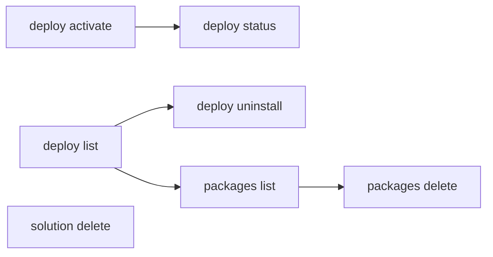

# Activate & Manage

Activate deployed solutions, uninstall deployments, and manage published solution packages.

> For full option details on any command, use `--help` (e.g., `uip solution deploy activate --help`).

## When to Use

- Activating a deployment that was not auto-activated
- Cleaning up old or failed deployments
- Managing published package versions in the solution feed
- Removing solutions from Studio Web

## Prerequisites

- Authenticated (`uip login`)
- Solution deployed (see [pack-and-deploy.md](pack-and-deploy.md))

## Flow



---

## Step 1: Activate a Deployment

`solution deploy run` activates by default. Use `deploy activate` only when:
- the deploy was started with `--skip-activate`, or
- the previous activation failed (e.g. missing config) and you've fixed the cause and want to retry without redeploying.

Activation provisions all solution components (processes, queues, assets, etc.) in the target folder:

```bash
uip solution deploy activate "MyDeployment" --output json

# With custom polling
uip solution deploy activate "MyDeployment" --timeout 600 --poll-interval 10000 --output json
```

| Option | Description | Default |
|--------|-------------|---------|
| `<deployment-name>` | Name of the deployment to activate (required) | -- |
| `--timeout <seconds>` | Polling timeout | 360 |
| `--poll-interval <ms>` | Polling interval | 5000 |

## Step 2: Check Deployment Status

After activation (or any deployment operation), verify the state:

```bash
# By pipeline deployment ID (returned by deploy run)
uip solution deploy status <pipeline-deployment-id> --output json

# Or list all deployments and inspect
uip solution deploy list --output json
```

## Step 3: Uninstall a Deployment

Remove a deployment, including all provisioned resources and the Orchestrator folder:

```bash
uip solution deploy uninstall "MyDeployment" --output json

# With custom polling
uip solution deploy uninstall "MyDeployment" --timeout 600 --poll-interval 10000 --output json
```

| Option | Description | Default |
|--------|-------------|---------|
| `<deployment-name>` | Name of the deployment to uninstall (required) | -- |
| `--timeout <seconds>` | Polling timeout | 360 |
| `--poll-interval <ms>` | Polling interval | 5000 |

This is destructive -- it removes the Orchestrator folder and all resources that were provisioned by the deployment.

## Step 4: List Published Packages

View all solution packages that have been published to the feed:

```bash
uip solution packages list --output json

# Paginate and sort
uip solution packages list --take 20 --order-by "Name" --order-direction "asc" --output json

# Filter by name (server-side substring match on the package name)
uip solution packages list --name "Invoice" --output json
```

| Option | Description | Default |
|--------|-------------|---------|
| `--take <n>` | Number of results to return | 10 |
| `--order-by <field>` | Sort field | -- |
| `--order-direction <dir>` | `asc` or `desc` | -- |

## Step 5: Delete a Package Version

Remove a specific version of a published package from the solution feed:

```bash
uip solution packages delete "MySolution" "1.0.0" --output json
```

Arguments: `<package-name> <version>`. This deletes only the specified version, not all versions of the package.

## Step 6: Delete from Studio Web

Remove a solution from Studio Web (browser-based editor). This is separate from deployment management:

```bash
uip solution delete <solution-id> --output json
```

This removes the solution from Studio Web. It does **not** affect any deployed instances in Orchestrator.

---

## Complete Example

List deployments, uninstall an old one, and clean up the published package version:

```bash
# List current deployments
uip solution deploy list --take 20 --output json

# Uninstall the old deployment
uip solution deploy uninstall "MySolution-v1" --output json

# Verify it was removed
uip solution deploy list --output json

# Clean up the old package version from the feed
uip solution packages list --output json
uip solution packages delete "MySolution" "1.0.0" --output json
```

---

## Variations and Gotchas

### `deploy uninstall` vs `solution delete`

These are different operations targeting different systems:

| Command | What it removes | System |
|---------|----------------|--------|
| `deploy uninstall <name>` | Orchestrator folder, provisioned resources | Orchestrator |
| `solution delete <id>` | Solution project | Studio Web |

Uninstalling a deployment does not remove the package from the solution feed. Deleting from Studio Web does not affect Orchestrator deployments.

### Activation Provisions Components

Activation is not instant. It provisions processes, queues, assets, and other resources in the Orchestrator folder. The command polls until completion or timeout. For large solutions, consider increasing `--timeout`.

### `packages delete` Deletes One Version

`packages delete` takes both a name **and** a version. It deletes only that specific version. To remove all versions, you must delete each one individually.

### Uninstall is Destructive

`deploy uninstall` removes the Orchestrator folder and all resources inside it. There is no undo. Verify the deployment name carefully before running this command.

### Polling Units

Same as `deploy run`: `--poll-interval` is in **milliseconds** (default 5000ms), `--timeout` is in **seconds** (default 360s).

---

## Related

- [pack-and-deploy.md](pack-and-deploy.md) -- Pack, publish, and deploy solutions
- [scenarios.md](scenarios.md) -- Multi-project recipes for resource-handling patterns
- [solution-overview.md](solution-overview.md) -- Solution overview and lifecycle
