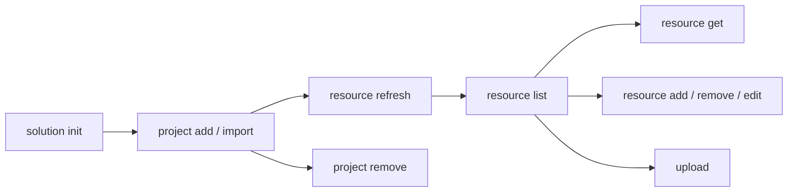

# Develop a Solution

Create a solution, add automation projects, and sync resource declarations.

> For full option details on any command, use `--help` (e.g., `uip solution project add --help`).

## When to Use

- Starting a new multi-project automation from scratch
- Organizing existing projects into a single deployable unit
- Managing resource declarations across projects before packing

## Prerequisites

- Authenticated (`uip login`) -- required for remote resource lookup during `resource refresh` and for `upload`
- Projects to add must contain `project.uiproj` or `project.json`

## Flow



`refresh` does bulk reconciliation from `bindings_v2.json`. `add`, `remove`, and `edit` are the atomic, single-resource siblings — use them when you're mutating one resource at a time (a coding agent making a single change, scripted CI step, etc.) and don't want to re-scan the whole solution. `add` is idempotent (a re-run returns `Status: "Unchanged"`); `remove` fails cleanly with `Resource not found in solution` if the key is already gone; `edit` patches an existing resource's spec (the only command that mutates one — `refresh` never overwrites).

---

## Step 1: Create a New Solution

```bash
uip solution init "InvoiceAutomation" --output json
```

Creates `InvoiceAutomation/InvoiceAutomation.uipx`. All projects must live inside this directory (or be imported into it).

> If the target folder already exists and is empty, `solution init` drops the `.uipx` inside without nesting or erroring. No need to pre-delete an empty target.

## Step 2: Add Existing Projects

> **Prerequisite for Coded Function and Coded Agent projects:** before running `uip solution project add`, run `uip functions init` (Coded Functions) or `uip codedagent init` (LangGraph/LlamaIndex/OpenAI Agents) inside the project directory to generate `entry-points.json`. Registration without it creates an incomplete solution entry.

Register a project that already lives inside the solution directory.

```bash
uip solution project add ./InvoiceAutomation/Processor --output json

# With explicit solution file
uip solution project add ./InvoiceAutomation/Reporter ./InvoiceAutomation/InvoiceAutomation.uipx --output json
```

The `.uipx` is auto-discovered by walking up from the project path if not specified. `Type` is auto-detected from `project.uiproj` / `project.json` — do not pass it.

`add` is transactional: on success, both the `.uipx` entry and the matching `resources/solution_folder/{package,process}/<name>.json` files are created together; on failure, nothing is mutated.

## Step 3: Import External Projects

Copy a project from outside the solution tree into the solution directory and register it.

```bash
uip solution project import --source /path/to/ExternalProject --output json
```

Unlike `add`, `import` copies source files into the solution directory first, then registers the copy.

> **Three names can diverge after `import`.** The destination folder name is the basename of `--source`. The `ProjectRelativePath` in `.uipx` matches the folder. The auto-generated package resource name is taken from the project metadata (e.g., `pyproject.toml [project].name` for Python coded agents) — which may differ from the folder. Rename the source directory to the intended project name **before** importing, or trace the relationship via the `projectKey` UUID inside the resource files.

## Step 4: Remove a Project

Unregister a project from the `.uipx` manifest. Does NOT delete files from disk.

```bash
uip solution project remove ./InvoiceAutomation/OldProject --output json
```

## Step 5: List Projects

Enumerate the projects registered in the local `.uipx` manifest. Reads only on-disk metadata — no backend call, so safe to use offline or in CI checks.

When the user asks to show or list registered projects, run this command. Reading the `.uipx` directly is useful as a follow-up verification step, but it is not a replacement for the CLI list surface.

```bash
# from inside the solution dir
uip solution project list --output json

# or with an explicit solution folder
uip solution project list --solution-folder ./InvoiceAutomation --output json
```

`Name` is read from each project's `project.uiproj`, falling back to the directory basename if the manifest is missing or unreadable. Empty solutions return `Data: []`.

## Step 6: List Resources

Show resources declared in the solution, available in Orchestrator, or both. Pass `--kind` to narrow to one resource kind. Run from inside the solution directory (default), or pass `--solution-folder <path>` to target another location.

```bash
# from inside the solution dir
uip solution resource list --kind Queue --output json
uip solution resource list --kind Process --source local --output json
uip solution resource list --kind Queue --search "Invoice" --output json

# explicit folder
uip solution resource list --kind App --solution-folder ./InvoiceAutomation --output json
```

| Option | Values | Default |
|--------|--------|---------|
| `--solution-folder <path>` | Path to solution root | Current working directory |
| `--kind <kind>` | `Queue`, `Asset`, `Bucket`, `Process`, `Connection`, `App`, `Index`, `Trigger` (any RCS kind) | All kinds |
| `--search <term>` | Name substring match | No filter |
| `--source <source>` | `all`, `local`, `remote` | `all` |
| `--login-validity <minutes>` | Minimum minutes left on token before refresh | `10` |

## Step 7: Refresh Resources

Re-scan all projects and sync resource declarations from their `bindings_v2.json` files. Refresh is the only way to reconcile a solution's local artefacts with cloud entities — run it after adding/importing projects, after editing `bindings_v2.json`, or before any `pack` / `upload`.

```bash
# from inside the solution dir
uip solution resource refresh --output json

# explicit folder
uip solution resource refresh --solution-folder ./InvoiceAutomation --output json
```

| Field | Meaning |
|-------|---------|
| `Created` | New local skeletons created (resource didn't exist in cloud) |
| `Imported` | Cloud resources imported into the solution (artefact files written + linked) |
| `Skipped` | Resources already tracked in the solution |
| `Warnings` | Bindings that couldn't be resolved (logged for follow-up) |

### What `refresh` actually does

> **`Result: Success` only means the CLI executed — not that the refresh service inside it succeeded.** The underlying service can fail (e.g., schema errors in `bindings_v2.json` logged to stderr as `ERROR [ResourceBuilder:BindingsMetadataSerializer] ...`) while the JSON still returns `Result: Success` with `Created: 0, Imported: 0, Skipped: 0`. Always inspect stderr for `ERROR` lines, and treat `Created==0 && Imported==0 && Skipped==0` while bindings exist on disk as a refresh failure.

Steps performed during refresh:

1. **Discover bindings** — reads `bindings_v2.json` from each project (solution root copy is also read for agent projects).
2. **Discover cloud GUIDs** — for agent projects, supplements bindings with `<project>/resources/<X>/resource.json` files. These carry a `referenceKey` (GUID) for tools/escalations/contexts that the agent depends on; the GUID is the unambiguous cloud identity (binding names alone aren't unique across folders).
3. **Reconcile in-solution projects (`.uipx`)** — generates project artefact files (`process/<type>/`, `package/`) from SDK templates. Internal to the solution; no debug overwrite written.
4. **Sync external references** — for each cloud resource the solution depends on, calls Orchestrator/Apps APIs and writes:
   - The artefact files under `resources/solution_folder/<kind>/...`
   - A user-scoped debug overwrite at `userProfile/<userId>/debug_overwrites.json` linking the local skeleton to the cloud entity (key + folder + FQN). Studio Web's runtime needs the FQN populated to resolve "configured folder" lookups.

### App resources

When an agent's escalation channel (`channels[].properties.resourceKey`) points to an Action Center App, refresh imports four artefact files:

```
resources/solution_folder/app/<subType>/<AppName>.json
resources/solution_folder/appVersion/<AppVersionTitle>.json
resources/solution_folder/package/<AppVersionTitle>.json
resources/solution_folder/process/webApp/<AppName>.json
```

Plus debug overwrites for the App and its codeBehindProcess. The App's `spec.version` must match the cloud Apps service `semVersion` (current published) — otherwise Studio Web's Health Analyzer flags "App is no longer available".

### Folder disambiguation

When a name (e.g. `orders` queue) exists in multiple cloud folders, refresh prefers the folder declared in the binding's `folderPath`. Without a folder hint and multiple matches, refresh marks the binding unresolved and emits a warning rather than picking one silently.

The placeholder `solution_folder` (and `.`) in a binding's folder field means "no folder" / tenant scope — they're not real cloud folders.

> For single-resource mutations that don't need a full project scan, see [Step 9: Add a Resource Atomically](#step-9-add-a-resource-atomically), [Step 10: Remove a Resource](#step-10-remove-a-resource), and [Step 11: Edit a Resource](#step-11-edit-a-resource). `refresh` and these solve different problems — `refresh` reconciles every binding in every project (and **never overwrites** a resource already in the solution); `add`/`remove`/`edit` operate on one resource at a time. To change an existing resource's spec, `edit` is the only path — `refresh` won't.

## Step 8: Get a Single Resource Configuration

Fetch the full configuration (`spec`, `apiVersion`, `isOverridable`, `resourceOverwrite`) for a specific resource by key. Useful when you need the resolved server state for a binding — e.g., constructing a deploy override, resolving an entry-point ID, inspecting a connection's authentication mode.

```bash
# from inside the solution dir
uip solution resource get <resource-key> --output json

# explicit folder + transitive deps
uip solution resource get <resource-key> --solution-folder ./InvoiceAutomation --include-dependencies --output json
```

| Option | Purpose |
|--------|---------|
| `--solution-folder <path>` | Solution root (default cwd) |
| `--include-dependencies` | Return the resource **plus** every dependency configuration in one shot |
| `--login-validity <minutes>` | Minimum minutes left on token before refresh (default `10`) |

### How resolution works

`get` accepts any key from `solution resource list` — local or remote — and dispatches accordingly:

1. **Local first** — calls SDK `getConfigurationAsync(key)`, which reads `resources/solution_folder/**/<resource>.json` and returns the design-time spec (plus any debug overwrite). This is what's bundled at pack time. Output is a subset of the cloud spec — good enough for most planning work.
2. **Fallback to RCS + FPS** — if the key isn't in the local solution, the CLI scans the resource catalog (`searchFolderEntities`) for it. On match, it builds a `ResourceReferenceModel` and calls the SDK's `IImportResourceHelper.exportResourceAsync` (the same workhorse `refresh` uses). The returned `ResourceDefinition` is mapped to the same `ResourceConfiguration` shape, so callers get a uniform output regardless of source.
3. **No match anywhere** → exits with `Failure` and `Resource '<key>' was not found in the solution or in the resource catalog`.

### Local vs remote spec — they're not identical

The local file is what `refresh` (and `solution project add`) wrote to disk: a declarative subset of the cloud entity. The remote (FPS) spec includes server-resolved fields the local can't have:

| Field | Local | Remote (FPS) |
|-------|-------|--------------|
| `name`, `package`, basic metadata | ✅ | ✅ |
| `apiVersion` | ✅ | ✅ |
| `entryPointUniqueId` / `entryPoints` | ❌ usually `null` | ✅ assigned by the server at deploy |
| `inputArgumentsSchemaV2` / `outputArgumentsSchemaV2` | ❌ | ✅ |
| `agentMemory`, `targetRuntime`, `environmentVariables` | ❌ | ✅ runtime defaults |

If you need the full server spec for a resource that's already in the solution (e.g., for a deploy override), `--include-dependencies` paired with manual inspection of the dependency graph is one option; the cleaner path is to delete the local file and let `refresh` re-import it from the cloud.

### Why `solution resource list` and `get` aren't symmetric

`list --source remote` returns entities from RCS that are **visible to your user** — including ones not bound to this solution. `get` is solution-context-aware: it considers anything in your `.uipx`'s solution_folder as "local", and falls back to RCS for everything else. A key shown by `list --source remote` that isn't bound to the solution will resolve via the FPS fallback.

## Step 9: Add a Resource Atomically

Add a single resource to the solution without touching `bindings_v2.json` or re-scanning every project. Two modes:

- `--source local` — create a *virtual stub*: a local-only resource record under `resources/solution_folder/<kind>/<name>.json` with no Orchestrator counterpart, to be provisioned at deploy time. Useful for new queues / assets / buckets that ship with the solution.
- `--source remote` — import an existing Orchestrator resource into the solution via RCS lookup.

`--source` is required, no default — pick the path explicitly. The command is idempotent: a second identical call returns `Status: "Unchanged"` instead of mutating, both on the local path (matched on `(kind, name, folder)`, suffix-aware so `name_<N>` siblings re-match) and the remote path (matched on resource key, case-insensitive).

```bash
# Create a local virtual queue (no auth required)
uip solution resource add --source local --kind Queue --name InvoiceQueue --output json

# Local asset with explicit subtype
uip solution resource add --source local --kind Asset --name ApiKey --type Text --output json

# Import an existing remote queue (folder disambiguates same-name resources)
uip solution resource add --source remote --kind Queue --name InvoiceQueue --folder-path Sales/CRM --output json

# Skip RCS lookup if you already know the cloud key
uip solution resource add --source remote --kind Queue --name InvoiceQueue \
    --cloud-key 8f3a1b2c-1234-4abc-9def-0123456789ab --output json
```

| Option | Values | Default |
|--------|--------|---------|
| `--source <source>` | `local`, `remote` | **required** |
| `--kind <kind>` | Any kind RCS indexes (e.g. Queue, Asset, Bucket, Process, Connection, App, Index, Trigger). Case-insensitive lookup; trimmed and lowerFirstChar-applied before persistence | **required** |
| `--name <name>` | Resource name (max 256 chars; path separators, control chars, and `: * ? " < > |` are rejected). Per-kind Orchestrator limits are stricter — queues cap at 50 | **required** |
| `--type <type>` | Resource subtype (e.g. `Text`/`Bool`/`Integer` for Asset, connector type for Connection) | None |
| `--folder-path <path>` | Orchestrator folder for remote lookup. **Not valid with `--source local`** — virtual stubs live under the solution folder | None |
| `--cloud-key <guid>` | Skip RCS search, import this exact resource key. Only valid with `--source remote`; must be a GUID | None |
| `--solution-folder <path>` | Path to solution root (must directly contain a `.uipx`) | Current working directory |
| `--login-validity <minutes>` | Minimum minutes left on token before refresh. Only used on `--source remote`; `--source local` is offline | `10` |

### Output

```json
{
  "Result": "Success",
  "Code": "ResourceAdded",
  "Data": {
    "Key": "8f3a1b2c-...",
    "Kind": "queue",
    "Type": null,
    "Name": "InvoiceQueue",
    "Folder": "solution_folder",
    "FolderKey": "5c2d61f4-...",
    "Source": "local",
    "Status": "Added"
  }
}
```

`Status` is `"Added"` (newly created), `"Updated"` (cloud spec re-applied when SDK detects drift on `--source remote`), or `"Unchanged"` (idempotency hit). For local stubs `Folder` is always `solution_folder` and `Source` is `"local"`; for remote imports, the resource lands locally under `solution_folder` regardless of which cloud folder it came from (debug overwrites carry the cloud-folder context for deploy).

### Ambiguous remote match

When `--source remote` is given without `--cloud-key` and the RCS search returns multiple resources with the same `(kind, name)` across different folders, `add` does **not** guess — it emits a structured error with every candidate inline so an agent can re-call without a separate `resource list`:

```json
{
  "Result": "Failure",
  "Message": "Ambiguous match: 3 remote resources matching kind=queue name=InvoiceQueue",
  "Instructions": "Candidates (use one folder via --folder-path, or pass --cloud-key directly):\n  - Folder=Sales/CRM  Key=8f3a1b2c-...\n  - Folder=Operations/Reporting  Key=21a07d4e-...\n  - Folder=Shared  Key=c0e9f7a3-..."
}
```

Resolve by re-running with `--folder-path <one-of-the-candidates>` or `--cloud-key <one-of-the-keys>`.

### How it relates to `refresh`

| Mechanism | When to use | Behavior |
|---|---|---|
| `resource refresh` | A `bindings_v2.json` was edited (by Studio Web, Maestro Flow/Case scaffolds, `maestro flow new`) and you need to reconcile all projects | Scans every project's bindings, creates / imports for everything new, suffixes name collisions across folders |
| `resource add` | One specific resource that's not driven by a binding (CI provisioning a queue, an agent that knows exactly what it wants to import) | Single resource, idempotent, no project scan |

`add` does **not** mutate any `bindings_v2.json`. If a binding references this resource, you still need the binding file to be present — `add` just creates the solution-level artefact so deploy validation passes.

## Step 10: Remove a Resource

Delete a single resource from the solution by key. Purely local: no auth round-trip, no `bindings_v2.json` mutation.

```bash
uip solution resource remove 8f3a1b2c-1234-4abc-9def-0123456789ab --output json

# explicit folder
uip solution resource remove 8f3a1b2c-... --solution-folder ./InvoiceAutomation --output json
```

`<resource-key>` is positional and required, validated as a GUID. Use `resource list --source local` to discover keys.

| Option | Values | Default |
|--------|--------|---------|
| `--solution-folder <path>` | Path to solution root (must directly contain a `.uipx`) | Current working directory |

### Output

```json
{
  "Result": "Success",
  "Code": "ResourceRemoved",
  "Data": {
    "Key": "8f3a1b2c-...",
    "Kind": "queue",
    "Name": "InvoiceQueue",
    "Folder": "solution_folder"
  }
}
```

If the key isn't in the local solution, the command exits with `Failure` and `Resource not found in solution` — there's no fallback to remote (unlike `resource get`). Use `resource list --source local` to confirm what's actually tracked.

> Removing a resource does **not** delete the binding in any `bindings_v2.json` that still references it. The next `resource refresh` will re-import it. To make a removal stick, either fix the binding through the owning product (Maestro Flow / Case, Studio Web, agent code) or remove the project from the solution first.

## Step 11: Edit a Resource

Change a resource's `spec` properties by key. This is the only command that mutates an existing resource — `refresh` is import-only (it skips resources already in the solution, never overwrites them).

```bash
# Patch a single spec property
uip solution resource edit <resource-key> --patch '{"maxNumberOfRetries":5}' --output json

# Patch several properties from a JSON object
uip solution resource edit <resource-key> --patch '{"acceptAutomaticallyRetry":false,"retentionPeriod":14}' --output json

# Read the patch from stdin (pipeline-friendly)
echo '{"slaInHours":"4"}' | uip solution resource edit <resource-key> --patch - --output json
```

| Option | Values | Default |
|--------|--------|---------|
| `<resource-key>` | Solution resource key (GUID, positional) — discover via `resource list --source local` | **required** |
| `--patch <json\|->` | JSON object of spec property → value; `-` reads the JSON from stdin | **required** |
| `--solution-folder <path>` | Path to solution root (must directly contain a `.uipx`) | Current working directory |

`--patch` is the only input. Purely local — no auth round-trip (a secret-property edit may need login; that surfaces as an SDK error if so). **Why no `--set k=v` shortcut?** Scalar coercion was ambiguous on numeric-looking strings (`--set slaInHours=2` would have become number `2`, but Queue's schema requires string `"2"`). JSON is unambiguous: the agent decides the type, the SDK gets exactly what was emitted.

### What the SDK enforces (and silently ignores)

`edit` is a thin wrapper over the SDK's `updateConfigurationAsync`, which classifies each property against kind metadata and **merges into `resource.spec`**:

- **Unknown / reference / read-only** properties are **silently skipped** — passing them is not an error, but nothing changes. (This is how the SDK enforces "don't hand-edit `*Reference` fields".)
- **Identity fields** (`key`, `kind`, `type`, `apiVersion`, `dependencies`, `folders`) are top-level, not `spec` — structurally unreachable through `edit`.
- **Secret** properties are stored via the secret-upsert path (you pass the value, the SDK keeps a key).
- **Name** is editable (renames the resource) with duplicate-name protection — supersedes the old "rename is Studio-Web-only" guidance.
- Merge is **top-level spec replacement**, not deep merge: `--patch '{"obj":{...}}'` replaces the whole `obj`.

### Output

```json
{
  "Result": "Success",
  "Code": "ResourceEdited",
  "Data": {
    "key": "8f3a1b2c-...",
    "spec": { "name": "InvoiceQueue", "maxNumberOfRetries": 5 },
    "locks": [],
    "apiVersion": "orchestrator.uipath.com/v1"
  }
}
```

`Data` is the SDK's `ResourceConfiguration` — the **same shape `resource get` returns**, so `get`↔`edit` round-trips cleanly: `resource get <key> --output json`, mutate the JSON, feed it back via `--patch`. If you need a before/after diff, run `get` first.

## Step 12: Upload to Studio Web

Upload the solution for browser-based editing. Accepts a directory, `.uipx` file, or `.uis` archive.

```bash
uip solution upload ./InvoiceAutomation --output json
```

If the `SolutionId` in `.uipx` matches an existing Studio Web solution, the upload is **refused** unless `--force` is passed. Forcing replaces the cloud project in place and wipes its Studio Web version history. On a freshly `solution init`-ed project (or any `.uipx` whose `SolutionId` does not yet exist in the cloud) the upload imports as new with no flag. See [`upload` refuses to overwrite without `--force`](#upload-refuses-to-overwrite-without---force) for the recovery path.

> A project's target framework (platform) is fixed at creation and **cannot be mutated** — re-uploading or editing configuration will not change it. To target a different platform (e.g., Windows → Cross-platform), **recreate the project** with the correct target framework and upload that.

## Step 13: Delete from Studio Web

Remove a solution from Studio Web by its UUID (returned by `upload`).

```bash
uip solution delete <solution-id> --output json
```

Deletes the Studio Web copy only -- local files and published packages are not affected.

---

## Complete Example

Create a solution with two projects, sync resources, and verify:

```bash
# 1. Create the solution
uip solution init "InvoiceAutomation" --output json

# 2. Add projects (already inside the solution directory)
uip solution project add ./InvoiceAutomation/Processor --output json
uip solution project add ./InvoiceAutomation/Reporter --output json

# 3. Move into the solution dir so subsequent commands default --solution-folder
cd ./InvoiceAutomation

# 4. Sync resource declarations from project bindings
uip solution resource refresh --output json

# 5. Verify resources are tracked (per kind)
uip solution resource list --kind Process --source local --output json
uip solution resource list --kind Queue --source local --output json

# 6. Inspect one resource's full configuration (local + RCS fallback)
uip solution resource get <resource-key> --output json
```

---

## Field-tested gotchas

Durable CLI behaviors that have caught agents in practice. Treat each as a hard rule.

### Always verify state after every mutation

`add`, `remove`, and `refresh` can succeed in stdout but fail (or partially fail) on disk. After every mutation:

```bash
# 1. What does .uipx claim?
cat ./MySolution/MySolution.uipx | grep -A 2 ProjectRelativePath

# 2. What resource files actually exist?
ls -1 ./MySolution/resources/solution_folder/package/
ls -1 ./MySolution/resources/solution_folder/process/

# 3. The two sets MUST agree by name. If not, the solution is corrupt.
```

Steps 1–3 verify *project* mutations (`project add`/`remove`, `refresh`). For *resource* mutations (`resource add`/`remove`) the relevant files live under other `resources/solution_folder/<kind>/` subtrees (`queue/`, `asset/`, `bucket/`, …), so verify at the resource level instead:

```bash
uip solution resource list --source local --output json
```

If `.uipx` and `resources/solution_folder/` disagree, follow the recovery procedure in the matching gotcha below.

### `bindings.json` vs `bindings_v2.json` — different files, different schemas

| File | Created by | Read by |
|---|---|---|
| `bindings.json` | `uipath init` (coded agent) | the agent at runtime |
| `bindings_v2.json` | `uip maestro flow new`, Maestro Case scaffold, Studio Web (mirrors agent bindings up to solution root) | `uip solution resource refresh` |

Copying `bindings.json` → `bindings_v2.json` does **not** work — the schemas differ, and `resource refresh` will silently fail (see "false success" gotcha above). Naive hand-authoring or copy-paste from `bindings.json` produces the opaque error `TypeError: Cannot read properties of undefined (reading 'toLowerCase')`. When a project's tooling already manages `bindings_v2.json` (Flow / Case / agent solutions), edit through that product's commands rather than the file directly, then run `resource refresh` to reconcile.

### `resource refresh` reports false success on schema errors

See [Step 7](#step-7-refresh-resources). Always capture stderr and grep for `ERROR`. The `Warnings` field stays empty even when the underlying parser throws.

### `project remove` leaves orphan package resources

See [Step 4](#step-4-remove-a-project). After `remove`, manually delete `resources/solution_folder/package/<name>.json` if you plan to re-add with the same name. To fully delete a project, also remove the project folder — `remove` does not touch source files.

---

## Variations and Gotchas

### `add` vs `import`

| | `project add` | `project import` |
|-|----------------|-------------------|
| Project location | Must already be inside the solution directory | Can be anywhere on disk |
| File handling | Registers only (no file copy) | Copies into solution tree, then registers |
| Use case | Project created inside the solution | Bringing in an external project |

### `remove` does not delete files

`project remove` unregisters from `.uipx` but leaves the project directory intact. Delete files manually if needed.

### `resource refresh` is the sync mechanism

Adding a project does not automatically sync its resources. The refresh scans all registered projects for `bindings_v2.json`, creates solution resources for untracked bindings, imports from Orchestrator when a match exists, and skips already-tracked bindings.

### Virtualizable vs non-virtualizable resources

| Virtualizable | Non-virtualizable |
|---------------|-------------------|
| Queue, Asset, Bucket | Process, Connection, App |
| Can exist as local placeholders (created at deploy time) | Must reference an existing Orchestrator/IS/Apps resource |

If a non-virtualizable resource isn't found in cloud, refresh emits a warning and the deployment will fail until the resource is provisioned (or the binding is fixed/removed).

### `bindings_v2.json` locations

Studio Web writes bindings in two places depending on project type:
- `<project>/bindings_v2.json` — for flow / RPA projects
- Solution root `bindings_v2.json` — added for agent projects (Studio Web mirrors them up)

Refresh reads both. Don't hand-edit these — they're regenerated whenever Studio Web saves the project.

### Per-user debug overwrites

`userProfile/<userId>/debug_overwrites.json` is per-user state (the `userId` is your UiPath user GUID). Refresh writes only your own entries; another user opening the bundled solution would have separate entries. The bundle (`.uis`) carries `userProfile/` for everyone who ran refresh; Studio Web picks the active user's at runtime.

### `upload` refuses to overwrite without `--force`

The `SolutionId` in `.uipx` determines identity. Before uploading, the CLI probes Studio Web for that id:

- **Cloud has no solution with that id** → imports as new (no flag needed). This is the freshly `solution init`-ed flow.
- **Cloud already has that id, no `--force`** → upload is refused with exit code 1 and no `.uipx` mutation. Refusing is the safe default — overwriting destroys the cloud project's Studio Web version history.
- **`--force` passed** → skips the probe and goes straight through the overwrite path (with the SDK's 404 → import fallback for stale ids).

To upload as an unrelated new cloud solution rather than overwriting, scaffold a fresh solution with `uip solution init` or remove the `SolutionId` from the local `.uipx` before re-running `upload`.

### `delete` uses the solution UUID, not the name

Get the UUID from `upload` output or Studio Web -- the name string is not accepted.

### `.uipx` auto-discovery

When `[solutionFile]` is omitted, the CLI walks up from the project path looking for a single `.uipx` file. If multiple `.uipx` files exist in the same directory, specify which one explicitly.

### `--solution-folder` defaults to cwd

`resource list / refresh / get / add / remove / edit` default `--solution-folder` to the current working directory. Run them from inside the solution dir for the shortest invocation (`uip solution resource list`) or pass `--solution-folder <path>` explicitly.

### `add` / `remove` / `edit` / `refresh` require a `.uipx` manifest in the target folder

Unlike `resource get` and `list` (which fall back to RCS when local state is missing), the write commands refuse to operate on a directory that doesn't directly contain a `.uipx`. This prevents `--solution-folder /tmp` from silently writing stray resource files anywhere on disk. If you see `<path> is not a UiPath solution (no .uipx manifest found)`, you're pointed at the wrong directory.

### `resource get` for cross-folder inspection

Because `get` falls back to RCS + FPS export when the key isn't local, it works as a quick way to fetch the full server spec for any resource your tenant exposes — even ones that aren't yet bound to this solution. Pair with `solution resource list --kind <kind> --source remote` to discover keys.

---

## Cheat sheet

| Want to... | Command | Watch for |
|---|---|---|
| Create a fresh solution | `uip solution init <name>` | Accepts an existing empty directory; drops `.uipx` inside |
| Add a project already in the solution dir | `uip solution project add ./<dir>` | Transactional — `.uipx` and `resources/solution_folder/{package,process}/` agree on success |
| Pull in an external project | `uip solution project import --source <path>` | Rename source folder first to avoid 3-name divergence |
| Remove a project | `uip solution project remove ./<dir>` | Manually delete `resources/.../package/<name>.json` afterwards |
| Sync resource bindings | `uip solution resource refresh --solution-folder <solution-dir>` | **Check stderr for ERROR**; `Result: Success` with 0/0/0 counts is suspicious if `bindings_v2.json` exists |
| Add a virtual queue / asset / bucket | `uip solution resource add --source local --kind <kind> --name <name>` | Offline-friendly; idempotent (re-run returns `Status: "Unchanged"`) |
| Import an existing remote resource | `uip solution resource add --source remote --kind <kind> --name <name> --folder-path <folder>` | On ambiguous match, the error lists every candidate with its key — pick one and re-call |
| Remove a single resource | `uip solution resource remove <resource-key>` | Purely local — no auth; doesn't touch `bindings_v2.json`, next `refresh` re-imports if a binding still references it |
| Edit a resource's spec | `uip solution resource edit <resource-key> --patch '{...}'` | Only command that mutates an existing resource; unknown/reference/read-only props are silently ignored. JSON is the only input — types preserved verbatim |
| List resources | `uip solution resource list --solution-folder <solution-dir> --source local` | Good sanity check after any mutation; add `--kind <kind>` to narrow to one resource kind |
| Pack | `uip solution pack <solution-dir> <output-dir>` | See [pack-and-deploy.md](pack-and-deploy.md) for full pack/publish/deploy flow |

---

## Related

- [Pack & Deploy](pack-and-deploy.md) -- Next step: pack, publish, and deploy the solution
- [Scenarios](scenarios.md) -- Multi-project recipes: same-name across folders, cross-ref intra-solution, shared cloud resources, virtual assets
- [solution-overview.md](solution-overview.md) -- Solution tool overview and full command tree
