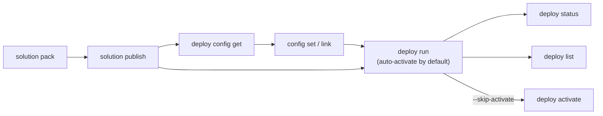

# Pack & Deploy

Pack a solution into a deployable package, publish to the feed, and deploy to Orchestrator with optional configuration.

> For full option details on any command, use `--help` (e.g., `uip solution deploy run --help`).

## When to Use

- Deploying automations to staging or production environments
- CI/CD pipelines that pack, publish, and deploy on every merge
- Multi-environment promotion (dev -> staging -> production)

## Prerequisites

- Authenticated (`uip login`)
- Solution developed and ready to pack (see [develop-solution.md](develop-solution.md))
- Solution state verified — `.uipx` and `resources/solution_folder/` agree on the project set (see [develop-solution.md - Always verify state after every mutation](develop-solution.md#always-verify-state-after-every-mutation))

## Flow



---

## Step 1: Pack the Solution

Build a deployable .zip from a solution directory:

```bash
uip solution pack ./MySolution ./output --output json

# With explicit name and version
uip solution pack ./MySolution ./output --name "MySolution" --version "2.0.0" --output json
```

| Option | Description | Default |
|--------|-------------|---------|
| `<solutionPath>` | Directory containing a `.uipx` or `.uis` file (required) | -- |
| `<output-path>` | Directory where the .zip will be written (required positional, no default — omitting it errors with `missing required argument 'output-path'`) | -- |
| `--name <name>` | Override the package name | Name from `.uipx` |
| `--version <version>` | Set the package version | `1.0.0` |

The output is a `.zip` file named `<name>.<version>.zip` written under `<output-path>/` (e.g., `MySolution.2.0.0.zip`). Run `solution resource refresh` first (from inside the solution dir, or with `--solution-folder <path>`) to ensure the solution's artefact files and debug overwrites are up to date — they're bundled into the package.

## Step 2: Publish to the Solution Feed

Upload the packed .zip so it appears in the UiPath solution feed:

```bash
uip solution publish ./output/MySolution.2.0.0.zip --output json

# Target a specific tenant
uip solution publish ./output/MySolution.2.0.0.zip --tenant "Production" --output json
```

After publishing, the package is visible via `uip solution packages list` and available for deployment.

## Step 3 (Alternative): Upload to Studio Web

If the goal is browser-based editing rather than deployment, use `upload` instead of `publish`:

```bash
uip solution upload ./MySolution --output json
```

This uploads to Studio Web for collaborative editing. It does **not** place the package on the solution feed and cannot be used with `deploy run`.

## Step 4: Deploy to Orchestrator

Deploy the published package. By default this creates a new Orchestrator folder, provisions all solution resources, **and activates the deployment** in one call:

```bash
uip solution deploy run -n "InvoiceAutomation-v2" \
  --package-name "MySolution" --package-version "2.0.0" \
  --folder-name "MySolutionFolder" --output json
```

A successful run returns `Status: DeploymentSucceeded` and `ActivationStatus: SuccessfulActivate`. If the package requires configuration before it can activate, deploy still succeeds but activation surfaces an explicit error pointing at `deploy activate <name>` — fix the config and retry the activate.

To skip auto-activation (legacy behaviour — leaves the deployment in `Inactive (Ready to activate)`):

```bash
uip solution deploy run … --skip-activate --output json
```

Key options:

| Option | Description | Default |
|--------|-------------|---------|
| `-n, --name <name>` | Deployment name (required) | -- |
| `--package-name <name>` | Published solution package name (required) | -- |
| `--package-version <version>` | Package version to deploy (required) | -- |
| `--folder-name <name>` | New Orchestrator folder to create (required) | -- |
| `--parent-folder-path <path>` | Parent folder under which the new folder is created | -- |
| `--parent-folder-key <key>` | Parent folder key (GUID, alternative to `--parent-folder-path`) | -- |
| `--config-file <path>` | Configuration file from `deploy config get` | -- |
| `--skip-activate` | Skip the post-deploy activation; leaves the deployment in `Inactive (Ready to activate)` | (off — auto-activate) |
| `--timeout <seconds>` | Polling timeout, applied per phase (deploy and, when not skipped, activate) | 360 |
| `--poll-interval <ms>` | Polling interval used during both phases | 5000 |
| `--login-validity <minutes>` | Minimum minutes left on the access token before the CLI proactively refreshes it before the deploy starts. Useful for long deploys close to token expiry. | 10 |
| `-t, --tenant <name>` | Tenant override | Current tenant |

## Step 5: Check Deployment Status

The `deploy run` command returns a pipeline deployment ID. Use it to check progress:

```bash
uip solution deploy status <pipeline-deployment-id> --output json
```

The CLI also falls back to the persistent `searchSearchDeployments22` record if the pipeline service has already recycled the in-flight tracking ID — so a deployment that finishes while the CLI is between polls is still surfaced as `DeploymentSucceeded` rather than a polling failure.

## Step 6: List Deployments

```bash
uip solution deploy list --output json
uip solution deploy list --folder-path "Shared" --limit 20 --sort-by "Name" --sort-order "Ascending" --output json
```

Options: `--folder-path`, `--limit` (default 50), `--sort-by`, `--sort-order` (`Ascending`/`Descending`).

---

## Configuration Workflow

The deploy config is a plain JSON file that lists every resource the package exposes, along with its default properties and an optional `linkToResource` directive. It controls two things at deploy time:

- **Per-resource properties** — queue retry count, retention periods, conflict-resolution behaviour, etc.
- **Link vs. install** — whether each resource is bound to an existing Orchestrator/Apps entity (`linkToResource` set) or provisioned fresh in the deployment folder (no `linkToResource`).

The CLI exposes `get` / `set` / `link` / `unlink` for the common edits, but the file is just JSON — you can also open it in an editor and modify any field directly. Pass the file to `deploy run --config-file <path>` to apply.

### File Structure

`deploy config get` writes a top-level `resources` array. Each entry looks like:

```jsonc
{
  "kind": "bucket",                                   // resource kind
  "name": "test",                                     // resource name in the solution
  "resourceKey": "19f344d2-...",                      // solution-resource key (cloud GUID for resources imported from RCS)
  "folderPaths": ["solution_folder"],                 // folders the resource lives in inside the solution
  "configuration": { /* kind-specific properties */ },
  "linkToResource": {                                 // optional — present only when linked
    "name": "ProductionBucket",
    "folderPath": "Shared/Production"
  }
}
```

Only `linkToResource` toggles link vs. install. Everything else under `configuration` is forwarded to the resource at deploy time and can be edited freely — change retention periods, conflict-fixing actions, queue/process settings, or the kind-specific nested fields (e.g. an index's `storageBucketReference`, a process's `retentionBucketRef`) by writing to the JSON directly. Some `configuration` fields cross-reference other resources by `resourceKey`; when you edit link state on one resource, align those cross-refs on its dependents by hand if the topology changes.

### Fetch the Default Configuration

```bash
uip solution deploy config get "MySolution" -d config.json --output json

# For a specific version (latest is used if omitted)
uip solution deploy config get "MySolution" -d config.json --package-version "2.0.0" --output json
```

The fetched file already contains every resource with default values — no manual scaffolding required.

### Set a Resource Property

```bash
uip solution deploy config set config.json MyQueue maxNumberOfRetries 5
```

Arguments: `<config-file> <resource-name> <property> <value>`. Property names match the keys under `configuration` (visible in the file).

### Set a Property for All Resources

```bash
uip solution deploy config set config.json --all conflictFixingAction UseExisting
```

`--all` is restricted to `conflictFixingAction` — the field that controls what happens when a resource with the same name already exists in the target folder.

### Link to an Existing Orchestrator Resource

Add `linkToResource` so the deployment binds to an existing entity instead of creating a new one:

```bash
uip solution deploy config link config.json MyQueue \
  --name ProductionQueue --folder-path "Shared/Production"
```

Effect on the file: appends `linkToResource: { name, folderPath }` to the matched resource entry. The `--name` / `--folder-path` arguments must point to a real Orchestrator/Apps resource — the deployment fails if it doesn't exist.

When the same resource name appears multiple times in the config (different kinds), pass `resourceKey` instead of `name` to disambiguate. The CLI surfaces the available keys in the error message.

### Unlink a Resource

Remove the link so the resource is provisioned fresh in the deployment folder:

```bash
uip solution deploy config unlink config.json MyQueue
```

Effect on the file: deletes the `linkToResource` field. The unlink command requires a `linkToResource` to already exist — to start from a default-install config, simply leave (or never add) the field.

### Editing the Config File Directly

Every change the CLI makes is a small edit to the JSON, and the file isn't restricted to the fields `set` / `link` / `unlink` know about. Any property under `configuration`, any cross-reference (e.g. `storageBucketReference.key`), or any new top-level resource entry can be edited or added by hand when the built-in commands don't cover the case. Validate by running `deploy run --config-file <path>` — the deploy fails fast if a referenced resource doesn't exist.

### Deploy with Configuration

Pass the customized config file to `deploy run`:

```bash
uip solution deploy run -n "InvoiceAutomation-Prod" \
  --package-name "MySolution" --package-version "2.0.0" \
  --folder-name "ProdFolder" --parent-folder-path "Production" \
  --config-file config.json --output json
```

Without `--config-file`, the deployment uses package defaults. With `--config-file`, every resource is provisioned exactly as the file describes — fresh-install for any entry without `linkToResource`, bound for any entry with one.

---

## CI/CD Example (GitHub Actions)

```yaml
name: Deploy UiPath Solution
on:
  push:
    branches: [main]
jobs:
  deploy:
    runs-on: ubuntu-latest
    steps:
      - uses: actions/checkout@v4
      - run: npm install -g @uipath/cli
      - run: uip login --client-id "${{ secrets.UIPATH_CLIENT_ID }}" --client-secret "${{ secrets.UIPATH_CLIENT_SECRET }}" --tenant "${{ secrets.UIPATH_TENANT }}" --output json
      - run: uip solution pack ./MySolution ./output --version "1.0.${{ github.run_number }}" --output json
      - run: uip solution publish ./output/MySolution.*.zip --output json
      - run: uip solution deploy run -n "MySolution-${{ github.run_number }}" --package-name "MySolution" --package-version "1.0.${{ github.run_number }}" --folder-name "MySolution" --config-file deploy-config.json --output json
```

---

## Environment Promotion

Pack once, then publish and deploy to each environment in sequence:

```bash
uip solution pack ./MySolution ./output --version "1.2.0" --output json

# Staging
uip login tenant set "Staging" --output json
uip solution publish ./output/MySolution.1.2.0.zip --output json
uip solution deploy run -n "MySolution-Staging" --package-name "MySolution" --package-version "1.2.0" \
  --folder-name "MySolution" --config-file staging-config.json --output json

# Production (after validation)
uip login tenant set "Production" --output json
uip solution publish ./output/MySolution.1.2.0.zip --output json
uip solution deploy run -n "MySolution-Prod" --package-name "MySolution" --package-version "1.2.0" \
  --folder-name "MySolution" --config-file production-config.json --output json
```

---

## Version Bumping

Always increment the version when republishing (patch for fixes, minor for features, major for breaking changes). The solution feed rejects duplicate name+version pairs.

---

## Variations and Gotchas

### `publish` vs `upload`

These are different commands with different destinations:

| Command | Destination | Purpose |
|---------|-------------|---------|
| `solution publish` | Solution feed | For deployment via `deploy run` |
| `solution upload` | Studio Web | For browser-based editing |

### `deploy run` Creates a New Folder

`--folder-name` specifies a folder to **create**, not an existing folder to deploy into. If the folder already exists, deployment will fail. Use `--parent-folder-path` to set the parent folder where the new folder is created.

### `--parent-folder-path` is the Parent

On `deploy run`, `--parent-folder-path` is the **parent** folder, not the deployment folder itself. The deployment folder is `--folder-name`, created inside `--parent-folder-path`. To produce a nested layout like `Shared/Nica/Solution`, pre-create `Shared/Nica` (or use a previous deploy to make it) and pass `--parent-folder-path "Shared/Nica" --folder-name "Solution"`.

### Config `link` Connects to Existing Resources

`config link` does not copy or move a resource. It writes a `linkToResource` directive that points the deployment at an existing Orchestrator/Apps resource instead of creating a new one. The linked resource must already exist in the specified folder when `deploy run` executes.

### Cross-Resource References Don't Auto-Update

Some resources reference others through `configuration` fields (an index's `storageBucketReference.key` pointing at a bucket, a process's `retentionBucketRef`, etc.). `link` / `unlink` only touch the targeted resource — they do not rewrite cross-references on its dependents. When you change link state for a resource that other entries point at, open the config file and align the cross-reference fields by hand.

### Config `set --all` is Limited

The `--all` flag on `config set` only works with `conflictFixingAction`. It cannot be used to set arbitrary properties across all resources.

### `deploy list --limit` and Folder Filtering

Folder filtering with `--folder-path` happens **after** fetching `--limit` results. If your deployment is missing from the list, increase `--limit` to ensure the server returns enough results before filtering.

### Units Mismatch

`--poll-interval` is in **milliseconds** (default 5000ms = 5s). `--timeout` is in **seconds** (default 360s = 6min). Do not confuse the two.

---

## Related

- [develop-solution.md](develop-solution.md) -- Create and structure a solution from scratch
- [scenarios.md](scenarios.md) -- Recipes for same-name resources, cross-refs, shared cloud entities, virtual assets at deploy
- [activate-and-manage.md](activate-and-manage.md) -- Activate deployments, uninstall, manage packages
