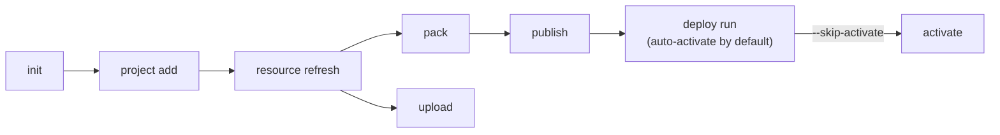

# Solutions (`uip solution`)

Create, pack, publish, deploy, and manage UiPath solution packages.

> For full option details on any command, use `--help` (e.g., `uip solution deploy run --help`).

---

## What is a Solution?

A UiPath Solution is a container that groups multiple automation projects (processes, libraries, tests) into a single deployable unit. Solutions enable:

- **Bundled deployment** -- Deploy multiple projects together as one package
- **Version management** -- Track and version the entire solution as a single entity
- **Configuration management** -- Apply environment-specific configuration at deploy time
- **Multi-environment promotion** -- Move solutions through dev, staging, and production

### Solution File Structure

```
MySolution/
├── MySolution.uipx                       <- Manifest. Source of truth: project list + IDs + StudioMinVersion.
├── <ProjectName>/
│   ├── project.uiproj OR project.json    <- Required for add/import. Type auto-detected.
│   ├── bindings.json                     <- Agent runtime bindings. NOT scanned by refresh.
│   ├── bindings_v2.json                  <- Solution refresh reads this (if it exists).
│   └── ...
├── <AnotherProjectName>/                 <- A solution can host many projects side-by-side.
│   ├── project.uiproj OR project.json
│   ├── bindings_v2.json
│   └── ...
├── resources/                            <- Auto-generated on add/import. NEVER hand-edit.
│   └── solution_folder/
│       ├── package/<name>.json           <- Auto-created on add. NOT cleaned by `project remove`.
│       └── process/{process,flow}/<name>.json   <- Auto-created on add. Auto-cleaned on remove.
└── userProfile/<user-uuid>/              <- Appears after first `project remove`.
```

> `.uipx` and `resources/solution_folder/` must always agree on the set of projects. Diffing them is the fastest way to detect a corrupted state — see [develop-solution.md - Field-tested gotchas](develop-solution.md#field-tested-gotchas).
>
> The `.uipx` also carries a `StudioMinVersion` field (e.g. `2025.10.0`). If users hit a version-mismatch when opening the solution, that's the constraint to check.

> **Coded apps are not registered in `.uipx`.** UiPath Coded Web Apps and Coded Action Apps have no `project.uiproj` / `project.json` — `uip solution project add` does not apply, and they are not packed by `uip solution pack`. They deploy independently via `uip codedapp publish` / `deploy`. A coded app directory can sit alongside a solution but is not part of its manifest. See [/uipath:uipath-coded-apps](/uipath:uipath-coded-apps).

---

## Solution Lifecycle



Two distinct distribution paths from the same solution source:
- **`pack` → `publish` → `deploy run`** — promotes a versioned package to Orchestrator.
- **`upload`** — pushes the solution to Studio Web for browser-based debugging only. Does not produce a published package and cannot be deployed via `deploy run`.

Always run `resource refresh` before either path so the bundled artefact files and `userProfile/<userId>/debug_overwrites.json` reflect the current cloud state.

---

## Command Tree

```
uip solution
  ├── init <name>                         Create a new solution directory with .uipx manifest
  │                                        (pre-rename CLIs expose this as `new`; see SKILL.md Operate-half "CLI Surface Probe")
  ├── delete <solution-id>                Delete a solution from Studio Web
  ├── upload <path>                       Upload solution to Studio Web
  ├── pack <solution> <output>            Pack into a deployable .zip package
  ├── publish <package>                   Upload packed solution to UiPath
  ├── project
  │     ├── add <project-path> [solutionFile]   Register an existing subfolder in .uipx
  │     ├── remove <project-path> [solutionFile] Unregister a project from .uipx
  │     ├── import --source <path>              Copy external project into solution and register
  │     └── list                                List projects registered in the local .uipx (no backend call)
  ├── resource
  │     ├── list                          List local, remote, or all resources (--solution-folder, default cwd)
  │     ├── refresh                       Sync resource declarations from project bindings (--solution-folder, default cwd)
  │     ├── get <resource-key>            Get full configuration for a single resource — local or remote (--solution-folder, default cwd)
  │     ├── add                           Add one resource atomically: --source local|remote --kind <kind> --name <name>
  │     ├── remove <resource-key>         Delete one resource from the solution by key (offline, no auth)
  │     └── edit <resource-key>           Patch an existing resource's spec via --patch '<json>' (or '-' for stdin)
  ├── deploy
  │     ├── run -n <name>                 Deploy a published solution package (auto-activates by default; pass --skip-activate to opt out)
  │     ├── status <id>                   Check deployment status
  │     ├── list                          List deployments
  │     ├── activate <name>               Activate a deployment (only needed after --skip-activate or to retry a failed auto-activation)
  │     ├── uninstall <name>              Uninstall a deployment
  │     └── config
  │           ├── get <package-name>      Fetch default deploy config
  │           ├── set <file> ...          Set a resource property in config
  │           ├── link <file> <resource>  Link to an existing Orchestrator resource
  │           └── unlink <file> <resource> Remove a resource link
  └── packages
        ├── list                          List published solution packages
        ├── download <name> [version]      Download a published solution package .zip
        └── delete <name> <version>       Delete a specific package version
```

---

## Workflow References

Each workflow doc covers a multi-command choreography for a specific goal. Load the one that matches your task.

| Workflow | File | Covers |
|----------|------|--------|
| Develop a Solution | [develop-solution.md](develop-solution.md) | Create, add projects, manage resources, upload |
| Pack & Deploy | [pack-and-deploy.md](pack-and-deploy.md) | Pack, publish, deploy run, deploy config |
| Activate & Manage | [activate-and-manage.md](activate-and-manage.md) | Activate, uninstall, packages list/delete |
| Scenarios | [scenarios.md](scenarios.md) | Multi-project recipes — same-name across folders, intra-solution cross-refs, shared cloud resources, virtual assets at deploy |

---

## Related

- **Orchestrator** (`uip or`) — folders, processes, jobs, machines → [`uipath-orchestrator`](../orchestrator/orchestrator.md)
- **Resources** (`uip resource`) — assets, queues, buckets used by solutions → [`uipath-resources`](../resources/resources.md)
